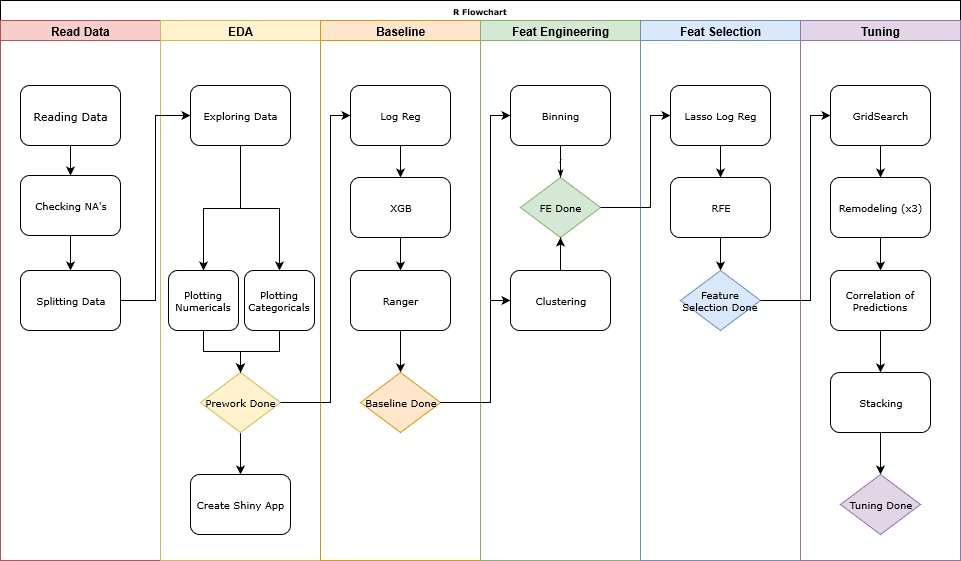

Predicting Term Deposits
================
MBD | ADVANCED R | June 2019

</br>

-----

## Bank Marketing Dataset

The *Bank Marketing* dataset contains the **direct marketing campaigns
of a Portuguese banking institution**. The original dataset can be found
on [Kaggle](https://www.kaggle.com/henriqueyamahata/bank-marketing).

All the files of this project are saved in a [GitHub
repository](https://github.com/ashomah/Bank-Marketing).

The dataset consists in:

  - **Train Set** with 36,168 observations with 16 features and the
    target `y`.  
  - **Test Set** with 9,043 observations with 16 features. The `y`
    column will be added to the Test Set, with NAs, to ease the
    pre-processing stage.

This project aims to predict if a customer will subscribe to a bank term
deposit, based on its features and call history of previous marketing
campaigns.

</br>

-----

## Packages

This analysis requires these R packages:

  - Data Manipulation: `data.table`, `dplyr`, `tibble`, `tidyr`

  - Plotting: `corrplot`, `GGally`, `ggmap`, `ggplot2`, `grid`,
    `gridExtra`, `ggthemes`, `tufte`

  - Machine Learning: `AUC`, `caret`, `caretEnsemble`, `flexclust`,
    `glmnet`, `MLmetrics`, `pROC`, `ranger`, `xgboost`

  - Multithreading: `doParallel`, `factoextra`, `foreach`, `parallel`

  - Reporting: `kableExtra`, `knitr`, `RColorBrewer`, `rsconnect`,
    `shiny`, `shinydashboard`, and… `beepr`.

These packages are installed and loaded if necessary by the main script.

</br>

-----

## Data Loading

The data seems to be pretty clean, the variables being a combination of
integers and factors with no null values.

    ## [1] "0 columns of the Train Set have NAs."
    ## [1] "0 columns of the Test Set have NAs."

</br>

As this analysis is a classification, the target `y` has to be set as
factor. The structures of the datasets after initial preparation are:

    ## Structure of the Train Set:
    ## 'data.frame':    36168 obs. of  17 variables:
    ##  $ age      : int  50 47 56 36 41 32 26 60 39 55 ...
    ##  $ job      : Factor w/ 12 levels "admin.","blue-collar",..: 3 10 4 2 5 9 9 2 8 1 ...
    ##  $ marital  : Factor w/ 3 levels "divorced","married",..: 2 2 2 2 2 3 3 2 1 1 ...
    ##  $ education: Factor w/ 4 levels "primary","secondary",..: 1 2 1 1 1 3 2 1 2 2 ...
    ##  $ default  : num  1 0 0 0 0 0 0 0 0 0 ...
    ##  $ balance  : int  537 -938 605 4608 362 0 782 193 2140 873 ...
    ##  $ housing  : num  1 1 0 1 1 0 0 1 1 1 ...
    ##  $ loan     : num  0 0 0 0 0 0 0 0 0 1 ...
    ##  $ contact  : Factor w/ 3 levels "cellular","telephone",..: 3 3 1 1 1 1 1 2 1 3 ...
    ##  $ day      : int  20 28 19 14 12 4 29 12 16 3 ...
    ##  $ month    : Factor w/ 12 levels "apr","aug","dec",..: 7 9 2 9 9 4 5 9 1 7 ...
    ##  $ duration : int  11 176 207 284 217 233 297 89 539 131 ...
    ##  $ campaign : int  15 2 6 7 3 3 1 2 1 1 ...
    ##  $ pdays    : int  -1 -1 -1 -1 -1 276 -1 -1 -1 -1 ...
    ##  $ previous : int  0 0 0 0 0 2 0 0 0 0 ...
    ##  $ poutcome : Factor w/ 4 levels "failure","other",..: 4 4 4 4 4 1 4 4 4 4 ...
    ##  $ y        : Factor w/ 2 levels "No","Yes": 1 1 1 1 1 2 1 1 1 1 ...

    ## Structure of the Test Set:
    ## 'data.frame':    9043 obs. of  17 variables:
    ##  $ age      : int  58 43 51 56 32 54 58 54 32 38 ...
    ##  $ job      : Factor w/ 12 levels "admin.","blue-collar",..: 5 10 6 5 2 6 7 2 5 5 ...
    ##  $ marital  : Factor w/ 3 levels "divorced","married",..: 2 3 2 2 3 2 2 2 2 3 ...
    ##  $ education: Factor w/ 4 levels "primary","secondary",..: 3 2 1 3 1 2 3 2 3 3 ...
    ##  $ default  : num  0 0 0 0 0 0 0 0 0 0 ...
    ##  $ balance  : int  2143 593 229 779 23 529 -364 1291 0 424 ...
    ##  $ housing  : num  1 1 1 1 1 1 1 1 1 1 ...
    ##  $ loan     : num  0 0 0 0 1 0 0 0 0 0 ...
    ##  $ contact  : Factor w/ 3 levels "cellular","telephone",..: 3 3 3 3 3 3 3 3 3 3 ...
    ##  $ day      : int  5 5 5 5 5 5 5 5 5 5 ...
    ##  $ month    : Factor w/ 12 levels "apr","aug","dec",..: 9 9 9 9 9 9 9 9 9 9 ...
    ##  $ duration : int  261 55 353 164 160 1492 355 266 179 104 ...
    ##  $ campaign : int  1 1 1 1 1 1 1 1 1 1 ...
    ##  $ pdays    : int  -1 -1 -1 -1 -1 -1 -1 -1 -1 -1 ...
    ##  $ previous : int  0 0 0 0 0 0 0 0 0 0 ...
    ##  $ poutcome : Factor w/ 4 levels "failure","other",..: 4 4 4 4 4 4 4 4 4 4 ...
    ##  $ y        : Factor w/ 2 levels "No","Yes": NA NA NA NA NA NA NA NA NA NA ...

</br>

-----

## Exploratory Data Analysis

The target of this analysis is the variable `y`. This boolean indicates
whether the customer has acquiered a bank term deposit account. With
88.4% of the customers not having subscribed to this product, we can say
that our Train set is slightly unbalanced. We might want to try
rebalancing our dataset later in this analysis, to ensure our model is
performing properly for unknown data.

</br>

The features of the dataset provide different type of information about
the customers.

</br>

  - Variables giving **personal information** of the customers:
    
      - **`age`** of the customer  
        Customers are between 18 and 95 years old, with a mean of 41 and
        a median of 39. The inter-quartile range is between 33 and 48.
        We can also notice the presence of some outliers.
    
      - **`job`** category of the customer  
        There are 12 categories of jobs with more than half belonging to
        `blue-collar`, `management` and `technicians`, followed by admin
        and services. Retired candidates form 5% of the dataset,
        self-emplyed and entrepreneur around 6% and unemployed,
        housemaid and students each around 2%. The candidate with unknow
        jobs form less than 1%.
    
      - **`marital`** status of the customer  
        60% are married, 28% are single, the others are divorced.
    
      - **`education`** level of the customer  
        51% of the customers went to secondary school, 29% to tertiary
        school, 15% to primary school. The education of the other
        customers remains unknown.

</br>

  - Variables related to **financial status** of the customers:
    
      - **`default`** history  
        This boolean indicates if the customer has already defaulted.
        Only 1.8% of the customers have defaulted.
    
      - **`balance`** of customer’s account  
        The average yearly balance of the customer in euros. The
        variable is ranged from -8,019 to 98,417 with a mean of 1,360
        and a median of 448. The data is highly right-skewed.
    
      - **`housing` ** loan  
        This boolean indicates if the customer has a house loan. 56% of
        the customers have one.
    
      - **`loan`**  
        This boolean indicates if the customer has a personal loan. 16%
        of the customers have one.

</br>

  - Variables related to **campaign interactions** with the customer:
    
      - **`contact`** mode  
        How the customer was contacted, with 65% on their mobile phone,
        and 6% ona landline.
    
      - **`day`**  
        This indicates on which day of the month the customer was
        contacted.
    
      - **`month`**  
        This indicates on which month the customer was contacted. May
        seems to be the peak month with 31% of the calls followed by
        June, July, and August.
    
      - **`duration`** of the call  
        Last phone call duration in seconds. The average call lasts
        around 4 minutes. However, the longest call lasts 1.4 hours.  
        Using `duration` would make our model deployable, but we decided
        to use it for the sake of the project. However, if we would
        ignore it, we would try developing a model that will actually be
        able to predict the time of the call based on the other data.
    
      - **`campaign`**  
        Number of times the customer was contacted *during* this
        campaign. Customers can have been contacted up to 63 times.
        Around 66% were contacted twice or less.
    
      - **`pdays`**  
        Number of days that passed after the customer was last contacted
        from a previous campaign. `-1` means that the client was not
        previously contacted and this is his first campaign. Around 82%
        of the candidates are newly campaign clients. The average time
        elapsed is 40 days.
    
      - **`previous`** contacts  
        Number of contacts performed *before* this campaign. Majority of
        the customers were never contacted. Other customers have been
        contacted 1 times on average, with a maximum of 58 times.
    
      - **`poutcome`** This categorical variable indicates the outcome
        from a previous campaign, whether it was a success or a failure.
        About 3% of the customers answered positively to previous
        campaigns.

</br>

``` r
###
### THIS APP ALLOW TO DISPLAY RELEVANT PLOTS FOR THE DATASET
###


# Load Packages
library('ggthemes')
library('ggplot2')
library('plyr')
library('grid')
library('gridExtra')
library('shiny')
library('shinyjs')

# Load Data
df <- readRDS('data/bank_train.rds')

for (i in c('age', 'balance', 'day', 'duration', 'pdays')){
    df[, i] <- as.numeric(df[ ,i])
}

for (i in c('job', 'marital', 'education', 'previous', 'campaign', 'default', 'housing', 'loan', 'contact', 'month', 'poutcome', 'y')){
    df[, i] <- as.factor(df[ ,i])
}


# Define UI for application
ui <- fluidPage(
    wellPanel(
        selectInput(
            inputId = 'feature',
            label = 'Feature',
            choices = sort(names(df)),
            selected = 'age'
        ),
        textOutput('class_feat')
    ),
    
    conditionalPanel("output.class_feat == 'factor'",
                     plotOutput("fact_plot_1", height = 200)),
    conditionalPanel("output.class_feat == 'factor'",
                     plotOutput("fact_plot_2", height = 200)),
    conditionalPanel("output.class_feat != 'factor'",
                     plotOutput("num_plot_1", height = 200)),
    conditionalPanel("output.class_feat != 'factor'",
                     plotOutput("num_plot_2", height = 200)),
    conditionalPanel("output.class_feat != 'factor'",
                     plotOutput("num_plot_3", height = 200))
)

# Define server logic
server <- function(input, output) {
    
    output$class_feat <- reactive({
        class_feat <- class(df[, input$feature])
    })
    
    
    output$fact_plot_1 <- renderPlot({
        if (class(df[, input$feature]) == 'factor'){
            ggplot(data = df, aes(x = df[, input$feature])) +
            geom_bar(color = 'darkcyan', fill = 'darkcyan', alpha = 0.4) +
            theme(axis.text.x=element_text(size=10, angle=90,hjust=0.95,vjust=0.2))+
            xlab(df[, input$feature])+
            ylab("Percent")+
            theme_tufte(base_size = 5, ticks=F)+
            theme(plot.margin = unit(c(10,10,10,10),'pt'),
                  axis.title=element_blank(),
                  axis.text = element_text(size = 10, family = 'Helvetica'),
                  axis.text.x = element_text(hjust = 1, size = 10, family = 'Helvetica', angle = 45),
                  legend.position = 'None')
        }
    })
    
    output$fact_plot_2 <- renderPlot({
        if (class(df[, input$feature]) == 'factor'){
            mytable <- table(df[, input$feature], df$y)
            tab <- as.data.frame(prop.table(mytable, 2))
            colnames(tab) <-  c('var', "y", "perc")

        ggplot(data = tab, aes(x = var, y = perc)) +
            geom_bar(aes(fill = y),stat = 'identity', position = 'dodge', alpha = 2/3) +
            theme(axis.text.x=element_text(size=10, angle=90,hjust=0.95,vjust=0.2))+
            xlab(df[, input$feature])+
            ylab("Percent")+
            theme_tufte(base_size = 5, ticks=F)+
            theme(plot.margin = unit(c(10,10,10,10),'pt'),
                  axis.title=element_blank(),
                  axis.text = element_text(size = 10, family = 'Helvetica'),
                  axis.text.x = element_text(hjust = 1, size = 10, family = 'Helvetica', angle = 45),
                  legend.position = 'None')
        }
    })
    
    output$num_plot_1 <- renderPlot({
        if (class(df[, input$feature]) != 'factor'){
            ggplot(df,
               aes(x = df[, input$feature])) +
            geom_density(color = 'darkcyan', fill = 'darkcyan', alpha = 0.4) +
            geom_vline(aes(xintercept=median(df[, input$feature])),
                       color="darkcyan", linetype="dashed", size=1) +
            theme_minimal() +
            theme(panel.grid.major = element_blank(),
                  panel.grid.minor = element_blank(),
                  panel.border = element_blank())+
            labs(x = paste0(toupper(substr(input$feature, 1, 1)), tolower(substr(
                input$feature, 2, nchar(input$feature)))),
                y = 'Density')
        }
    })
    
    output$num_plot_2 <- renderPlot({
        if (class(df[, input$feature]) != 'factor'){
            ggplot(df, aes(y=df[, input$feature])) +
            geom_boxplot(fill = "darkcyan", color = 'darkcyan', outlier.colour = 'darkcyan', alpha=0.4)+
            coord_flip()+
            theme_tufte(base_size = 5, ticks=F)+
            theme(plot.margin = unit(c(10,10,10,10),'pt'),
                  axis.title=element_blank(),
                  axis.text = element_text(size = 10, family = 'Helvetica'),
                  axis.text.x = element_text(hjust = 1, size = 10, family = 'Helvetica'),
                  legend.position = 'None')    +
                labs(x = paste0(toupper(substr(input$feature, 1, 1)), tolower(substr(
                    input$feature, 2, nchar(input$feature)))))
            
        }
        })
    
    output$num_plot_3 <- renderPlot({
        if (class(df[, input$feature]) != 'factor'){
            # mu <- ddply(df, "y", summarise, grp.median=median(df[, input$feature]))
        ggplot(data = df, aes(x = df[, input$feature], color = y, group = y, fill = y)) + 
            geom_density(alpha=0.4) +
            # geom_vline(data=df, aes(xintercept=median(df[df$y == 1, input$feature])), linetype = "dashed", size = 1)+
            theme_minimal()+
            theme(panel.grid.major = element_blank(), 
                  panel.grid.minor = element_blank(), 
                  panel.border = element_blank()) + 
            labs(x = paste0(toupper(substr(input$feature, 1, 1)), tolower(substr(
                input$feature, 2, nchar(input$feature)))),
                y = 'Density')
        }
        })
    
}

# Run the application 
shinyApp(ui = ui, server = server, options = list(height = 800))
```

<iframe src ="http://ashomah.shinyapps.io/plot_eda" height=800px width=100% position="center" frameborder="0" />

</br>

A quick look at the Test Set shows that the variables follow almost
similar distributions.

</br>

-----

## Analysis Method

This flowchart describes the method we used for this analysis.



</br>

``` r
####
#### THIS SCRIPT CALLS ALL SUB-SCRIPTS TO READ AND PREPARE THE DATASET,
#### RUN THE ANALYSIS AND OUTPUT RELEVANT DATA FILES
####

start_time <- Sys.time()
print(paste0('---START--- Starting at ', start_time))

options(warn = 0) # -1 to hide the warnings, 0 to show them
seed <- 2019
set.seed(seed)

# Install Necessary Packages ----
source('scripts/install_packages.R')

# Read and Format Dataset ----
source('scripts/read_format_data.R')

# Split and Preprocess Dataset ----
source('scripts/split_n_preproc.R')

# Model Pipelines ----
source('scripts/model_glm.R')
source('scripts/model_xgbTree.R')
source('scripts/model_ranger.R')
source('scripts/model_stacking.R')

# Parameters of Baseline ----
source('scripts/param_modeling.R')

# Baseline Logistic Regression ----
pipeline_glm(target = 'y', train_set = bank_train_A_proc_dum,
             valid_set = bank_train_B_proc_dum, test_set = bank_test_proc_dum,
             trControl = fitControl, tuneGrid = NULL,
             suffix = 'baseline', calculate = FALSE, seed = seed,
             n_cores = detectCores()-1)

# Baseline XGBoost ----
pipeline_xgbTree(target = 'y', train_set = bank_train_A_proc_dum,
                 valid_set = bank_train_B_proc_dum, test_set = bank_test_proc_dum,
                 trControl = fitControl, tuneGrid = NULL,
                 suffix = 'baseline', calculate = FALSE, seed = seed,
                 n_cores = detectCores()-1)

# Baseline Ranger ----
pipeline_ranger(target = 'y', train_set = bank_train_A_proc_dum,
                 valid_set = bank_train_B_proc_dum, test_set = bank_test_proc_dum,
                 trControl = fitControl, tuneGrid = NULL,
                 suffix = 'baseline', calculate = FALSE, seed = seed,
                 n_cores = detectCores()-1)

# Feature Engineering Clustering ----
calculate <- FALSE
source('scripts/fe_clusters.R')

# Logistic Regression Clustering ----
pipeline_glm(target = 'y', train_set = bank_train_A_FE1,
             valid_set = bank_train_B_FE1, test_set = bank_test_FE1,
             trControl = fitControl, tuneGrid = NULL,
             suffix = 'FE1 Clustering', calculate = FALSE, seed = seed,
             n_cores = detectCores()-1)

# XGBoost Clustering ----
pipeline_xgbTree(target = 'y', train_set = bank_train_A_FE1,
             valid_set = bank_train_B_FE1, test_set = bank_test_FE1,
             trControl = fitControl, tuneGrid = NULL,
             suffix = 'FE1 Clustering', calculate = FALSE, seed = seed,
             n_cores = detectCores()-1)

# Ranger Clustering ----
pipeline_ranger(target = 'y', train_set = bank_train_A_FE1,
                valid_set = bank_train_B_FE1, test_set = bank_test_FE1,
                trControl = fitControl, tuneGrid = NULL,
                suffix = 'FE1 Clustering', calculate = FALSE, seed = seed,
                n_cores = detectCores()-1)

# Feature Engineering Binning ----
source('scripts/fe_binning.R')

# Logistic Regression Binning ----
pipeline_glm(target = 'y', train_set = bank_train_A_FE2,
             valid_set = bank_train_B_FE2, test_set = bank_test_FE2,
             trControl = fitControl, tuneGrid = NULL,
             suffix = 'FE2 Binning', calculate = FALSE, seed = seed,
             n_cores = detectCores()-1)

# XGBoost Binning ----
pipeline_xgbTree(target = 'y', train_set = bank_train_A_FE2,
                 valid_set = bank_train_B_FE2, test_set = bank_test_FE2,
                 trControl = fitControl, tuneGrid = NULL,
                 suffix = 'FE2 Binning', calculate = FALSE, seed = seed,
                 n_cores = detectCores()-1)

# Ranger Binning ----
pipeline_ranger(target = 'y', train_set = bank_train_A_FE2,
                valid_set = bank_train_B_FE2, test_set = bank_test_FE2,
                trControl = fitControl, tuneGrid = NULL,
                suffix = 'FE2 Binning', calculate = FALSE, seed = seed,
                n_cores = detectCores()-1)

# Feature Selection Lasso ----
source('scripts/featsel_lasso.R')

# Feature Selection RFE ----
calculate <- FALSE
source('scripts/featsel_rfe.R')

# Logistic Regression Post RFE ----
pipeline_glm(target = 'y', train_set = bank_train_A_rfe,
                 valid_set = bank_train_B_rfe, test_set = bank_test_rfe,
                 trControl = fitControl, tuneGrid = NULL,
                 suffix = 'RFE', calculate = FALSE, seed = seed,
                 n_cores = detectCores()-1)

# XGBoost Post RFE ----
pipeline_xgbTree(target = 'y', train_set = bank_train_A_rfe,
                 valid_set = bank_train_B_rfe, test_set = bank_test_rfe,
                 trControl = fitControl, tuneGrid = NULL,
                 suffix = 'RFE', calculate = FALSE, seed = seed,
                 n_cores = detectCores()-1)

# XGBoost Tuning ----
pipeline_xgbTree(target = 'y', train_set = bank_train_A_rfe,
                 valid_set = bank_train_B_rfe, test_set = bank_test_rfe,
                 trControl = tuningControl, tuneGrid = xgb_grid,
                 suffix = 'Tuning', calculate = FALSE, seed = seed,
                 n_cores = detectCores()-1)

# Ranger Tuning ----
pipeline_ranger(target = 'y', train_set = bank_train_A_rfe,
                 valid_set = bank_train_B_rfe, test_set = bank_test_rfe,
                 trControl = tuningControl, tuneGrid = ranger_grid,
                 suffix = 'Tuning', calculate = FALSE, seed = seed,
                 n_cores = detectCores()-1)

# Baseline Stacking Logistic Regression | Ranger | xgbTree ----
pipeline_stack(target = 'y', train_set = bank_train_A_proc_dum,
                valid_set = bank_train_B_proc_dum, test_set = bank_test_proc_dum,
                trControl = fitControl, tuneGrid = NULL,
                suffix = 'baseline', calculate = FALSE, seed = seed,
                n_cores = detectCores()-1)

# Baseline Stacking Logistic Regression | Ranger | xgbTree ----
pipeline_stack(target = 'y', train_set = bank_train_A_FE1,
               valid_set = bank_train_B_FE1, test_set = bank_test_FE1,
               trControl = fitControl, tuneGrid = NULL,
               suffix = 'clustering', calculate = FALSE, seed = seed,
               n_cores = detectCores()-1)

# Baseline Stacking Logistic Regression | Ranger | xgbTree ----
pipeline_stack(target = 'y', train_set = bank_train_A_FE2,
               valid_set = bank_train_B_FE2, test_set = bank_test_FE2,
               trControl = fitControl, tuneGrid = NULL,
               suffix = 'binning', calculate = FALSE, seed = seed,
               n_cores = detectCores()-1)

# Baseline Stacking Logistic Regression | Ranger | xgbTree ----
pipeline_stack(target = 'y', train_set = bank_train_A_rfe,
               valid_set = bank_train_B_rfe, test_set = bank_test_rfe,
               trControl = fitControl, tuneGrid = NULL,
               suffix = 'Tuning', calculate = FALSE, seed = seed,
               n_cores = detectCores()-1)

# Creating the table with the sensitivities for different thresholds
source('scripts/sensitivity_thresholds.R')

print(paste0('[', round(
  difftime(Sys.time(), start_time, units = 'mins'), 1
), 'm]: ',
'All operations are over!'))


# Render RMarkdown Report ----
if (is.null(webshot:::find_phantom())) {
  webshot::install_phantomjs()
}
invisible(
  rmarkdown::render(
    'Bank-Marketing-Report.Rmd',
    'github_document',
    params = list(shiny = FALSE),
    runtime = 'static'
  )
)
invisible(
  rmarkdown::render(
    'Bank-Marketing-Report.Rmd',
    'html_document',
    params = list(shiny = TRUE),
    output_options = list(code_folding = 'hide')
  )
)
# # invisible(rmarkdown::run('Bank-Marketing-Report.Rmd'))

print(paste0('[', round(
  difftime(Sys.time(), start_time, units = 'mins'), 1
), 'm]: ',
'Report generated! ---END---'))
```

</br>

-----

## Data Preparation

As the Test Set doesn’t contain the feature `y`, it is necessary to
randomly split the Train Set in two, with a 80|20 ratio:

  - **Train Set A**, which will be used to train our model.  
  - **Train Set B**, which will be used to test our model and validate
    the performance of the model.

These datasets are ranged from `0` to `1`, using the `preProcess`
function of the package `caret`. These transformations should improve
the performance of linear models.

Categorical variables are dummified, using the `dummyVars` function of
the package `caret`.

``` r
####
#### THIS SCRIPT SPLIT THE TRAIN SET AND 
####

seed <- ifelse(exists('seed'), seed, 2019)
set.seed(seed)

# Splitting Train Set into two parts ----

index <-
  createDataPartition(bank_train$y,
                      p = 0.8,
                      list = FALSE,
                      times = 1)
bank_train_A <- bank_train[index,]
bank_train_B <- bank_train[-index,]

print(paste0(
  ifelse(exists('start_time'), paste0('[', round(
    difftime(Sys.time(), start_time, units = 'mins'), 1
  ), 'm]: '), ''),
  'Train Set is split!'))


# Center and Scale Train Sets and Test Set ----
preProcValues <-
  preProcess(bank_train_A, method = c("range"), rangeBounds = c(0, 1) )
bank_train_A_proc <- predict(preProcValues, bank_train_A)
bank_train_B_proc <- predict(preProcValues, bank_train_B)
bank_test_proc <- predict(preProcValues, bank_test)


# Dummify the datasets
dummy_train <- dummyVars(formula = '~.', data = bank_train_A_proc[, !names(bank_train_A_proc) %in% c('y')])
assign('bank_train_A_proc_dum', as.data.frame(cbind(
  predict(dummy_train, bank_train_A_proc[, !names(bank_train_A_proc) %in% c('y')]),
  bank_train_A_proc[, 'y']
)))
colnames(bank_train_A_proc_dum) <- c(colnames(bank_train_A_proc_dum)[-length(colnames(bank_train_A_proc_dum))], 'y')
bank_train_A_proc_dum[,'y'] <- as.factor(bank_train_A_proc_dum[,'y'])
levels(bank_train_A_proc_dum$y) <- c('No', 'Yes')

dummy_valid <- dummyVars(formula = '~.', data = bank_train_B_proc[, !names(bank_train_B_proc) %in% c('y')])
assign('bank_train_B_proc_dum', as.data.frame(cbind(
  predict(dummy_valid, bank_train_B_proc[, !names(bank_train_B_proc) %in% c('y')]),
  bank_train_B_proc[, 'y']
)))
colnames(bank_train_B_proc_dum) <- c(colnames(bank_train_B_proc_dum)[-length(colnames(bank_train_B_proc_dum))], 'y')
bank_train_B_proc_dum[,'y'] <- as.factor(bank_train_B_proc_dum[,'y'])
levels(bank_train_B_proc_dum$y) <- c('No', 'Yes')

dummy_test <- dummyVars(formula = '~.', data = bank_test_proc[, !names(bank_test_proc) %in% c('y')])
assign('bank_test_proc_dum', as.data.frame(cbind(
  predict(dummy_test, bank_test_proc[, !names(bank_test_proc) %in% c('y')]),
  bank_test_proc[, 'y']
)))
colnames(bank_test_proc_dum) <- c(colnames(bank_test_proc_dum)[-length(colnames(bank_test_proc_dum))], 'y')
bank_test_proc_dum[,'y'] <- as.factor(bank_test_proc_dum[,'y'])
levels(bank_test_proc_dum$y) <- c('No', 'Yes')


print(paste0(
  ifelse(exists('start_time'), paste0('[', round(
    difftime(Sys.time(), start_time, units = 'mins'), 1
  ), 'm]: '), ''),
  'Data Sets are centered and scaled!'
))
```

</br>

-----

## Cross-Validation Strategy

To validate the stability of our models, we will apply a 10-fold
cross-validation, repeated 3 times.

(*Note: for the stacking that is explained in the following part of the
report we use another, more extensive cross validation approach*)

``` r
####
#### THIS SCRIPT DEFINES PARAMETERS AND FUNCTIONS FOR MODELING
####

seed <- ifelse(exists('seed'), seed, 2019)
set.seed(seed)

time_fit_start <- 0
time_fit_end <- 0
all_results <- data.frame()
all_real_results <- data.frame()
file_list <- data.frame()


# Cross-Validation Settings ----
fitControl <-
  trainControl(
    method = 'repeatedcv',
    number = 10,
    repeats = 3,
    verboseIter = TRUE,
    allowParallel = TRUE,
    classProbs = TRUE,
    savePredictions = TRUE
  )

print(paste0(
  ifelse(exists('start_time'), paste0('[', round(
    difftime(Sys.time(), start_time, units = 'mins'), 1
  ),
  'm]: '), ''),
  'Fit Control will use ',
  fitControl$method,
  ' with ',
  fitControl$number,
  ' folds and ',
  fitControl$repeats,
  ' repeats.'
))


# Cross-Validation for Tuning Settings ----
tuningControl <-
  trainControl(
    method = 'cv',
    number = 10,
    verboseIter = TRUE,
    allowParallel = TRUE,
    classProbs = TRUE,
    savePredictions = TRUE
  )

print(paste0(
  ifelse(exists('start_time'), paste0('[', round(
    difftime(Sys.time(), start_time, units = 'mins'), 1
  ),
  'm]: '), ''),
  'Tuning Control will use ',
  tuningControl$method,
  ' with ',
  tuningControl$number,
  ' folds and ',
  tuningControl$repeats,
  ' repeats.'
))


# Default tuneGrid for Random Forest ----
ranger_grid = expand.grid(
  mtry = c(1, 2, 3, 4, 5, 6, 7, 10),
  splitrule = c('gini'),
  min.node.size = c(5, 6, 7, 8, 9, 10)
)


# Default tuneGrid for XGBoost ----
nrounds = 1000

xgb_grid = expand.grid(
  nrounds = seq(from = 200, to = nrounds, by = 100),
  max_depth = c(5, 6, 7, 8, 9),
  eta = c(0.025, 0.05, 0.1, 0.2, 0.3),
  gamma = 0,
  colsample_bytree = 1,
  min_child_weight = c(2, 3, 5),
  subsample = 1
)
```

</br>

-----

## Baseline

For our baseline, we used 3 algorithms: **Logistic Regression**,
**XGBoost** and **Ranger (Random Forest)**.

</br>

If the *Accuracy* of the resulting models are similar, there is a bug
difference in term of *Sensitivity*. *Ranger* has the best performance
so
far.

<table class="table table-hover table-condensed" style="margin-left: auto; margin-right: auto;">

<thead>

<tr>

<th style="text-align:right;">

Model

</th>

<th style="text-align:right;">

Accuracy

</th>

<th style="text-align:right;">

Sensitivity

</th>

<th style="text-align:right;">

Precision

</th>

<th style="text-align:right;">

Specificity

</th>

<th style="text-align:right;">

F1 Score

</th>

<th style="text-align:right;">

AUC

</th>

<th style="text-align:right;">

Coefficients

</th>

<th style="text-align:right;">

Train Time (min)

</th>

</tr>

</thead>

<tbody>

<tr>

<td style="text-align:right;">

Ranger
baseline

</td>

<td style="text-align:right;">

0.9738698

</td>

<td style="text-align:right;">

<span style=" font-weight: bold;    color: white !important;border-radius: 4px; padding-right: 4px; padding-left: 4px; background-color: rgba(33, 144, 140, 1) !important;font-size: 12px;">0.8319428</span>

</td>

<td style="text-align:right;">

0.9356568

</td>

<td style="text-align:right;">

0.9924930

</td>

<td style="text-align:right;">

0.8807571

</td>

<td style="text-align:right;">

0.9569605

</td>

<td style="text-align:right;">

48

</td>

<td style="text-align:right;">

75.3

</td>

</tr>

<tr>

<td style="text-align:right;">

XGBoost
baseline

</td>

<td style="text-align:right;">

0.9252039

</td>

<td style="text-align:right;">

<span style="     color: ghostwhite !important;border-radius: 4px; padding-right: 4px; padding-left: 4px; background-color: rgba(87, 198, 102, 1) !important;font-size: 11px;">0.5589988</span>

</td>

<td style="text-align:right;">

0.7328125

</td>

<td style="text-align:right;">

0.9732562

</td>

<td style="text-align:right;">

0.6342123

</td>

<td style="text-align:right;">

0.8383462

</td>

<td style="text-align:right;">

48

</td>

<td style="text-align:right;">

25.3

</td>

</tr>

<tr>

<td style="text-align:right;">

Logistic Reg.
baseline

</td>

<td style="text-align:right;">

0.9033596

</td>

<td style="text-align:right;">

<span style="     color: ghostwhite !important;border-radius: 4px; padding-right: 4px; padding-left: 4px; background-color: rgba(241, 229, 29, 1) !important;font-size: 11px;">0.3408820</span>

</td>

<td style="text-align:right;">

0.6620370

</td>

<td style="text-align:right;">

0.9771661

</td>

<td style="text-align:right;">

0.4500393

</td>

<td style="text-align:right;">

0.7903627

</td>

<td style="text-align:right;">

49

</td>

<td style="text-align:right;">

0.5

</td>

</tr>

</tbody>

</table>

``` r
####
#### THIS SCRIPT FITS A LOGISTIC REGRESSION MODEL AND MAKE PREDICTIONS
####

# Set seed
seed <- ifelse(exists('seed'), seed, 2019)
set.seed(seed)


pipeline_glm <- function(target, train_set, valid_set, test_set,
                         trControl = NULL, tuneGrid = NULL,
                         suffix = NULL, calculate = FALSE, seed = 2019,
                         n_cores = 1){
  
  # Define objects suffix
  suffix <- ifelse(is.null(suffix), NULL, paste0('_', suffix))  
  
  # Default trControl if input is NULL
  if (is.null(trControl)){
    trControl <- trainControl()
  }
  
  # Logistic Regression ----
  if (calculate == TRUE) {
    
    # Set up Multithreading
    library(doParallel)
    cl <- makePSOCKcluster(n_cores)
    clusterEvalQ(cl, library(foreach))
    registerDoParallel(cl)
    
    print(paste0(
      ifelse(exists('start_time'), paste0('[', round(
        difftime(Sys.time(), start_time, units = 'mins'), 1
      ),
      'm]: '), ''),
      'Starting Logistic Regression Model Fit... ',
      ifelse(is.null(suffix), NULL, paste0(' ', substr(
        suffix, 2, nchar(suffix)
      )))
    ))
    
    # Model Training
    time_fit_start <- Sys.time()
    assign(
      paste0('fit_glm', suffix),
      train(
        x = train_set[, !names(train_set) %in% c(target)],
        y = train_set[, target],
        method = 'glm',
        trControl = trControl,
        tuneGrid = tuneGrid,
        metric = 'Accuracy'
      )
      , envir = .GlobalEnv) 
    time_fit_end <- Sys.time()
    
    # Stop Multithreading
    stopCluster(cl)
    registerDoSEQ()
    
    # Save model
    assign(paste0('time_fit_glm', suffix),
           time_fit_end - time_fit_start, envir = .GlobalEnv)
    saveRDS(get(paste0('fit_glm', suffix)), paste0('models/fit_glm', suffix, '.rds'))
    saveRDS(get(paste0('time_fit_glm', suffix)), paste0('models/time_fit_glm', suffix, '.rds'))
  }
  
  # Load Model
  assign(paste0('fit_glm', suffix),
         readRDS(paste0('models/fit_glm', suffix, '.rds')), envir = .GlobalEnv)
  assign(paste0('time_fit_glm', suffix),
         readRDS(paste0('models/time_fit_glm', suffix, '.rds')), envir = .GlobalEnv)
  
  # Predicting against Valid Set with transformed target
  assign(paste0('pred_glm', suffix),
         predict(get(paste0('fit_glm', suffix)), valid_set, type = 'prob'), envir = .GlobalEnv)
  assign(paste0('pred_glm_prob', suffix), get(paste0('pred_glm', suffix)), envir = .GlobalEnv)
  assign(paste0('pred_glm', suffix), get(paste0('pred_glm_prob', suffix))$Yes, envir = .GlobalEnv)

  assign(paste0('pred_glm', suffix), ifelse(get(paste0('pred_glm', suffix)) > 0.5, no = 0, yes = 1), envir = .GlobalEnv)
  
  # Storing Sensitivity for different thresholds
  sens_temp <- data.frame(rbind(rep_len(0, length(seq(from = 0.05, to = 1, by = 0.05)))))
  temp_cols <- c()
  for (t in seq(from = 0.05, to = 1, by =0.05)){
    temp_cols <- cbind(temp_cols, paste0('t_', format(t, nsmall=2)))
  }
  colnames(sens_temp) <- temp_cols

  valid_set[,target] <- ifelse(valid_set[,target]=='No',0,1)

  for (t in seq(from = 0.05, to = 1, by = 0.05)){
    assign(paste0('tres_pred_glm', suffix, '_', format(t, nsmall=2)), ifelse(get(paste0('pred_glm_prob', suffix))$Yes > t, no = 0, yes = 1), envir = .GlobalEnv)
    sens_temp[, paste0('t_', format(t, nsmall=2))] <- Sensitivity(y_pred = get(paste0('tres_pred_glm', suffix, '_', format(t, nsmall=2))),
                                                                  y_true = valid_set[,target], positive = '1')
    
  }  
  assign(paste0('sens_temp_glm', suffix), sens_temp, envir = .GlobalEnv)
  
  
  # Compare Predictions and Valid Set
  assign(paste0('comp_glm', suffix),
         data.frame(obs = valid_set[,target],
                    pred = get(paste0('pred_glm', suffix))), envir = .GlobalEnv)
  
  # Generate results with transformed target
  assign(paste0('results', suffix),
         as.data.frame(
           rbind(
             cbind('Accuracy' = Accuracy(y_pred = get(paste0('pred_glm', suffix)),
                                         y_true = valid_set[,target]),
                   'Sensitivity' = Sensitivity(y_pred = get(paste0('pred_glm', suffix)),
                                               y_true = valid_set[,target], positive = '1'),
                   'Precision' = Precision(y_pred = get(paste0('pred_glm', suffix)),
                                           y_true = valid_set[,target], positive = '1'),
                   'Recall' = Recall(y_pred = get(paste0('pred_glm', suffix)),
                                     y_true = valid_set[,target], positive = '1'),
                   'F1 Score' = F1_Score(y_pred = get(paste0('pred_glm', suffix)),
                                         y_true = valid_set[,target], positive = '1'),
                   'AUC'      = AUC::auc(AUC::roc(as.numeric(valid_set[,target]), as.factor(get(paste0('pred_glm', suffix))))),
                   'Coefficients' = length(get(paste0('fit_glm', suffix))$finalModel$coefficients),
                   'Train Time (min)' = round(as.numeric(get(paste0('time_fit_glm', suffix)), units = 'mins'), 1),
                   'CV | Accuracy' = get_best_result(get(paste0('fit_glm', suffix)))[, 'Accuracy'],
                   'CV | Kappa' = get_best_result(get(paste0('fit_glm', suffix)))[, 'Kappa'],
                   'CV | AccuracySD' = get_best_result(get(paste0('fit_glm', suffix)))[, 'AccuracySD'],
                   'CV | KappaSD' = get_best_result(get(paste0('fit_glm', suffix)))[, 'KappaSD']
             )
           ), envir = .GlobalEnv
         )
  )
  
  # Generate all_results table | with CV and transformed target
  results_title = paste0('Logistic Reg.', ifelse(is.null(suffix), NULL, paste0(' ', substr(suffix,2, nchar(suffix)))))
  
  if (exists('all_results')){
    assign('all_results', rbind(all_results, get(paste0('results', suffix))), envir = .GlobalEnv)
    rownames(all_results) <- c(rownames(all_results)[-length(rownames(all_results))], results_title)
    assign('all_results', all_results, envir = .GlobalEnv)
  } else{
    assign('all_results', rbind(get(paste0('results', suffix))), envir = .GlobalEnv)
    rownames(all_results) <- c(rownames(all_results)[-length(rownames(all_results))], results_title)
    assign('all_results', all_results, envir = .GlobalEnv)
  }
  
  # Save Variables Importance plot
  png(
    paste0('plots/fit_glm_', ifelse(is.null(suffix), NULL, paste0(substr(suffix,2, nchar(suffix)), '_')), 'varImp.png'),
    width = 1500,
    height = 1000
  )
  p <- plot(varImp(get(paste0('fit_glm', suffix))), top = 30)
  print(p)
  dev.off()
  
  # Predicting against Test Set
  assign(paste0('pred_glm_test', suffix), predict(get(paste0('fit_glm', suffix)), test_set), envir = .GlobalEnv)
  
  submissions_test <- as.data.frame(cbind(
    get(paste0('pred_glm_test', suffix)) # To adjust if target is transformed
  ))
  colnames(submissions_test) <- c(target)
  assign(paste0('submission_glm_test', suffix), submissions_test, envir = .GlobalEnv)
  
  # Generating submissions file
  write.csv(get(paste0('submission_glm_test', suffix)),
            paste0('submissions/submission_glm', suffix, '.csv'),
            row.names = FALSE)
  
  
  # Predicting against Valid Set with original target
  assign(paste0('pred_glm_valid', suffix), predict(get(paste0('fit_glm', suffix)), valid_set), envir = .GlobalEnv)
  
  # Generate real_results with original target
  submissions_valid <- as.data.frame(cbind(
    get(paste0('pred_glm_valid', suffix)) # To adjust if target is transformed
  ))
  colnames(submissions_valid) <- c(target)
  submissions_valid[,'y'] <- ifelse(submissions_valid[,'y']=='1',0,1)
  assign(paste0('submission_glm_valid', suffix), submissions_valid, envir = .GlobalEnv)
  
  assign(paste0('real_results', suffix), as.data.frame(cbind(
    'Accuracy' = Accuracy(y_pred = get(paste0('submission_glm_valid', suffix))[, target], y_true = as.numeric(valid_set[, c(target)])),
    'Sensitivity' = Sensitivity(y_pred = get(paste0('submission_glm_valid', suffix))[, target], y_true = as.numeric(valid_set[, c(target)]), positive = '1'),
    'Precision' = Precision(y_pred = get(paste0('submission_glm_valid', suffix))[, target], y_true = as.numeric(valid_set[, c(target)]), positive = '1'),
    'Recall' = Recall(y_pred = get(paste0('submission_glm_valid', suffix))[, target], y_true = as.numeric(valid_set[, c(target)]), positive = '1'),
    'F1 Score' = F1_Score(y_pred = get(paste0('submission_glm_valid', suffix))[, target], y_true = as.numeric(valid_set[, c(target)]), positive = '1'),
    'AUC'      = AUC::auc(AUC::roc(as.numeric(valid_set[, c(target)]), as.factor(get(paste0('submission_glm_valid', suffix))[, target]))),
    'Coefficients' = length(get(paste0('fit_glm', suffix))$finalModel$coefficients),
    'Train Time (min)' = round(as.numeric(get(paste0('time_fit_glm', suffix)), units = 'mins'), 1)
  )), envir = .GlobalEnv)
  
  # Generate all_real_results table with original target
  if (exists('all_real_results')){
    assign('all_real_results', rbind(all_real_results, results_title = get(paste0('real_results', suffix))), envir = .GlobalEnv)
    rownames(all_real_results) <- c(rownames(all_real_results)[-length(rownames(all_real_results))], results_title)
    assign('all_real_results', all_real_results, envir = .GlobalEnv)
  } else{
    assign('all_real_results', rbind(results_title = get(paste0('real_results', suffix))), envir = .GlobalEnv)
    rownames(all_real_results) <- c(rownames(all_real_results)[-length(rownames(all_real_results))], results_title)
    assign('all_real_results', all_real_results, envir = .GlobalEnv)
  }
  
  # Plot ROC
  roc_glm <- AUC::roc(as.factor(valid_set[, c(target)]), as.factor(get(paste0('submission_glm_valid', suffix))[, target]))
  assign(paste0('roc_object_glm', suffix), roc_glm,  envir = .GlobalEnv)
  # plot(get(paste0('roc_object_glm', suffix)), col=color4, lwd=4, main="ROC Curve GLM")
  
  # Density Plot
  prob_glm <- get(paste0('pred_glm_prob', suffix))
  prob_glm<- melt(prob_glm)
  assign(paste0('density_plot_glm', suffix), ggplot(prob_glm,aes(x=value, fill=variable)) + geom_density(alpha=0.25)+
           theme_tufte(base_size = 5, ticks=F)+ 
           ggtitle(paste0('Density Plot glm', suffix))+
           theme(plot.margin = unit(c(10,10,10,10),'pt'),
                 axis.title=element_blank(),
                 axis.text = element_text(colour = color2, size = 9, family = font2),
                 axis.text.x = element_text(hjust = 1, size = 9, family = font2),
                 plot.title = element_text(size = 15, face = "bold", hjust = 0.5), 
                 plot.background = element_rect(fill = color1)), envir = .GlobalEnv)
  
  # get(paste0('density_plot_glm', suffix))
  
  # Confusion Matrix
  assign(paste0('cm_glm', suffix), confusionMatrix(as.factor(get(paste0('submission_glm_valid', suffix))[, target]), as.factor(valid_set[, c(target)])), envir = .GlobalEnv)
  # cm_plot_glm <- fourfoldplot(cm_glm$table)
  # assign(paste0('cm_plot_glm', suffix), cm_plot_glm, envir = .GlobalEnv)
  # get(paste0('cm_plot_glm', suffix))
  
  # List of files for Dashboard
  assign(paste0('files', suffix), as.data.frame(cbind(
    'model_file' = paste0('fit_glm', suffix),
    'cm_file' = paste0('cm_glm', suffix),
    'roc' = paste0('roc_object_glm', suffix),
    'density' = paste0('density_plot_glm', suffix)
  )), envir = .GlobalEnv)
  
  if (exists('file_list')){
    assign('file_list', rbind(file_list, 'model_file' = get(paste0('files', suffix))), envir = .GlobalEnv)
    rownames(file_list) <- c(rownames(file_list)[-length(rownames(file_list))], results_title)
    assign('file_list', file_list, envir = .GlobalEnv)
  } else{
    assign('file_list', rbind('model_file' = get(paste0('files', suffix))), envir = .GlobalEnv)
    rownames(file_list) <- c(rownames(file_list)[-length(rownames(file_list))], results_title)
    assign('file_list', file_list, envir = .GlobalEnv)
  }
  
  
  print(paste0(
    ifelse(exists('start_time'), paste0('[', round(
      difftime(Sys.time(), start_time, units = 'mins'), 1
    ), 'm]: '), ''),
    'Logistic Regression is done!', ifelse(is.null(suffix), NULL, paste0(' ', substr(suffix,2, nchar(suffix))))))
}
```

</br>

-----

## Feature Engineering

### A. Clusters

The first step of the Feature Engineering process is to create a new
feature based on **clustering method**.

First of all, we select the variable describing the clients: `age`,
`job`, `marital`, `education`, `default`, `balance`, `housing`, `loan`.
These will be the clustering variables. Since we are using a **K-means**
algorithm, we first define the optimal number of clusters.

``` r
####
#### THIS SCRIPT CREATES A NEW FEATURE BASED ON CLUSTERING METHOD
####

# Set seed
seed <- ifelse(exists('seed'), seed, 2019)
set.seed(seed)


# Select the features describing the clients
to_cluster <- colnames(bank_train_A_proc_dum)[substr(x = colnames(bank_train_A_proc_dum), start = 1, stop = 3) %in% c('age', 'job', 'mar', 'edu', 'def', 'bal', 'hou', 'loa')]


# Define the optimal number of clusters for K-Means
if (calculate == TRUE){
  opt_nb_clusters <- fviz_nbclust(bank_train_A_proc_dum[, to_cluster], kmeans, method = c("silhouette", "wss", "gap_stat"))
  saveRDS(opt_nb_clusters, 'data_output/opt_nb_clusters.rds')
}
opt_nb_clusters <- readRDS('data_output/opt_nb_clusters.rds')
k <- as.integer(opt_nb_clusters$data[opt_nb_clusters$data$y == max(opt_nb_clusters$data$y), 'clusters'])

# Training Clusters ----
if (calculate == TRUE){
  assign(paste0('kmeans_', k), kcca(bank_train_A_proc_dum[, to_cluster], k, kccaFamily('kmeans'), save.data = TRUE))
  assign(paste0('silhouette_', k), Silhouette(get(paste0('kmeans_', k))))
  
  saveRDS(get(paste0('kmeans_', k)), paste0('data_output/kmeans_', k, '.rds'))
  saveRDS(get(paste0('silhouette_', k)), paste0('data_output/silhouette_', k, '.rds'))
}

assign(paste0('kmeans_', k), readRDS(paste0('data_output/kmeans_', k, '.rds')))
assign(paste0('silhouette_', k), readRDS(paste0('data_output/silhouette_', k, '.rds')))


# Predicting Clusters
dummy_cluster <- dummyVars(formula = '~.', data = data.frame('cluster' = as.factor(predict(get(paste0('kmeans_', k))))))
bank_train_A_FE1 <- cbind(bank_train_A_proc_dum, predict(dummy_cluster, data.frame('cluster' = as.factor(predict(get(paste0('kmeans_', k)))))))
bank_train_B_FE1 <- cbind(bank_train_B_proc_dum, predict(dummy_cluster, data.frame('cluster' = as.factor(predict(get(paste0('kmeans_', k)), bank_train_B_proc_dum[, to_cluster])))))
bank_test_FE1 <- cbind(bank_test_proc_dum, predict(dummy_cluster, data.frame('cluster' = as.factor(predict(get(paste0('kmeans_', k)), bank_test_proc_dum[, to_cluster])))))
```


</br>

With K-means, **9 clusters** have been created and added to the
dataframe.

With these new features, we train over the 3 models that we used as our
baseline and compare the results with the previous
ones.

<table class="table table-hover table-condensed" style="margin-left: auto; margin-right: auto;">

<thead>

<tr>

<th style="text-align:right;">

Model

</th>

<th style="text-align:right;">

Accuracy

</th>

<th style="text-align:right;">

Sensitivity

</th>

<th style="text-align:right;">

Precision

</th>

<th style="text-align:right;">

Specificity

</th>

<th style="text-align:right;">

F1 Score

</th>

<th style="text-align:right;">

AUC

</th>

<th style="text-align:right;">

Coefficients

</th>

<th style="text-align:right;">

Train Time (min)

</th>

</tr>

</thead>

<tbody>

<tr>

<td style="text-align:right;">

Ranger
baseline

</td>

<td style="text-align:right;">

0.9738698

</td>

<td style="text-align:right;">

<span style=" font-weight: bold;    color: white !important;border-radius: 4px; padding-right: 4px; padding-left: 4px; background-color: rgba(33, 144, 140, 1) !important;font-size: 12px;">0.8319428</span>

</td>

<td style="text-align:right;">

0.9356568

</td>

<td style="text-align:right;">

0.9924930

</td>

<td style="text-align:right;">

0.8807571

</td>

<td style="text-align:right;">

0.9569605

</td>

<td style="text-align:right;">

48

</td>

<td style="text-align:right;">

75.3

</td>

</tr>

<tr>

<td style="text-align:right;">

Ranger FE1
Clustering

</td>

<td style="text-align:right;">

0.9738698

</td>

<td style="text-align:right;">

<span style=" font-weight: bold;    color: white !important;border-radius: 4px; padding-right: 4px; padding-left: 4px; background-color: rgba(34, 167, 133, 1) !important;font-size: 12px;">0.8307509</span>

</td>

<td style="text-align:right;">

0.9368280

</td>

<td style="text-align:right;">

0.9926494

</td>

<td style="text-align:right;">

0.8806064

</td>

<td style="text-align:right;">

0.9574724

</td>

<td style="text-align:right;">

57

</td>

<td style="text-align:right;">

97.6

</td>

</tr>

<tr>

<td style="text-align:right;">

XGBoost FE1
Clustering

</td>

<td style="text-align:right;">

0.9270012

</td>

<td style="text-align:right;">

<span style=" font-weight: bold;    color: white !important;border-radius: 4px; padding-right: 4px; padding-left: 4px; background-color: rgba(63, 188, 115, 1) !important;font-size: 12px;">0.5697259</span>

</td>

<td style="text-align:right;">

0.7410853

</td>

<td style="text-align:right;">

0.9738818

</td>

<td style="text-align:right;">

0.6442049

</td>

<td style="text-align:right;">

0.8431443

</td>

<td style="text-align:right;">

57

</td>

<td style="text-align:right;">

28.6

</td>

</tr>

<tr>

<td style="text-align:right;">

XGBoost
baseline

</td>

<td style="text-align:right;">

0.9252039

</td>

<td style="text-align:right;">

<span style="     color: ghostwhite !important;border-radius: 4px; padding-right: 4px; padding-left: 4px; background-color: rgba(115, 208, 86, 1) !important;font-size: 11px;">0.5589988</span>

</td>

<td style="text-align:right;">

0.7328125

</td>

<td style="text-align:right;">

0.9732562

</td>

<td style="text-align:right;">

0.6342123

</td>

<td style="text-align:right;">

0.8383462

</td>

<td style="text-align:right;">

48

</td>

<td style="text-align:right;">

25.3

</td>

</tr>

<tr>

<td style="text-align:right;">

Logistic Reg. FE1
Clustering

</td>

<td style="text-align:right;">

0.9029448

</td>

<td style="text-align:right;">

<span style="     color: ghostwhite !important;border-radius: 4px; padding-right: 4px; padding-left: 4px; background-color: rgba(177, 221, 46, 1) !important;font-size: 11px;">0.3444577</span>

</td>

<td style="text-align:right;">

0.6553288

</td>

<td style="text-align:right;">

0.9762277

</td>

<td style="text-align:right;">

0.4515625

</td>

<td style="text-align:right;">

0.7871756

</td>

<td style="text-align:right;">

58

</td>

<td style="text-align:right;">

0.4

</td>

</tr>

<tr>

<td style="text-align:right;">

Logistic Reg.
baseline

</td>

<td style="text-align:right;">

0.9033596

</td>

<td style="text-align:right;">

<span style="     color: ghostwhite !important;border-radius: 4px; padding-right: 4px; padding-left: 4px; background-color: rgba(241, 229, 29, 1) !important;font-size: 11px;">0.3408820</span>

</td>

<td style="text-align:right;">

0.6620370

</td>

<td style="text-align:right;">

0.9771661

</td>

<td style="text-align:right;">

0.4500393

</td>

<td style="text-align:right;">

0.7903627

</td>

<td style="text-align:right;">

49

</td>

<td style="text-align:right;">

0.5

</td>

</tr>

</tbody>

</table>

</br>

Clustering slightly improves the results of *Logistic Regression* and
*XGBoost*, but not for *Ranger*.

</br>

### B. Binning

The next Feature Engineering step is **binning** some of the numerical
variables (`age`, `balance`, `duration` and `campaign`) following to
their quantiles. **Quantile** binning aims to assign the same number of
observations to each bin. In the following steps we try binning with
various numbers of quantiles:

  - 3 bins (dividing the data in 3 quantiles of approx **33%** each)  
  - 4 bins (quartiles of **25%**)  
  - 5 bins (quantiles of **20%**)  
  - 10 bins (quantiles of **10%**)

The clusters now being found based on Train Set A, can be associated to
the points of Train Set B.

After the binning, we will **one-hot-encode** the categorical variables
generated.

``` r
####
#### THIS SCRIPT CREATES A NEW FEATURE BASED ON QUARTILE BINNING METHOD
####


# Set seed
seed <- ifelse(exists('seed'), seed, 2019)
set.seed(seed)


# Custom Function to bin featues:
bin_features <- function(df, lst, cut_rate) {
  for (i in lst) {
    df[, paste0(i, '_bin_', cut_rate)] <- .bincode(df[, i],
                                                   breaks = quantile(df[, i], seq(0, 1, by = 1 / cut_rate)),
                                                   include.lowest = TRUE)
    df[, paste0(i, '_bin_', cut_rate)] <-
      factor(df[, paste0(i, '_bin_', cut_rate)], levels = seq(1, cut_rate))
    # df[, i] <- NULL
  }
  return(df)
}

features_list <- c('age', 'balance', 'duration', 'campaign')

# First: binning numerical variables in 3 bins:
bank_train_A_FE2 <- copy(bank_train_A_FE1)
bank_train_B_FE2 <- copy(bank_train_B_FE1)
bank_test_FE2 <- copy(bank_test_FE1)
bank_train_A_FE2 <- bin_features(bank_train_A_FE2, features_list, 3)
bank_train_B_FE2 <- bin_features(bank_train_B_FE2, features_list, 3)
bank_test_FE2 <- bin_features(bank_test_FE2, features_list, 3)

# Second: binning numerical variables in 4 bins:
bank_train_A_FE2 <- bin_features(bank_train_A_FE2, features_list, 4)
bank_train_B_FE2 <- bin_features(bank_train_B_FE2, features_list, 4)
bank_test_FE2 <- bin_features(bank_test_FE2, features_list, 4)

# Third: binning numerical variables in 5 bins:
bank_train_A_FE2 <- bin_features(bank_train_A_FE2, features_list, 5)
bank_train_B_FE2 <- bin_features(bank_train_B_FE2, features_list, 5)
bank_test_FE2 <- bin_features(bank_test_FE2, features_list, 5)

# Fourth: binning numerical variables in 10 bins:
bank_train_A_FE2 <-
  bin_features(bank_train_A_FE2, features_list, 10)
bank_train_B_FE2 <-
  bin_features(bank_train_B_FE2, features_list, 10)
bank_test_FE2 <- bin_features(bank_test_FE2, features_list, 10)


# Dummies
dummy_bins <-
  dummyVars(formula = '~.', data = bank_train_A_FE2[, (substr(
    x = colnames(bank_train_A_FE2),
    start = nchar(colnames(bank_train_A_FE2)) - 5,
    stop = nchar(colnames(bank_train_A_FE2)) - 2
  ) == '_bin') |
    (substr(
      x = colnames(bank_train_A_FE2),
      start = nchar(colnames(bank_train_A_FE2)) - 5,
      stop = nchar(colnames(bank_train_A_FE2)) - 2
    ) == 'bin_')])
bank_train_A_FE2 <-
  cbind(bank_train_A_FE2[, (substr(
    x = colnames(bank_train_A_FE2),
    start = nchar(colnames(bank_train_A_FE2)) - 5,
    stop = nchar(colnames(bank_train_A_FE2)) - 2
  ) != '_bin') &
    (substr(
      x = colnames(bank_train_A_FE2),
      start = nchar(colnames(bank_train_A_FE2)) - 5,
      stop = nchar(colnames(bank_train_A_FE2)) - 2
    ) != 'bin_')],
  predict(dummy_bins, bank_train_A_FE2[, (substr(
    x = colnames(bank_train_A_FE2),
    start = nchar(colnames(bank_train_A_FE2)) - 5,
    stop = nchar(colnames(bank_train_A_FE2)) - 2
  ) == '_bin') |
    (substr(
      x = colnames(bank_train_A_FE2),
      start = nchar(colnames(bank_train_A_FE2)) - 5,
      stop = nchar(colnames(bank_train_A_FE2)) - 2
    ) == 'bin_')]))

bank_train_B_FE2 <-
  cbind(bank_train_B_FE2[, (substr(
    x = colnames(bank_train_B_FE2),
    start = nchar(colnames(bank_train_B_FE2)) - 5,
    stop = nchar(colnames(bank_train_B_FE2)) - 2
  ) != '_bin') &
    (substr(
      x = colnames(bank_train_B_FE2),
      start = nchar(colnames(bank_train_B_FE2)) - 5,
      stop = nchar(colnames(bank_train_B_FE2)) - 2
    ) != 'bin_')],
  predict(dummy_bins, bank_train_B_FE2[, (substr(
    x = colnames(bank_train_B_FE2),
    start = nchar(colnames(bank_train_B_FE2)) - 5,
    stop = nchar(colnames(bank_train_B_FE2)) - 2
  ) == '_bin') |
    (substr(
      x = colnames(bank_train_B_FE2),
      start = nchar(colnames(bank_train_B_FE2)) - 5,
      stop = nchar(colnames(bank_train_B_FE2)) - 2
    ) == 'bin_')]))

bank_test_FE2 <-
  cbind(bank_test_FE2[, (substr(
    x = colnames(bank_test_FE2),
    start = nchar(colnames(bank_test_FE2)) - 5,
    stop = nchar(colnames(bank_test_FE2)) - 2
  ) != '_bin') &
    (substr(
      x = colnames(bank_test_FE2),
      start = nchar(colnames(bank_test_FE2)) - 5,
      stop = nchar(colnames(bank_test_FE2)) - 2
    ) != 'bin_')],
  predict(dummy_bins, bank_test_FE2[, (substr(
    x = colnames(bank_test_FE2),
    start = nchar(colnames(bank_test_FE2)) - 5,
    stop = nchar(colnames(bank_test_FE2)) - 2
  ) == '_bin') |
    (substr(
      x = colnames(bank_test_FE2),
      start = nchar(colnames(bank_test_FE2)) - 5,
      stop = nchar(colnames(bank_test_FE2)) - 2
    ) == 'bin_')]))
```

</br>

Comparing the results of the 3 algorithms with the best models we had so
far. Adding Binning to *Ranger* seems to improve significantly its
performance.

<table class="table table-hover table-condensed" style="margin-left: auto; margin-right: auto;">

<thead>

<tr>

<th style="text-align:right;">

Model

</th>

<th style="text-align:right;">

Accuracy

</th>

<th style="text-align:right;">

Sensitivity

</th>

<th style="text-align:right;">

Precision

</th>

<th style="text-align:right;">

Specificity

</th>

<th style="text-align:right;">

F1 Score

</th>

<th style="text-align:right;">

AUC

</th>

<th style="text-align:right;">

Coefficients

</th>

<th style="text-align:right;">

Train Time (min)

</th>

</tr>

</thead>

<tbody>

<tr>

<td style="text-align:right;">

Ranger FE2
Binning

</td>

<td style="text-align:right;">

0.9776027

</td>

<td style="text-align:right;">

<span style=" font-weight: bold;    color: white !important;border-radius: 4px; padding-right: 4px; padding-left: 4px; background-color: rgba(33, 144, 140, 1) !important;font-size: 12px;">0.8617402</span>

</td>

<td style="text-align:right;">

0.9401821

</td>

<td style="text-align:right;">

0.9928058

</td>

<td style="text-align:right;">

0.8992537

</td>

<td style="text-align:right;">

0.9611183

</td>

<td style="text-align:right;">

145

</td>

<td style="text-align:right;">

266.8

</td>

</tr>

<tr>

<td style="text-align:right;">

Ranger
baseline

</td>

<td style="text-align:right;">

0.9738698

</td>

<td style="text-align:right;">

<span style=" font-weight: bold;    color: white !important;border-radius: 4px; padding-right: 4px; padding-left: 4px; background-color: rgba(38, 173, 129, 1) !important;font-size: 12px;">0.8319428</span>

</td>

<td style="text-align:right;">

0.9356568

</td>

<td style="text-align:right;">

0.9924930

</td>

<td style="text-align:right;">

0.8807571

</td>

<td style="text-align:right;">

0.9569605

</td>

<td style="text-align:right;">

48

</td>

<td style="text-align:right;">

75.3

</td>

</tr>

<tr>

<td style="text-align:right;">

Ranger FE1
Clustering

</td>

<td style="text-align:right;">

0.9738698

</td>

<td style="text-align:right;">

<span style=" font-weight: bold;    color: white !important;border-radius: 4px; padding-right: 4px; padding-left: 4px; background-color: rgba(87, 198, 102, 1) !important;font-size: 12px;">0.8307509</span>

</td>

<td style="text-align:right;">

0.9368280

</td>

<td style="text-align:right;">

0.9926494

</td>

<td style="text-align:right;">

0.8806064

</td>

<td style="text-align:right;">

0.9574724

</td>

<td style="text-align:right;">

57

</td>

<td style="text-align:right;">

97.6

</td>

</tr>

<tr>

<td style="text-align:right;">

XGBoost FE2
Binning

</td>

<td style="text-align:right;">

0.9232684

</td>

<td style="text-align:right;">

<span style="     color: ghostwhite !important;border-radius: 4px; padding-right: 4px; padding-left: 4px; background-color: rgba(160, 218, 57, 1) !important;font-size: 11px;">0.5137068</span>

</td>

<td style="text-align:right;">

0.7456747

</td>

<td style="text-align:right;">

0.9770097

</td>

<td style="text-align:right;">

0.6083275

</td>

<td style="text-align:right;">

0.8421837

</td>

<td style="text-align:right;">

145

</td>

<td style="text-align:right;">

67.8

</td>

</tr>

<tr>

<td style="text-align:right;">

Logistic Reg. FE2
Binning

</td>

<td style="text-align:right;">

0.9028066

</td>

<td style="text-align:right;">

<span style="     color: ghostwhite !important;border-radius: 4px; padding-right: 4px; padding-left: 4px; background-color: rgba(241, 229, 29, 1) !important;font-size: 11px;">0.3551847</span>

</td>

<td style="text-align:right;">

0.6478261

</td>

<td style="text-align:right;">

0.9746637

</td>

<td style="text-align:right;">

0.4588145

</td>

<td style="text-align:right;">

0.7839751

</td>

<td style="text-align:right;">

146

</td>

<td style="text-align:right;">

2.0

</td>

</tr>

</tbody>

</table>

</br>

-----

## Feature Selection with Lasso and RFE

After doing all the necessary **feature pre processing**, **feature
engineering** and developing our initial **models**, it is about time to
start experimenting with some **feature selection methodologies**. In
our case we follow the below two methods:

  - Feature Selection using **Lasso Logistic Regression**.  
  - Feature Selection with **Recursive Feature Elimination** using
    Random Forest functions.

Going deeper in the process, we first take the variables that the
*lasso* regression gives us, in order to deal with the problem of
multicollinearity as well. In particular, we started our process with
146 variables and the algorithm ended up choosing 83 of them as
important. 62 features were rejected by
    Lasso.

    ## [1] "The Lasso Regression selected 83 variables, and rejected 62 variables."

<table class="table table-hover table-condensed" style="margin-left: auto; margin-right: auto;">

<thead>

<tr>

<th style="text-align:left;">

Rejected Features

</th>

<th style="text-align:left;">

</th>

<th style="text-align:left;">

</th>

<th style="text-align:left;">

</th>

<th style="text-align:left;">

</th>

</tr>

</thead>

<tbody>

<tr>

<td style="text-align:left;">

age\_bin\_10.2

</td>

<td style="text-align:left;">

age\_bin\_10.3

</td>

<td style="text-align:left;">

age\_bin\_10.5

</td>

<td style="text-align:left;">

age\_bin\_10.6

</td>

<td style="text-align:left;">

age\_bin\_10.7

</td>

</tr>

<tr>

<td style="text-align:left;">

age\_bin\_3.1

</td>

<td style="text-align:left;">

age\_bin\_3.3

</td>

<td style="text-align:left;">

age\_bin\_4.2

</td>

<td style="text-align:left;">

age\_bin\_4.4

</td>

<td style="text-align:left;">

age\_bin\_5.1

</td>

</tr>

<tr>

<td style="text-align:left;">

age\_bin\_5.2

</td>

<td style="text-align:left;">

age\_bin\_5.3

</td>

<td style="text-align:left;">

age\_bin\_5.4

</td>

<td style="text-align:left;">

age\_bin\_5.5

</td>

<td style="text-align:left;">

balance\_bin\_10.1

</td>

</tr>

<tr>

<td style="text-align:left;">

balance\_bin\_10.10

</td>

<td style="text-align:left;">

balance\_bin\_10.3

</td>

<td style="text-align:left;">

balance\_bin\_10.5

</td>

<td style="text-align:left;">

balance\_bin\_10.8

</td>

<td style="text-align:left;">

balance\_bin\_10.9

</td>

</tr>

<tr>

<td style="text-align:left;">

balance\_bin\_3.1

</td>

<td style="text-align:left;">

balance\_bin\_3.3

</td>

<td style="text-align:left;">

balance\_bin\_4.2

</td>

<td style="text-align:left;">

balance\_bin\_4.3

</td>

<td style="text-align:left;">

balance\_bin\_5.2

</td>

</tr>

<tr>

<td style="text-align:left;">

balance\_bin\_5.3

</td>

<td style="text-align:left;">

campaign\_bin\_10.10

</td>

<td style="text-align:left;">

campaign\_bin\_10.2

</td>

<td style="text-align:left;">

campaign\_bin\_10.3

</td>

<td style="text-align:left;">

campaign\_bin\_10.4

</td>

</tr>

<tr>

<td style="text-align:left;">

campaign\_bin\_10.5

</td>

<td style="text-align:left;">

campaign\_bin\_10.6

</td>

<td style="text-align:left;">

campaign\_bin\_10.8

</td>

<td style="text-align:left;">

campaign\_bin\_3.2

</td>

<td style="text-align:left;">

campaign\_bin\_4.2

</td>

</tr>

<tr>

<td style="text-align:left;">

campaign\_bin\_5.2

</td>

<td style="text-align:left;">

campaign\_bin\_5.3

</td>

<td style="text-align:left;">

campaign\_bin\_5.4

</td>

<td style="text-align:left;">

cluster.2

</td>

<td style="text-align:left;">

cluster.3

</td>

</tr>

<tr>

<td style="text-align:left;">

cluster.4

</td>

<td style="text-align:left;">

cluster.6

</td>

<td style="text-align:left;">

cluster.7

</td>

<td style="text-align:left;">

contact.telephone

</td>

<td style="text-align:left;">

duration\_bin\_10.2

</td>

</tr>

<tr>

<td style="text-align:left;">

duration\_bin\_10.3

</td>

<td style="text-align:left;">

duration\_bin\_10.4

</td>

<td style="text-align:left;">

duration\_bin\_10.5

</td>

<td style="text-align:left;">

duration\_bin\_10.6

</td>

<td style="text-align:left;">

duration\_bin\_10.8

</td>

</tr>

<tr>

<td style="text-align:left;">

duration\_bin\_10.9

</td>

<td style="text-align:left;">

duration\_bin\_3.2

</td>

<td style="text-align:left;">

duration\_bin\_5.3

</td>

<td style="text-align:left;">

education.secondary

</td>

<td style="text-align:left;">

job.management

</td>

</tr>

<tr>

<td style="text-align:left;">

job.services

</td>

<td style="text-align:left;">

job.technician

</td>

<td style="text-align:left;">

marital.divorced

</td>

<td style="text-align:left;">

marital.single

</td>

<td style="text-align:left;">

month.may

</td>

</tr>

<tr>

<td style="text-align:left;">

pdays

</td>

<td style="text-align:left;">

poutcome.failure

</td>

<td style="text-align:left;">

</td>

<td style="text-align:left;">

</td>

<td style="text-align:left;">

</td>

</tr>

</tbody>

</table>

``` r
####
#### THIS SCRIPT SELECTS FEATURE USING A LASSO REGRESSION
####


# Set seed
seed <- ifelse(exists('seed'), seed, 2019)
set.seed(seed)

# Feature Selection with Lasso Regression ----
X <- model.matrix(y ~ ., bank_train_A_FE2)[,-1]
y <- ifelse(bank_train_A_FE2$y == 'Yes', 1, 0)
cv <- cv.glmnet(X, y, alpha = 1, family = 'binomial')
lasso_glmnet <- glmnet(X, y, alpha = 1, family = 'binomial', lambda = cv$lambda.min)
coef(lasso_glmnet)

lassoVarImp <-
  varImp(lasso_glmnet, scale = FALSE, lambda = cv$lambda.min)

varsSelected    <-
  rownames(lassoVarImp)[which(lassoVarImp$Overall != 0)]
varsNotSelected <-
  rownames(lassoVarImp)[which(lassoVarImp$Overall == 0)]

print(
  paste0(
    'The Lasso Regression selected ',
    length(varsSelected),
    ' variables, and rejected ',
    length(varsNotSelected),
    ' variables.'
  )
)

bank_train_A_lasso <-
  bank_train_A_FE2[,!names(bank_train_A_FE2) %in% varsNotSelected]
bank_train_B_lasso <-
  bank_train_B_FE2[,!names(bank_train_B_FE2) %in% varsNotSelected]
bank_test_lasso <-
  bank_test_FE2[,!names(bank_test_FE2) %in% varsNotSelected]

print(paste0( 
  '[',
  round(difftime(Sys.time(), start_time, units = 'mins'), 1),
  'm]: ',
  'Feature Selection with Lasso Regression is done!'
))
```

</br>

As a following up step, we apply **RFE**, using *Random Forest*
functions and a cross validation methodology, on the variables kept by
the lasso regression to get another subset of the important variables,
based now on a *tree* method (RandomForest) and we ended up with 18
variables. The justification behind the decision for 18 variables is the
plot below that came up as an outcome of the RFE
approach.


<table class="table table-hover table-condensed" style="margin-left: auto; margin-right: auto;">

<thead>

<tr>

<th style="text-align:left;">

Selected Features

</th>

<th style="text-align:left;">

</th>

<th style="text-align:left;">

</th>

<th style="text-align:left;">

</th>

<th style="text-align:left;">

</th>

</tr>

</thead>

<tbody>

<tr>

<td style="text-align:left;">

age

</td>

<td style="text-align:left;">

balance

</td>

<td style="text-align:left;">

contact.cellular

</td>

<td style="text-align:left;">

contact.unknown

</td>

<td style="text-align:left;">

day

</td>

</tr>

<tr>

<td style="text-align:left;">

duration

</td>

<td style="text-align:left;">

duration\_bin\_10.10

</td>

<td style="text-align:left;">

housing

</td>

<td style="text-align:left;">

month.apr

</td>

<td style="text-align:left;">

month.aug

</td>

</tr>

<tr>

<td style="text-align:left;">

month.dec

</td>

<td style="text-align:left;">

month.jul

</td>

<td style="text-align:left;">

month.mar

</td>

<td style="text-align:left;">

month.oct

</td>

<td style="text-align:left;">

month.sep

</td>

</tr>

<tr>

<td style="text-align:left;">

poutcome.success

</td>

<td style="text-align:left;">

poutcome.unknown

</td>

<td style="text-align:left;">

previous

</td>

<td style="text-align:left;">

</td>

<td style="text-align:left;">

</td>

</tr>

</tbody>

</table>

``` r
####
#### THIS SCRIPT SELECTS FEATURE USING A RECURSIVE FEATURE ELIMINATION
####


# Set seed
seed <- ifelse(exists('seed'), seed, 2019)
set.seed(seed)

# Feature Selection with Recursive Feature Elimination ----
subsets <- c(10, 20, 24, 26, 28, 30, 32, 34, 36, 40, 50, 60, 80, 100)

ctrl <- rfeControl(
  functions = rfFuncs,
  method = "cv",
  number = 5,
  verbose = TRUE,
  allowParallel = TRUE
)

if (calculate == TRUE) {
  library(doParallel)
  cl <- makePSOCKcluster(7)
  clusterEvalQ(cl, library(foreach))
  registerDoParallel(cl)
  print(paste0('[',
               round(
                 difftime(Sys.time(), start_time, units = 'mins'), 1
               ),
               'm]: ',
               'Starting RFE...'))
  time_fit_start <- Sys.time()
  
  results_rfe <-
    rfe(
      x = bank_train_A_lasso[,!names(bank_train_A_lasso) %in% c('y')],
      y = bank_train_A_lasso[, 'y'],
      sizes = subsets,
      rfeControl = ctrl,
      metric = 'Accuracy',
      maximize = TRUE
    )
  time_fit_end <- Sys.time()
  stopCluster(cl)
  registerDoSEQ()
  time_fit_rfe <- time_fit_end - time_fit_start
  saveRDS(results_rfe, 'models/results_rfe.rds')
  saveRDS(time_fit_rfe,
          'models/time_fit_rfe.rds')
}

results_rfe <- readRDS('models/results_rfe.rds')
time_fit_rfe <- readRDS('models/time_fit_rfe.rds')


varImp_rfe <-
  data.frame(
    'Variables' = attr(results_rfe$fit$importance[, 2], which = 'names'),
    'Importance' = as.vector(round(results_rfe$fit$importance[, 2], 4))
  )
varImp_rfe <- varImp_rfe[order(varImp_rfe$Importance), ]
varImp_rfe$perc <-
  round(varImp_rfe$Importance / sum(varImp_rfe$Importance) * 100, 4)
var_sel_rfe <- varImp_rfe[varImp_rfe$perc > 0.1, ]
var_rej_rfe <- varImp_rfe[varImp_rfe$perc <= 0.1, ]

ggplot(tail(varImp_rfe,50), aes(x = reorder(Variables, Importance), y = Importance)) +
  geom_bar(stat = 'identity') +
  coord_flip()

bank_train_A_rfe <-
  bank_train_A_FE2[, names(bank_train_A_FE2) %in% var_sel_rfe$Variables |
                       names(bank_train_A_FE2) == 'y']
bank_train_B_rfe <-
  bank_train_B_FE2[, names(bank_train_B_FE2) %in% var_sel_rfe$Variables |
                       names(bank_train_B_FE2) == 'y']
bank_test_rfe <-
  bank_test_FE2[, names(bank_test_FE2) %in% var_sel_rfe$Variables |
                    names(bank_test_FE2) == 'y']


print(
  paste0(
    '[',
    round(difftime(Sys.time(), start_time, units = 'mins'), 1),
    'm]: ',
    'Feature Selection with Recursive Feature Elimination is done!'
  )
)
```

</br>

-----

## Tuning

Now that we have the most efficient set of variables according to our
*Feature Selection* approach, we remodel on these set of variables,
using once more our 3 main algorithms: **Logistic Regression**, **Random
Forest** and **XGBoost**.

However, at this stage in order to improve our results, we apply to each
one of the algorithms an extensive **Grid Search** on the parameters
that can be tuned and might affect our performance.

``` r
# Cross-Validation for Tuning Settings ----
tuningControl <-
  trainControl(
    method = 'cv',
    number = 10,
    verboseIter = TRUE,
    allowParallel = TRUE,
    classProbs = TRUE,
    savePredictions = TRUE
  )

print(paste0(
  ifelse(exists('start_time'), paste0('[', round(
    difftime(Sys.time(), start_time, units = 'mins'), 1
  ),
  'm]: '), ''),
  'Tuning Control will use ',
  tuningControl$method,
  ' with ',
  tuningControl$number,
  ' folds and ',
  tuningControl$repeats,
  ' repeats.'
))


# Default tuneGrid for Random Forest ----
ranger_grid = expand.grid(
  mtry = c(1, 2, 3, 4, 5, 6, 7, 10),
  splitrule = c('gini'),
  min.node.size = c(5, 6, 7, 8, 9, 10)
)


# Default tuneGrid for XGBoost ----
nrounds = 1000

xgb_grid = expand.grid(
  nrounds = seq(from = 200, to = nrounds, by = 100),
  max_depth = c(5, 6, 7, 8, 9),
  eta = c(0.025, 0.05, 0.1, 0.2, 0.3),
  gamma = 0,
  colsample_bytree = 1,
  min_child_weight = c(2, 3, 5),
  subsample = 1
)
```

</br>

#### XGBoost Grid Search


</br>

#### Ranger Grid Search


</br>

The optimal paramaters for *XGBoost* and *Random Forest* are:

  - **XGBoost**
      - max\_depth = 6  
      - gamma = 0  
      - eta = 0.05  
      - colsample\_bytree = 1  
      - min\_child\_weight = 3  
      - subsample = 1

</br>

  - **Random Forest**
      - mtry = 4  
      - splitrule = gini  
      - min.node.size = 9

</br>

Unfortunately, reducing the number of variables impact significantly the
performance of our
models.

<table class="table table-hover table-condensed" style="margin-left: auto; margin-right: auto;">

<thead>

<tr>

<th style="text-align:right;">

Model

</th>

<th style="text-align:right;">

Accuracy

</th>

<th style="text-align:right;">

Sensitivity

</th>

<th style="text-align:right;">

Precision

</th>

<th style="text-align:right;">

Specificity

</th>

<th style="text-align:right;">

F1 Score

</th>

<th style="text-align:right;">

AUC

</th>

<th style="text-align:right;">

Coefficients

</th>

<th style="text-align:right;">

Train Time (min)

</th>

</tr>

</thead>

<tbody>

<tr>

<td style="text-align:right;">

Ranger FE2
Binning

</td>

<td style="text-align:right;">

0.9776027

</td>

<td style="text-align:right;">

<span style=" font-weight: bold;    color: white !important;border-radius: 4px; padding-right: 4px; padding-left: 4px; background-color: rgba(33, 144, 140, 1) !important;font-size: 12px;">0.8617402</span>

</td>

<td style="text-align:right;">

0.9401821

</td>

<td style="text-align:right;">

0.9928058

</td>

<td style="text-align:right;">

0.8992537

</td>

<td style="text-align:right;">

0.9611183

</td>

<td style="text-align:right;">

145

</td>

<td style="text-align:right;">

266.8

</td>

</tr>

<tr>

<td style="text-align:right;">

Ranger
baseline

</td>

<td style="text-align:right;">

0.9738698

</td>

<td style="text-align:right;">

<span style=" font-weight: bold;    color: white !important;border-radius: 4px; padding-right: 4px; padding-left: 4px; background-color: rgba(38, 173, 129, 1) !important;font-size: 12px;">0.8319428</span>

</td>

<td style="text-align:right;">

0.9356568

</td>

<td style="text-align:right;">

0.9924930

</td>

<td style="text-align:right;">

0.8807571

</td>

<td style="text-align:right;">

0.9569605

</td>

<td style="text-align:right;">

48

</td>

<td style="text-align:right;">

75.3

</td>

</tr>

<tr>

<td style="text-align:right;">

Ranger FE1
Clustering

</td>

<td style="text-align:right;">

0.9738698

</td>

<td style="text-align:right;">

<span style=" font-weight: bold;    color: white !important;border-radius: 4px; padding-right: 4px; padding-left: 4px; background-color: rgba(87, 198, 102, 1) !important;font-size: 12px;">0.8307509</span>

</td>

<td style="text-align:right;">

0.9368280

</td>

<td style="text-align:right;">

0.9926494

</td>

<td style="text-align:right;">

0.8806064

</td>

<td style="text-align:right;">

0.9574724

</td>

<td style="text-align:right;">

57

</td>

<td style="text-align:right;">

97.6

</td>

</tr>

<tr>

<td style="text-align:right;">

XGBoost
Tuning

</td>

<td style="text-align:right;">

0.9065395

</td>

<td style="text-align:right;">

<span style="     color: ghostwhite !important;border-radius: 4px; padding-right: 4px; padding-left: 4px; background-color: rgba(160, 218, 57, 1) !important;font-size: 11px;">0.4386174</span>

</td>

<td style="text-align:right;">

0.6422339

</td>

<td style="text-align:right;">

0.9679387

</td>

<td style="text-align:right;">

0.5212465

</td>

<td style="text-align:right;">

0.7857566

</td>

<td style="text-align:right;">

18

</td>

<td style="text-align:right;">

199.8

</td>

</tr>

<tr>

<td style="text-align:right;">

Ranger
Tuning

</td>

<td style="text-align:right;">

0.9054334

</td>

<td style="text-align:right;">

<span style="     color: ghostwhite !important;border-radius: 4px; padding-right: 4px; padding-left: 4px; background-color: rgba(241, 229, 29, 1) !important;font-size: 11px;">0.3969011</span>

</td>

<td style="text-align:right;">

0.6516634

</td>

<td style="text-align:right;">

0.9721614

</td>

<td style="text-align:right;">

0.4933333

</td>

<td style="text-align:right;">

0.7881941

</td>

<td style="text-align:right;">

18

</td>

<td style="text-align:right;">

62.1

</td>

</tr>

</tbody>

</table>

</br>

-----

## Stacking

At this stage, we have optimized our *variable set* and we have tuned
our algorithms through a *Grid Search*. There is another option that we
want to try: **stacking models**.

As an initial step to decide whether stacking would make sense or not,
we gather all our previous predictions and we plot a *correlation
matrix*. The reason behind this, is the fact that if our predictions are
*uncorrelated* between each other or at least have low correlation, then
the models that generate them are capturing *different aspects* of the
validation set, so it makes sense to combine them through a stacking
approach. Based on the matrix below, the models that seem better to
combine are the ones that generated the predictions based on the
**binning** feature engineering step, as the correlation between them is
around
50%.


</br>

However, in order to have a more complete modelling approach, we want to
stack all the possible combinations and compare their performance. More
in detail we follow the below mentioned process:

  - We create the below mentioned *stacking categories*:
      - Baseline modelling  
      - Clustering modelling (FE1)  
      - Binning modelling (FE2)  
      - RFE - Tuning modelling

</br>

  - For each of the categories we stack the corresponding models with *3
    different algorithms*:
      - Logistic Regression  
      - XGBoost  
      - Random Forest

<!-- end list -->

``` r
####
#### THIS SCRIPT FITS A LOGISTIC REGRESSION MODEL AND MAKE PREDICTIONS
####

# Set seed
seed <- ifelse(exists('seed'), seed, 2019)
set.seed(seed)


pipeline_stack <- function(target, train_set, valid_set, test_set,
                         trControl = NULL, tuneGrid = NULL,
                         suffix = NULL, calculate = FALSE, seed = 2019,
                         n_cores = 1){
  
  # Define objects suffix
  suffix <- ifelse(is.null(suffix), NULL, paste0('_', suffix))  
  
  # Default trControl if input is NULL
  if (is.null(trControl)){
    trControl <- trainControl()
  }
  
  # Logistic Regression ----
  if (calculate == TRUE) {
    
    # Set up Multithreading
    # library(doParallel)
    # cl <- makePSOCKcluster(n_cores)
    # clusterEvalQ(cl, library(foreach))
    # registerDoParallel(cl)
    
    print(paste0(
      ifelse(exists('start_time'), paste0('[', round(
        difftime(Sys.time(), start_time, units = 'mins'), 1
      ),
      'm]: '), ''),
      'Starting Stacking Model Fit... ',
      ifelse(is.null(suffix), NULL, paste0(' ', substr(
        suffix, 2, nchar(suffix)
      )))
    ))
    
    control <- trainControl(method = "repeatedcv", number = 10, repeats = 3, search = "grid", savePredictions = "final", 
                            index = createResample(train_set$y, 5), summaryFunction = twoClassSummary, 
                            classProbs = TRUE, verboseIter = TRUE)
    # Model List Training
    time_fit_start <- Sys.time()
    assign(
      paste0('fit_model_list', suffix),
      caretList( x = train_set[, !names(train_set) %in% c(target)],
                 y = train_set[, target],
                 trControl = control,
                 tuneList=list(
                   xgbTree = caretModelSpec(method="xgbTree", tuneGrid=data.frame(nrounds = 200, 
                                                                                  max_depth = 6,
                                                                                  gamma = 0,
                                                                                  eta = 0.05,
                                                                                  colsample_bytree = 1,
                                                                                  min_child_weight = 3,
                                                                                  subsample = 1)),
                   ranger  = caretModelSpec(method="ranger",    tuneGrid=data.frame(mtry = 4,
                                                                                    splitrule = "gini",
                                                                                    min.node.size = 9)),
                   glm  = caretModelSpec(method="glm")),
                 continue_on_fail = FALSE,
                 preProcess = c('center','scale'))
      , envir = .GlobalEnv) 
    
    # Baseline (25, gini, 1 \\ 150, 3, 0.3, 0.8, 0.75)
    # Clustering (29, gini, 1 \\ 150, 3, 0.4, 0.8, 1)
    # Bining (73, gini, 1 \\ 100, 3, 0.3, 0.6, 1)
    
    
    # Save model list
    time_fit_end <- Sys.time()
    assign(paste0('time_fit_model_list', suffix),
           time_fit_end - time_fit_start, envir = .GlobalEnv)
    saveRDS(get(paste0('fit_model_list', suffix)), paste0('models/fit_model_list', suffix, '.rds'))
    saveRDS(get(paste0('time_fit_model_list', suffix)), paste0('models/time_fit_model_list', suffix, '.rds'))
    
    # Model Training Stacking
    stackControl <- trainControl(method = "repeatedcv", number = 10, repeats = 3, savePredictions = TRUE, classProbs = TRUE,
                                 verboseIter = TRUE)
    assign(
      paste0('fit_stack_glm', suffix),
      caretStack(
        
        get(paste0('fit_model_list', suffix)), 
        method = "glm", 
        metric = "Accuracy",
        trControl = stackControl)
      
      , envir = .GlobalEnv)
    
    assign(
      paste0('fit_stack_rf', suffix),
      caretStack(
        
        get(paste0('fit_model_list', suffix)), 
        method = "ranger", 
        metric = "Accuracy",
        trControl = stackControl)
      
      , envir = .GlobalEnv)
    
    assign(
      paste0('fit_stack_xgbTree', suffix),
      caretStack(
        
        get(paste0('fit_model_list', suffix)), 
        method = "xgbTree", 
        metric = "Accuracy",
        trControl = stackControl)
      
      , envir = .GlobalEnv)
    
    # Stop Multithreading
    #stopCluster(cl)
    
    # Save model stack
    time_fit_end_0 <- Sys.time()
    assign(paste0('time_fit_stack', suffix),
           time_fit_end_0 - time_fit_start, envir = .GlobalEnv)
    saveRDS(get(paste0('fit_stack_glm', suffix)), paste0('models/fit_stack_glm', suffix, '.rds'))
    saveRDS(get(paste0('fit_stack_rf', suffix)), paste0('models/fit_stack_rf', suffix, '.rds'))
    saveRDS(get(paste0('fit_stack_xgbTree', suffix)), paste0('models/fit_stack_xgbTree', suffix, '.rds'))
    saveRDS(get(paste0('time_fit_stack', suffix)), paste0('models/time_fit_stack_glm', suffix, '.rds'))
  }
  
  # Load Model
  assign(paste0('fit_model_list', suffix),
         readRDS(paste0('models/fit_model_list', suffix, '.rds')), envir = .GlobalEnv)
  assign(paste0('fit_stack_glm', suffix),
         readRDS(paste0('models/fit_stack_glm', suffix, '.rds')), envir = .GlobalEnv)
  assign(paste0('fit_stack_rf', suffix),
         readRDS(paste0('models/fit_stack_rf', suffix, '.rds')), envir = .GlobalEnv)
  assign(paste0('fit_stack_xgbTree', suffix),
         readRDS(paste0('models/fit_stack_xgbTree', suffix, '.rds')), envir = .GlobalEnv)
  assign(paste0('time_fit_stack', suffix),
         readRDS(paste0('models/time_fit_stack_glm', suffix, '.rds')), envir = .GlobalEnv)
  
  # Predicting against Valid Set with transformed target
  assign(paste0('pred_glm_stack', suffix),
         predict(get(paste0('fit_stack_glm', suffix)), valid_set, type = 'prob'), envir = .GlobalEnv)
  assign(paste0('pred_glm_stack_prob', suffix), get(paste0('pred_glm_stack', suffix)), envir = .GlobalEnv)
  assign(paste0('pred_glm_stack', suffix), ifelse(get(paste0('pred_glm_stack', suffix)) > 0.5, yes = 1,no = 0), envir = .GlobalEnv)
  
  assign(paste0('pred_rf_stack', suffix),
         predict(get(paste0('fit_stack_rf', suffix)), valid_set, type = 'prob'), envir = .GlobalEnv)
  assign(paste0('pred_rf_stack_prob', suffix), get(paste0('pred_rf_stack', suffix)), envir = .GlobalEnv)
  assign(paste0('pred_rf_stack', suffix), ifelse(get(paste0('pred_rf_stack', suffix)) > 0.5, yes = 1,no = 0), envir = .GlobalEnv)
  
  assign(paste0('pred_xgbTree_stack', suffix),
         predict(get(paste0('fit_stack_xgbTree', suffix)), valid_set, type = 'prob'), envir = .GlobalEnv)
  assign(paste0('pred_xgbTree_stack_prob', suffix), get(paste0('pred_xgbTree_stack', suffix)), envir = .GlobalEnv)
  assign(paste0('pred_xgbTree_stack', suffix), ifelse(get(paste0('pred_xgbTree_stack', suffix)) > 0.5,yes =  1,no =  0), envir = .GlobalEnv)
  
  # Storing Sensitivity for different thresholds GLM
  sens_temp <- data.frame(rbind(rep_len(0, length(seq(from = 0.05, to = 1, by = 0.05)))))
  temp_cols <- c()
  for (t in seq(from = 0.05, to = 1, by =0.05)){
    temp_cols <- cbind(temp_cols, paste0('t_', format(t, nsmall=2)))
  }
  colnames(sens_temp) <- temp_cols
  
  valid_set[,target] <- ifelse(valid_set[,target]=='No',0,1)
  
  for (t in seq(from = 0.05, to = 1, by = 0.05)){
    assign(paste0('tres_pred_glm_stack', suffix, '_', format(t, nsmall=2)), ifelse(get(paste0('pred_glm_stack_prob', suffix)) > t, no = 0, yes = 1), envir = .GlobalEnv)
    sens_temp[, paste0('t_', format(t, nsmall=2))] <- Sensitivity(y_pred = get(paste0('tres_pred_glm_stack', suffix, '_', format(t, nsmall=2))),
                                                                  y_true = valid_set[,target], positive = '1')
    
  }  
  assign(paste0('sens_temp_glm_stack', suffix), sens_temp, envir = .GlobalEnv)
  
  # Storing Sensitivity for different thresholds RANGER
  sens_temp <- data.frame(rbind(rep_len(0, length(seq(from = 0.05, to = 1, by = 0.05)))))
  temp_cols <- c()
  for (t in seq(from = 0.05, to = 1, by =0.05)){
    temp_cols <- cbind(temp_cols, paste0('t_', format(t, nsmall=2)))
  }
  colnames(sens_temp) <- temp_cols
  
  for (t in seq(from = 0.05, to = 1, by = 0.05)){
    assign(paste0('tres_pred_rf_stack', suffix, '_', format(t, nsmall=2)), ifelse(get(paste0('pred_rf_stack_prob', suffix)) > t, no = 0, yes = 1), envir = .GlobalEnv)
    sens_temp[, paste0('t_', format(t, nsmall=2))] <- Sensitivity(y_pred = get(paste0('tres_pred_rf_stack', suffix, '_', format(t, nsmall=2))),
                                                                  y_true = valid_set[,target], positive = '1')
    
  }  
  assign(paste0('sens_temp_rf_stack', suffix), sens_temp, envir = .GlobalEnv)
  
  # Storing Sensitivity for different thresholds XGBTREE
  sens_temp <- data.frame(rbind(rep_len(0, length(seq(from = 0.05, to = 1, by = 0.05)))))
  temp_cols <- c()
  for (t in seq(from = 0.05, to = 1, by =0.05)){
    temp_cols <- cbind(temp_cols, paste0('t_', format(t, nsmall=2)))
  }
  colnames(sens_temp) <- temp_cols
  
  for (t in seq(from = 0.05, to = 1, by = 0.05)){
    assign(paste0('tres_pred_xgbTree_stack', suffix, '_', format(t, nsmall=2)), ifelse(get(paste0('pred_xgbTree_stack_prob', suffix)) > t, no = 0, yes = 1), envir = .GlobalEnv)
    sens_temp[, paste0('t_', format(t, nsmall=2))] <- Sensitivity(y_pred = get(paste0('tres_pred_xgbTree_stack', suffix, '_', format(t, nsmall=2))),
                                                                  y_true = valid_set[,target], positive = '1')
    
  }  
  assign(paste0('sens_temp_xgbTree_stack', suffix), sens_temp, envir = .GlobalEnv)
  
  
  # Compare Predictions and Valid Set
  assign(paste0('comp_stack', suffix),
         data.frame(obs = valid_set[,target],
                    pred_glm = get(paste0('pred_glm_stack', suffix)),
                    pred_rf = get(paste0('pred_rf_stack', suffix)),
                    pred_xgbTree = get(paste0('pred_xgbTree_stack', suffix))
                    ), envir = .GlobalEnv)
  
  # Generate results with transformed target
  assign(paste0('results', suffix),
         as.data.frame(
           rbind(   cbind(
                   'Accuracy' = Accuracy(y_pred = get(paste0('pred_glm_stack', suffix)),
                                         y_true = valid_set[,target]),
                   'Sensitivity' = Sensitivity(y_pred = get(paste0('pred_glm_stack', suffix)),positive = '1',
                                               y_true = valid_set[,target]),
                   'Precision' = Precision(y_pred = get(paste0('pred_glm_stack', suffix)),positive = '1',
                                           y_true = valid_set[,target]),
                   'Recall' = Recall(y_pred = get(paste0('pred_glm_stack', suffix)),positive = '1',
                                     y_true = valid_set[,target]),
                   'F1 Score' = F1_Score(y_pred = get(paste0('pred_glm_stack', suffix)),positive = '1',
                                         y_true = valid_set[,target]),
                   'AUC'      = AUC::auc(AUC::roc(as.numeric(valid_set[,target]), as.factor(get(paste0('pred_glm_stack', suffix))))),
                   'Coefficients' = length(get(paste0('fit_stack_glm', suffix))$ens_model$finalModel$coefficients),
                   'Train Time (min)' = round(as.numeric(get(paste0('time_fit_stack', suffix)), units = 'mins'), 1),
                   'CV | Accuracy' = get(paste0('fit_stack_glm', suffix))$error[, 'Accuracy'],
                   'CV | Kappa' = get(paste0('fit_stack_glm', suffix))$error[, 'Kappa'],
                   'CV | AccuracySD' = get(paste0('fit_stack_glm', suffix))$error[, 'AccuracySD'],
                   'CV | KappaSD' = get(paste0('fit_stack_glm', suffix))$error[, 'KappaSD']),
                   cbind(
                   'Accuracy' = Accuracy(y_pred = get(paste0('pred_rf_stack', suffix)),
                                         y_true = valid_set[,target]),
                   'Sensitivity' = Sensitivity(y_pred = get(paste0('pred_rf_stack', suffix)),positive = '1',
                                               y_true = valid_set[,target]),
                   'Precision' = Precision(y_pred = get(paste0('pred_rf_stack', suffix)),positive = '1',
                                           y_true = valid_set[,target]),
                   'Recall' = Recall(y_pred = get(paste0('pred_rf_stack', suffix)),positive = '1',
                                     y_true = valid_set[,target]),
                   'F1 Score' = F1_Score(y_pred = get(paste0('pred_rf_stack', suffix)),positive = '1',
                                         y_true = valid_set[,target]),
                   'AUC'      = AUC::auc(AUC::roc(as.numeric(valid_set[,target]), as.factor(get(paste0('pred_rf_stack', suffix))))),
                   'Coefficients' = length(get(paste0('fit_stack_rf', suffix))$ens_model$finalModel$num.trees),
                   'Train Time (min)' = round(as.numeric(get(paste0('time_fit_stack', suffix)), units = 'mins'), 1),
                   'CV | Accuracy' = mean(get(paste0('fit_stack_rf', suffix))$error[, 'Accuracy']),
                   'CV | Kappa' = mean(get(paste0('fit_stack_rf', suffix))$error[, 'Kappa']),
                   'CV | AccuracySD' = mean(get(paste0('fit_stack_rf', suffix))$error[, 'AccuracySD']),
                   'CV | KappaSD' = mean(get(paste0('fit_stack_rf', suffix))$error[, 'KappaSD']))
                   ,cbind(
                   'Accuracy' = Accuracy(y_pred = get(paste0('pred_xgbTree_stack', suffix)),
                                         y_true = valid_set[,target]),
                   'Sensitivity' = Sensitivity(y_pred = get(paste0('pred_xgbTree_stack', suffix)),positive = '1',
                                               y_true = valid_set[,target]),
                   'Precision' = Precision(y_pred = get(paste0('pred_xgbTree_stack', suffix)),positive = '1',
                                           y_true = valid_set[,target]),
                   'Recall' = Recall(y_pred = get(paste0('pred_xgbTree_stack', suffix)),positive = '1',
                                     y_true = valid_set[,target]),
                   'F1 Score' = F1_Score(y_pred = get(paste0('pred_xgbTree_stack', suffix)),positive = '1',
                                         y_true = valid_set[,target]),
                   'AUC'      = AUC::auc(AUC::roc(as.numeric(valid_set[,target]), as.factor(get(paste0('pred_xgbTree_stack', suffix))))),
                   'Coefficients' = length(get(paste0('fit_stack_xgbTree', suffix))$ens_model$finalModel$params$max_depth),
                   'Train Time (min)' = round(as.numeric(get(paste0('time_fit_stack', suffix)), units = 'mins'), 1),
                   'CV | Accuracy' = mean(get(paste0('fit_stack_xgbTree', suffix))$error[, 'Accuracy']),
                   'CV | Kappa' = mean(get(paste0('fit_stack_xgbTree', suffix))$error[, 'Kappa']),
                   'CV | AccuracySD' = mean(get(paste0('fit_stack_xgbTree', suffix))$error[, 'AccuracySD']),
                   'CV | KappaSD' = mean(get(paste0('fit_stack_xgbTree', suffix))$error[, 'KappaSD']))

           ), envir = .GlobalEnv
         )
  )

  # Generate all_results table | with CV and transformed target
  results_title_glm <- paste0('Stacking glm', ifelse(is.null(suffix), NULL, paste0(' ', substr(suffix,2, nchar(suffix)))))
  results_title_rf <- paste0('Stacking rf', ifelse(is.null(suffix), NULL, paste0(' ', substr(suffix,2, nchar(suffix)))))
  results_title_xgb <- paste0('Stacking xgb', ifelse(is.null(suffix), NULL, paste0(' ', substr(suffix,2, nchar(suffix)))))
  
  if (exists('all_results')){
    a <- rownames(all_results)
    assign('all_results', rbind(all_results, get(paste0('results', suffix))), envir = .GlobalEnv)
    rownames(all_results) <- c(a, results_title_glm, results_title_rf, results_title_xgb)
    assign('all_results', all_results, envir = .GlobalEnv)
  } else{
    assign('all_results', rbind(get(paste0('results', suffix))), envir = .GlobalEnv)
    rownames(all_results) <- c(results_title_glm, results_title_rf, results_title_xgb)
    assign('all_results', all_results, envir = .GlobalEnv)
  }
  
  # TO FIX - NOT SAVING PROPERLY...
  # Save Variables Importance plot
  # png(
  #   paste0('plots/fit_stack_glm_', ifelse(is.null(suffix), NULL, paste0(substr(suffix,2, nchar(suffix)), '_')), 'varImp.png'),
  #   width = 1500,
  #   height = 1000
  # )
  # p <- plot(varImp(get(paste0('fit_stack_glm', suffix))), top = 30)
  # p
  # dev.off()
  
  # Predicting against Test Set
  assign(paste0('pred_glm_stack_test', suffix), predict(get(paste0('fit_stack_glm', suffix)), test_set), envir = .GlobalEnv)
  assign(paste0('pred_rf_stack_test', suffix), predict(get(paste0('fit_stack_rf', suffix)), test_set), envir = .GlobalEnv)
  assign(paste0('pred_xgbTree_stack_test', suffix), predict(get(paste0('fit_stack_xgbTree', suffix)), test_set), envir = .GlobalEnv)
  
  submissions_test <- as.data.frame(cbind(
    get(paste0('pred_glm_stack_test', suffix)),
    get(paste0('pred_rf_stack_test', suffix)),
    get(paste0('pred_xgbTree_stack_test', suffix))# To adjust if target is transformed
  ))
  
  colnames(submissions_test) <- c('stack_glm', 'stack_rf', 'stack_xgbTree')
  assign(paste0('submission_stack_test', suffix), submissions_test, envir = .GlobalEnv)
  
  # Generating submissions file
  write.csv(get(paste0('submission_stack_test', suffix)),
            paste0('submissions/submission_stack', suffix, '.csv'),
            row.names = FALSE)
  
  
  # Predicting against Valid Set with original target
  assign(paste0('pred_stack_glm_valid', suffix), predict(get(paste0('fit_stack_glm', suffix)), valid_set), envir = .GlobalEnv)
  assign(paste0('pred_stack_rf_valid', suffix), predict(get(paste0('fit_stack_rf', suffix)), valid_set), envir = .GlobalEnv)
  assign(paste0('pred_stack_xgbTree_valid', suffix), predict(get(paste0('fit_stack_xgbTree', suffix)), valid_set), envir = .GlobalEnv)
  
  # Generate real_results with original target
  submissions_valid <- as.data.frame(cbind(
    get(paste0('pred_stack_glm_valid', suffix)),
    get(paste0('pred_stack_rf_valid', suffix)),
    get(paste0('pred_stack_xgbTree_valid', suffix)) # To adjust if target is transformed
  ))
  colnames(submissions_valid) <- c('stack_glm', 'stack_rf', 'stack_xgbTree')
  submissions_valid[,'stack_glm'] <- ifelse(submissions_valid[,'stack_glm']=='1',0,1)
  submissions_valid[,'stack_rf'] <- ifelse(submissions_valid[,'stack_rf']=='1',0,1)
  submissions_valid[,'stack_xgbTree'] <- ifelse(submissions_valid[,'stack_xgbTree']=='1',0,1)
  assign(paste0('submission_stack_valid', suffix), submissions_valid, envir = .GlobalEnv)
  
  assign(paste0('real_results', suffix), as.data.frame(rbind(
    cbind(
    'Accuracy' = Accuracy(y_pred = get(paste0('submission_stack_valid', suffix))[, 'stack_glm'], y_true = as.numeric(valid_set[, c(target)])),
    'Sensitivity' = Sensitivity(y_pred = get(paste0('submission_stack_valid', suffix))[, 'stack_glm'], y_true = as.numeric(valid_set[, c(target)]),positive = '1'),
    'Precision' = Precision(y_pred = get(paste0('submission_stack_valid', suffix))[, 'stack_glm'], y_true = as.numeric(valid_set[, c(target)]),positive = '1'),
    'Recall' = Recall(y_pred = get(paste0('submission_stack_valid', suffix))[, 'stack_glm'], y_true = as.numeric(valid_set[, c(target)]),positive = '1'),
    'F1 Score' = F1_Score(y_pred = get(paste0('submission_stack_valid', suffix))[, 'stack_glm'], y_true = as.numeric(valid_set[, c(target)]),positive = '1'),
    'AUC'      = AUC::auc(AUC::roc(as.numeric(valid_set[, c(target)]), as.factor(get(paste0('submission_stack_valid', suffix))[, 'stack_glm']))),
    'Coefficients' = length(get(paste0('fit_stack_glm', suffix))$ens_model$finalModel$coefficients),
    'Train Time (min)' = round(as.numeric(get(paste0('time_fit_stack', suffix)), units = 'mins'), 1)),

    cbind(
      'Accuracy' = Accuracy(y_pred = get(paste0('submission_stack_valid', suffix))[, 'stack_rf'], y_true = as.numeric(valid_set[, c(target)])),
      'Sensitivity' = Sensitivity(y_pred = get(paste0('submission_stack_valid', suffix))[, 'stack_rf'], y_true = as.numeric(valid_set[, c(target)]),positive = '1'),
      'Precision' = Precision(y_pred = get(paste0('submission_stack_valid', suffix))[, 'stack_rf'], y_true = as.numeric(valid_set[, c(target)]),positive = '1'),
      'Recall' = Recall(y_pred = get(paste0('submission_stack_valid', suffix))[, 'stack_rf'], y_true = as.numeric(valid_set[, c(target)]),positive = '1'),
      'F1 Score' = F1_Score(y_pred = get(paste0('submission_stack_valid', suffix))[, 'stack_rf'], y_true = as.numeric(valid_set[, c(target)]),positive = '1'),
      'AUC'      = AUC::auc(AUC::roc(as.numeric(valid_set[, c(target)]), as.factor(get(paste0('submission_stack_valid', suffix))[, 'stack_rf']))),
      'Coefficients' = length(get(paste0('fit_stack_rf', suffix))$ens_model$finalModel$num.trees),
      'Train Time (min)' = round(as.numeric(get(paste0('time_fit_stack', suffix)), units = 'mins'), 1)),
      
    cbind(
      'Accuracy' = Accuracy(y_pred = get(paste0('submission_stack_valid', suffix))[, 'stack_xgbTree'], y_true = as.numeric(valid_set[, c(target)])),
      'Sensitivity' = Sensitivity(y_pred = get(paste0('submission_stack_valid', suffix))[, 'stack_xgbTree'], y_true = as.numeric(valid_set[, c(target)]),positive = '1'),
      'Precision' = Precision(y_pred = get(paste0('submission_stack_valid', suffix))[, 'stack_xgbTree'], y_true = as.numeric(valid_set[, c(target)]),positive = '1'),
      'Recall' = Recall(y_pred = get(paste0('submission_stack_valid', suffix))[, 'stack_xgbTree'], y_true = as.numeric(valid_set[, c(target)]),positive = '1'),
      'F1 Score' = F1_Score(y_pred = get(paste0('submission_stack_valid', suffix))[, 'stack_xgbTree'], y_true = as.numeric(valid_set[, c(target)]),positive = '1'),
      'AUC'      = AUC::auc(AUC::roc(as.numeric(valid_set[, c(target)]), as.factor(get(paste0('submission_stack_valid', suffix))[, 'stack_xgbTree']))),
      'Coefficients' = length(get(paste0('fit_stack_xgbTree', suffix))$finalModel$params$max_depth),
      'Train Time (min)' = round(as.numeric(get(paste0('time_fit_stack', suffix)), units = 'mins'), 1)
        )
      )
    )
  )
  
  # Generate all_real_results table with original target
  if (exists('all_real_results')){
    a <- rownames(all_real_results)
    assign('all_real_results', rbind(all_real_results, results_title = get(paste0('real_results', suffix))), envir = .GlobalEnv)
    rownames(all_real_results) <- c(a, results_title_glm, results_title_rf, results_title_xgb)
    assign('all_real_results', all_real_results, envir = .GlobalEnv)
  } else{
    assign('all_real_results', rbind(results_title = get(paste0('real_results', suffix))), envir = .GlobalEnv)
    rownames(all_real_results) <- c(results_title_glm, results_title_rf, results_title_xgb)
    assign('all_real_results', all_real_results, envir = .GlobalEnv)
  }
  
  # PLOT ROC
  roc_glm <- AUC::roc(as.factor(valid_set[, c(target)]), as.factor(get(paste0('submission_stack_valid', suffix))[, 'stack_glm']))
  assign(paste0('roc_object_stack_glm', suffix), roc_glm,  envir = .GlobalEnv)
  roc_glm <- AUC::roc(as.factor(valid_set[, c(target)]), as.factor(get(paste0('submission_stack_valid', suffix))[, 'stack_rf']))
  assign(paste0('roc_object_stack_rf', suffix), roc_glm,  envir = .GlobalEnv)
  roc_glm <- AUC::roc(as.factor(valid_set[, c(target)]), as.factor(get(paste0('submission_stack_valid', suffix))[, 'stack_xgbTree']))
  assign(paste0('roc_object_stack_xgbTree', suffix), roc_glm,  envir = .GlobalEnv)
  
  # plot(get(paste0('roc_object_stack_glm', suffix)), col=color4, lwd=4, main="ROC Curve Stack glm")
  # plot(get(paste0('roc_object_stack_rf', suffix)), col=color4, lwd=4, main="ROC Curve Stack rf")
  # plot(get(paste0('roc_object_stack_xgbTree', suffix)), col=color4, lwd=4, main="ROC Curve Stack xgbTree")
  
  # Density Plot
  prob_glm <- data.frame(No = get(paste0('pred_glm_stack_prob', suffix)), Yes = 1 - get(paste0('pred_glm_stack_prob', suffix)))
  prob_glm<- melt(prob_glm)
  assign(paste0('density_plot_stack_glm', suffix), ggplot(prob_glm,aes(x=value, fill=variable)) + geom_density(alpha=0.25)+
           theme_tufte(base_size = 5, ticks=F)+ 
           ggtitle(paste0('Density Plot Stack glm', suffix))+
           theme(plot.margin = unit(c(10,10,10,10),'pt'),
                 axis.title=element_blank(),
                 axis.text = element_text(colour = color2, size = 9, family = font2),
                 axis.text.x = element_text(hjust = 1, size = 9, family = font2),
                 plot.title = element_text(size = 15, face = "bold", hjust = 0.5), 
                 plot.background = element_rect(fill = color1)), envir = .GlobalEnv)
  
  prob_glm <- data.frame(No = get(paste0('pred_rf_stack_prob', suffix)), Yes = 1 - get(paste0('pred_rf_stack_prob', suffix)))
  prob_glm<- melt(prob_glm)
  assign(paste0('density_plot_stack_rf', suffix), ggplot(prob_glm,aes(x=value, fill=variable)) + geom_density(alpha=0.25)+
           theme_tufte(base_size = 5, ticks=F)+ 
           ggtitle(paste0('Density Plot Stack RF', suffix))+
           theme(plot.margin = unit(c(10,10,10,10),'pt'),
                 axis.title=element_blank(),
                 axis.text = element_text(colour = color2, size = 9, family = font2),
                 axis.text.x = element_text(hjust = 1, size = 9, family = font2),
                 plot.title = element_text(size = 15, face = "bold", hjust = 0.5), 
                 plot.background = element_rect(fill = color1)), envir = .GlobalEnv)
  
  prob_glm <- data.frame(No = get(paste0('pred_xgbTree_stack_prob', suffix)), Yes = 1 - get(paste0('pred_xgbTree_stack_prob', suffix)))
  prob_glm<- melt(prob_glm)
  assign(paste0('density_plot_stack_xgbTree', suffix), ggplot(prob_glm,aes(x=value, fill=variable)) + geom_density(alpha=0.25)+
           theme_tufte(base_size = 5, ticks=F)+ 
           ggtitle(paste0('Density Plot Stack xgbTree', suffix))+
           theme(plot.margin = unit(c(10,10,10,10),'pt'),
                 axis.title=element_blank(),
                 axis.text = element_text(colour = color2, size = 9, family = font2),
                 axis.text.x = element_text(hjust = 1, size = 9, family = font2),
                 plot.title = element_text(size = 15, face = "bold", hjust = 0.5), 
                 plot.background = element_rect(fill = color1)), envir = .GlobalEnv)

  
  # Confusion Matrix
  assign(paste0('cm_glm', suffix), confusionMatrix(as.factor(get(paste0('submission_stack_valid', suffix))[, 'stack_glm']), as.factor(valid_set[, c(target)])), envir = .GlobalEnv)
  # cm_plot_glm <- fourfoldplot(cm_glm$table)
  # assign(paste0('cm_plot_stack_glm', suffix), cm_plot_glm, envir = .GlobalEnv)
  # get(paste0('cm_plot_stack_glm', suffix))
  
  assign(paste0('cm_glm', suffix), confusionMatrix(as.factor(get(paste0('submission_stack_valid', suffix))[, 'stack_rf']), as.factor(valid_set[, c(target)])), envir = .GlobalEnv)
  # cm_plot_glm <- fourfoldplot(cm_glm$table)
  # assign(paste0('cm_plot_stack_rf', suffix), cm_plot_glm, envir = .GlobalEnv)
  # get(paste0('cm_plot_stack_rf', suffix))
  
  assign(paste0('cm_glm', suffix), confusionMatrix(as.factor(get(paste0('submission_stack_valid', suffix))[, 'stack_xgbTree']), as.factor(valid_set[, c(target)])), envir = .GlobalEnv)
  # cm_plot_glm <- fourfoldplot(cm_glm$table)
  # assign(paste0('cm_plot_stack_xgbTree', suffix), cm_plot_glm, envir = .GlobalEnv)
  # get(paste0('cm_plot_stack_xgbTree', suffix))
  
  print(paste0(
    ifelse(exists('start_time'), paste0('[', round(
      difftime(Sys.time(), start_time, units = 'mins'), 1
    ), 'm]: '), ''),
    'Stacking with done!', ifelse(is.null(suffix), NULL, paste0(' ', substr(suffix,2, nchar(suffix))))))
}
```

<br>

-----

## Final Model

Based on the table shown below, in which we gathered all the necessary
metrics to compare our models we decide to go with the **Ranger
(RandomForest) algorithm trained on the set of variables that include
the Binning** step of the Feature Engineering process and is the one
that we choose to create our final submission.

The metric that was required is the `Sensitivity`, and was the main
driver of our decision. As a closing observation, we can notice that our
models are really good in predicting the **No** value of target variable
as we manage to achieve a high *Precision*, but they have harder times
*(comparing to the NOs)* adjusting their performance on the **Yes**
variable: the best model has a `Recall` value of only 86%. We can detect
that through various confusion matrices, in which the **True Negative**
value is pretty high (thing that justifies the above mentioned
observation).

<table class="table table-hover table-condensed" style="margin-left: auto; margin-right: auto;">

<thead>

<tr>

<th style="text-align:right;">

Model

</th>

<th style="text-align:right;">

Accuracy

</th>

<th style="text-align:right;">

Sensitivity

</th>

<th style="text-align:right;">

Precision

</th>

<th style="text-align:right;">

Specificity

</th>

<th style="text-align:right;">

F1 Score

</th>

<th style="text-align:right;">

AUC

</th>

<th style="text-align:right;">

Coefficients

</th>

<th style="text-align:right;">

Train Time (min)

</th>

</tr>

</thead>

<tbody>

<tr>

<td style="text-align:right;">

Ranger FE2
Binning

</td>

<td style="text-align:right;">

0.9776027

</td>

<td style="text-align:right;">

<span style=" font-weight: bold;    color: white !important;border-radius: 4px; padding-right: 4px; padding-left: 4px; background-color: rgba(33, 144, 140, 1) !important;font-size: 12px;">0.8617402</span>

</td>

<td style="text-align:right;">

0.9401821

</td>

<td style="text-align:right;">

0.9928058

</td>

<td style="text-align:right;">

0.8992537

</td>

<td style="text-align:right;">

0.9611183

</td>

<td style="text-align:right;">

145

</td>

<td style="text-align:right;">

266.8

</td>

</tr>

<tr>

<td style="text-align:right;">

Ranger
baseline

</td>

<td style="text-align:right;">

0.9738698

</td>

<td style="text-align:right;">

<span style=" font-weight: bold;    color: white !important;border-radius: 4px; padding-right: 4px; padding-left: 4px; background-color: rgba(31, 149, 139, 1) !important;font-size: 12px;">0.8319428</span>

</td>

<td style="text-align:right;">

0.9356568

</td>

<td style="text-align:right;">

0.9924930

</td>

<td style="text-align:right;">

0.8807571

</td>

<td style="text-align:right;">

0.9569605

</td>

<td style="text-align:right;">

48

</td>

<td style="text-align:right;">

75.3

</td>

</tr>

<tr>

<td style="text-align:right;">

Ranger FE1
Clustering

</td>

<td style="text-align:right;">

0.9738698

</td>

<td style="text-align:right;">

<span style=" font-weight: bold;    color: white !important;border-radius: 4px; padding-right: 4px; padding-left: 4px; background-color: rgba(31, 154, 138, 1) !important;font-size: 12px;">0.8307509</span>

</td>

<td style="text-align:right;">

0.9368280

</td>

<td style="text-align:right;">

0.9926494

</td>

<td style="text-align:right;">

0.8806064

</td>

<td style="text-align:right;">

0.9574724

</td>

<td style="text-align:right;">

57

</td>

<td style="text-align:right;">

97.6

</td>

</tr>

<tr>

<td style="text-align:right;">

XGBoost FE1
Clustering

</td>

<td style="text-align:right;">

0.9270012

</td>

<td style="text-align:right;">

<span style="     color: ghostwhite !important;border-radius: 4px; padding-right: 4px; padding-left: 4px; background-color: rgba(31, 159, 136, 1) !important;font-size: 11px;">0.5697259</span>

</td>

<td style="text-align:right;">

0.7410853

</td>

<td style="text-align:right;">

0.9738818

</td>

<td style="text-align:right;">

0.6442049

</td>

<td style="text-align:right;">

0.8431443

</td>

<td style="text-align:right;">

57

</td>

<td style="text-align:right;">

28.6

</td>

</tr>

<tr>

<td style="text-align:right;">

XGBoost
baseline

</td>

<td style="text-align:right;">

0.9252039

</td>

<td style="text-align:right;">

<span style="     color: ghostwhite !important;border-radius: 4px; padding-right: 4px; padding-left: 4px; background-color: rgba(32, 163, 134, 1) !important;font-size: 11px;">0.5589988</span>

</td>

<td style="text-align:right;">

0.7328125

</td>

<td style="text-align:right;">

0.9732562

</td>

<td style="text-align:right;">

0.6342123

</td>

<td style="text-align:right;">

0.8383462

</td>

<td style="text-align:right;">

48

</td>

<td style="text-align:right;">

25.3

</td>

</tr>

<tr>

<td style="text-align:right;">

Stacking xgb
clustering

</td>

<td style="text-align:right;">

0.9113784

</td>

<td style="text-align:right;">

<span style="     color: ghostwhite !important;border-radius: 4px; padding-right: 4px; padding-left: 4px; background-color: rgba(34, 168, 132, 1) !important;font-size: 11px;">0.5220501</span>

</td>

<td style="text-align:right;">

0.6460177

</td>

<td style="text-align:right;">

0.9624648

</td>

<td style="text-align:right;">

0.5774555

</td>

<td style="text-align:right;">

0.7924215

</td>

<td style="text-align:right;">

3

</td>

<td style="text-align:right;">

95.9

</td>

</tr>

<tr>

<td style="text-align:right;">

XGBoost FE2
Binning

</td>

<td style="text-align:right;">

0.9232684

</td>

<td style="text-align:right;">

<span style="     color: ghostwhite !important;border-radius: 4px; padding-right: 4px; padding-left: 4px; background-color: rgba(38, 173, 129, 1) !important;font-size: 11px;">0.5137068</span>

</td>

<td style="text-align:right;">

0.7456747

</td>

<td style="text-align:right;">

0.9770097

</td>

<td style="text-align:right;">

0.6083275

</td>

<td style="text-align:right;">

0.8421837

</td>

<td style="text-align:right;">

145

</td>

<td style="text-align:right;">

67.8

</td>

</tr>

<tr>

<td style="text-align:right;">

Stacking xgb
baseline

</td>

<td style="text-align:right;">

0.9105489

</td>

<td style="text-align:right;">

<span style="     color: ghostwhite !important;border-radius: 4px; padding-right: 4px; padding-left: 4px; background-color: rgba(44, 177, 126, 1) !important;font-size: 11px;">0.4958284</span>

</td>

<td style="text-align:right;">

0.6500000

</td>

<td style="text-align:right;">

0.9649672

</td>

<td style="text-align:right;">

0.5625423

</td>

<td style="text-align:right;">

0.7929205

</td>

<td style="text-align:right;">

3

</td>

<td style="text-align:right;">

98.5

</td>

</tr>

<tr>

<td style="text-align:right;">

XGBoost
RFE

</td>

<td style="text-align:right;">

0.9164938

</td>

<td style="text-align:right;">

<span style="     color: ghostwhite !important;border-radius: 4px; padding-right: 4px; padding-left: 4px; background-color: rgba(51, 182, 122, 1) !important;font-size: 11px;">0.4910608</span>

</td>

<td style="text-align:right;">

0.6994907

</td>

<td style="text-align:right;">

0.9723178

</td>

<td style="text-align:right;">

0.5770308

</td>

<td style="text-align:right;">

0.8176111

</td>

<td style="text-align:right;">

18

</td>

<td style="text-align:right;">

12.2

</td>

</tr>

<tr>

<td style="text-align:right;">

Stacking glm
baseline

</td>

<td style="text-align:right;">

0.9123462

</td>

<td style="text-align:right;">

<span style="     color: ghostwhite !important;border-radius: 4px; padding-right: 4px; padding-left: 4px; background-color: rgba(59, 187, 117, 1) !important;font-size: 11px;">0.4851013</span>

</td>

<td style="text-align:right;">

0.6683087

</td>

<td style="text-align:right;">

0.9684079

</td>

<td style="text-align:right;">

0.5621547

</td>

<td style="text-align:right;">

0.8015457

</td>

<td style="text-align:right;">

4

</td>

<td style="text-align:right;">

98.5

</td>

</tr>

<tr>

<td style="text-align:right;">

Stacking rf
baseline

</td>

<td style="text-align:right;">

0.9025301

</td>

<td style="text-align:right;">

<span style="     color: ghostwhite !important;border-radius: 4px; padding-right: 4px; padding-left: 4px; background-color: rgba(67, 190, 113, 1) !important;font-size: 11px;">0.4755662</span>

</td>

<td style="text-align:right;">

0.6009036

</td>

<td style="text-align:right;">

0.9585549

</td>

<td style="text-align:right;">

0.5309381

</td>

<td style="text-align:right;">

0.7669612

</td>

<td style="text-align:right;">

3

</td>

<td style="text-align:right;">

98.5

</td>

</tr>

<tr>

<td style="text-align:right;">

Stacking xgb
binning

</td>

<td style="text-align:right;">

0.9109636

</td>

<td style="text-align:right;">

<span style="     color: ghostwhite !important;border-radius: 4px; padding-right: 4px; padding-left: 4px; background-color: rgba(77, 195, 107, 1) !important;font-size: 11px;">0.4755662</span>

</td>

<td style="text-align:right;">

0.6616915

</td>

<td style="text-align:right;">

0.9680951

</td>

<td style="text-align:right;">

0.5533981

</td>

<td style="text-align:right;">

0.7976633

</td>

<td style="text-align:right;">

3

</td>

<td style="text-align:right;">

80.5

</td>

</tr>

<tr>

<td style="text-align:right;">

Stacking glm
clustering

</td>

<td style="text-align:right;">

0.9116549

</td>

<td style="text-align:right;">

<span style="     color: ghostwhite !important;border-radius: 4px; padding-right: 4px; padding-left: 4px; background-color: rgba(87, 198, 102, 1) !important;font-size: 11px;">0.4719905</span>

</td>

<td style="text-align:right;">

0.6689189

</td>

<td style="text-align:right;">

0.9693463

</td>

<td style="text-align:right;">

0.5534591

</td>

<td style="text-align:right;">

0.8011060

</td>

<td style="text-align:right;">

4

</td>

<td style="text-align:right;">

95.9

</td>

</tr>

<tr>

<td style="text-align:right;">

Stacking rf
binning

</td>

<td style="text-align:right;">

0.9026683

</td>

<td style="text-align:right;">

<span style="     color: ghostwhite !important;border-radius: 4px; padding-right: 4px; padding-left: 4px; background-color: rgba(98, 203, 95, 1) !important;font-size: 11px;">0.4660310</span>

</td>

<td style="text-align:right;">

0.6043277

</td>

<td style="text-align:right;">

0.9599625

</td>

<td style="text-align:right;">

0.5262450

</td>

<td style="text-align:right;">

0.7681523

</td>

<td style="text-align:right;">

3

</td>

<td style="text-align:right;">

80.5

</td>

</tr>

<tr>

<td style="text-align:right;">

Stacking xgb
Tuning

</td>

<td style="text-align:right;">

0.9057099

</td>

<td style="text-align:right;">

<span style="     color: ghostwhite !important;border-radius: 4px; padding-right: 4px; padding-left: 4px; background-color: rgba(110, 206, 88, 1) !important;font-size: 11px;">0.4636472</span>

</td>

<td style="text-align:right;">

0.6264090

</td>

<td style="text-align:right;">

0.9637160

</td>

<td style="text-align:right;">

0.5328767

</td>

<td style="text-align:right;">

0.7791755

</td>

<td style="text-align:right;">

3

</td>

<td style="text-align:right;">

72.2

</td>

</tr>

<tr>

<td style="text-align:right;">

Stacking rf
clustering

</td>

<td style="text-align:right;">

0.8981059

</td>

<td style="text-align:right;">

<span style="     color: ghostwhite !important;border-radius: 4px; padding-right: 4px; padding-left: 4px; background-color: rgba(122, 209, 81, 1) !important;font-size: 11px;">0.4588796</span>

</td>

<td style="text-align:right;">

0.5763473

</td>

<td style="text-align:right;">

0.9557398

</td>

<td style="text-align:right;">

0.5109489

</td>

<td style="text-align:right;">

0.7535963

</td>

<td style="text-align:right;">

3

</td>

<td style="text-align:right;">

95.9

</td>

</tr>

<tr>

<td style="text-align:right;">

Stacking glm
binning

</td>

<td style="text-align:right;">

0.9077838

</td>

<td style="text-align:right;">

<span style="     color: ghostwhite !important;border-radius: 4px; padding-right: 4px; padding-left: 4px; background-color: rgba(134, 213, 73, 1) !important;font-size: 11px;">0.4505364</span>

</td>

<td style="text-align:right;">

0.6472603

</td>

<td style="text-align:right;">

0.9677823

</td>

<td style="text-align:right;">

0.5312720

</td>

<td style="text-align:right;">

0.7889633

</td>

<td style="text-align:right;">

4

</td>

<td style="text-align:right;">

80.5

</td>

</tr>

<tr>

<td style="text-align:right;">

Stacking rf
Tuning

</td>

<td style="text-align:right;">

0.9008710

</td>

<td style="text-align:right;">

<span style="     color: ghostwhite !important;border-radius: 4px; padding-right: 4px; padding-left: 4px; background-color: rgba(148, 215, 65, 1) !important;font-size: 11px;">0.4469607</span>

</td>

<td style="text-align:right;">

0.5971338

</td>

<td style="text-align:right;">

0.9604317

</td>

<td style="text-align:right;">

0.5112474

</td>

<td style="text-align:right;">

0.7634420

</td>

<td style="text-align:right;">

3

</td>

<td style="text-align:right;">

72.2

</td>

</tr>

<tr>

<td style="text-align:right;">

XGBoost
Tuning

</td>

<td style="text-align:right;">

0.9065395

</td>

<td style="text-align:right;">

<span style="     color: ghostwhite !important;border-radius: 4px; padding-right: 4px; padding-left: 4px; background-color: rgba(160, 218, 57, 1) !important;font-size: 11px;">0.4386174</span>

</td>

<td style="text-align:right;">

0.6422339

</td>

<td style="text-align:right;">

0.9679387

</td>

<td style="text-align:right;">

0.5212465

</td>

<td style="text-align:right;">

0.7857566

</td>

<td style="text-align:right;">

18

</td>

<td style="text-align:right;">

199.8

</td>

</tr>

<tr>

<td style="text-align:right;">

Stacking glm
Tuning

</td>

<td style="text-align:right;">

0.9050187

</td>

<td style="text-align:right;">

<span style="     color: ghostwhite !important;border-radius: 4px; padding-right: 4px; padding-left: 4px; background-color: rgba(174, 220, 48, 1) !important;font-size: 11px;">0.4219309</span>

</td>

<td style="text-align:right;">

0.6366906

</td>

<td style="text-align:right;">

0.9684079

</td>

<td style="text-align:right;">

0.5075269

</td>

<td style="text-align:right;">

0.7820266

</td>

<td style="text-align:right;">

4

</td>

<td style="text-align:right;">

72.2

</td>

</tr>

<tr>

<td style="text-align:right;">

Ranger
Tuning

</td>

<td style="text-align:right;">

0.9054334

</td>

<td style="text-align:right;">

<span style="     color: ghostwhite !important;border-radius: 4px; padding-right: 4px; padding-left: 4px; background-color: rgba(188, 223, 38, 1) !important;font-size: 11px;">0.3969011</span>

</td>

<td style="text-align:right;">

0.6516634

</td>

<td style="text-align:right;">

0.9721614

</td>

<td style="text-align:right;">

0.4933333

</td>

<td style="text-align:right;">

0.7881941

</td>

<td style="text-align:right;">

18

</td>

<td style="text-align:right;">

62.1

</td>

</tr>

<tr>

<td style="text-align:right;">

Logistic Reg. FE2
Binning

</td>

<td style="text-align:right;">

0.9028066

</td>

<td style="text-align:right;">

<span style="     color: ghostwhite !important;border-radius: 4px; padding-right: 4px; padding-left: 4px; background-color: rgba(201, 225, 32, 1) !important;font-size: 11px;">0.3551847</span>

</td>

<td style="text-align:right;">

0.6478261

</td>

<td style="text-align:right;">

0.9746637

</td>

<td style="text-align:right;">

0.4588145

</td>

<td style="text-align:right;">

0.7839751

</td>

<td style="text-align:right;">

146

</td>

<td style="text-align:right;">

2.0

</td>

</tr>

<tr>

<td style="text-align:right;">

Logistic Reg. FE1
Clustering

</td>

<td style="text-align:right;">

0.9029448

</td>

<td style="text-align:right;">

<span style="     color: ghostwhite !important;border-radius: 4px; padding-right: 4px; padding-left: 4px; background-color: rgba(216, 226, 25, 1) !important;font-size: 11px;">0.3444577</span>

</td>

<td style="text-align:right;">

0.6553288

</td>

<td style="text-align:right;">

0.9762277

</td>

<td style="text-align:right;">

0.4515625

</td>

<td style="text-align:right;">

0.7871756

</td>

<td style="text-align:right;">

58

</td>

<td style="text-align:right;">

0.4

</td>

</tr>

<tr>

<td style="text-align:right;">

Logistic Reg.
RFE

</td>

<td style="text-align:right;">

0.9032213

</td>

<td style="text-align:right;">

<span style="     color: ghostwhite !important;border-radius: 4px; padding-right: 4px; padding-left: 4px; background-color: rgba(228, 228, 25, 1) !important;font-size: 11px;">0.3444577</span>

</td>

<td style="text-align:right;">

0.6583144

</td>

<td style="text-align:right;">

0.9765405

</td>

<td style="text-align:right;">

0.4522692

</td>

<td style="text-align:right;">

0.7886803

</td>

<td style="text-align:right;">

19

</td>

<td style="text-align:right;">

0.3

</td>

</tr>

<tr>

<td style="text-align:right;">

Logistic Reg.
baseline

</td>

<td style="text-align:right;">

0.9033596

</td>

<td style="text-align:right;">

<span style="     color: ghostwhite !important;border-radius: 4px; padding-right: 4px; padding-left: 4px; background-color: rgba(241, 229, 29, 1) !important;font-size: 11px;">0.3408820</span>

</td>

<td style="text-align:right;">

0.6620370

</td>

<td style="text-align:right;">

0.9771661

</td>

<td style="text-align:right;">

0.4500393

</td>

<td style="text-align:right;">

0.7903627

</td>

<td style="text-align:right;">

49

</td>

<td style="text-align:right;">

0.5

</td>

</tr>

</tbody>

</table>

</br>

The overall objective of the model is to identify customers who are
responsive to a campaign and will eventually purchase the product.
Though the final model does feature high sensitivity (True Positive
rate), it also has relatively low specificity (True Negative rate). This
implies a lot of customers targeted by the campaign may ultimately end
up rejecting the offer. Ultimately, the trade-off stands between the
cost of targeting the client with the campaign, and the increased
revenue from capturing the client.

In this particular case, one can assume the cost of running the campaign
is only a small fraction of the **Customer Life-time Value**. Therefore,
it makes sense to provide **an aggressive rather than conservative
model**, since the cost of the campaign may only involve customer
service labor at relatively low wages. In other settings where the cost
of a false positive is higher relatively to the benefit of the true
positive, a more conservative option should be adopted.

  - Among those that we don’t call: all are not responsive anyways  
  - But among those we don’t call: we have a lot of No’s

This table lists the Sensitivities we can achieve with each model by
tuning the threshold `t`, highlighting the Sensitivities above
`0.9`.

<div style="border: 1px solid #ddd; padding: 0px; overflow-y: scroll; height:100%; overflow-x: scroll; width:100%; ">

<table class="table table-hover table-condensed" style="margin-left: auto; margin-right: auto;">

<thead>

<tr>

<th style="text-align:right;position: sticky; top:0; background-color: #FFFFFF;">

Model

</th>

<th style="text-align:right;position: sticky; top:0; background-color: #FFFFFF;">

t\_0.05

</th>

<th style="text-align:right;position: sticky; top:0; background-color: #FFFFFF;">

t\_0.10

</th>

<th style="text-align:right;position: sticky; top:0; background-color: #FFFFFF;">

t\_0.15

</th>

<th style="text-align:right;position: sticky; top:0; background-color: #FFFFFF;">

t\_0.20

</th>

<th style="text-align:right;position: sticky; top:0; background-color: #FFFFFF;">

t\_0.25

</th>

<th style="text-align:right;position: sticky; top:0; background-color: #FFFFFF;">

t\_0.30

</th>

<th style="text-align:right;position: sticky; top:0; background-color: #FFFFFF;">

t\_0.35

</th>

<th style="text-align:right;position: sticky; top:0; background-color: #FFFFFF;">

t\_0.40

</th>

<th style="text-align:right;position: sticky; top:0; background-color: #FFFFFF;">

t\_0.45

</th>

<th style="text-align:right;position: sticky; top:0; background-color: #FFFFFF;">

t\_0.50

</th>

<th style="text-align:right;position: sticky; top:0; background-color: #FFFFFF;">

t\_0.55

</th>

<th style="text-align:right;position: sticky; top:0; background-color: #FFFFFF;">

t\_0.60

</th>

<th style="text-align:right;position: sticky; top:0; background-color: #FFFFFF;">

t\_0.65

</th>

<th style="text-align:right;position: sticky; top:0; background-color: #FFFFFF;">

t\_0.70

</th>

<th style="text-align:right;position: sticky; top:0; background-color: #FFFFFF;">

t\_0.75

</th>

<th style="text-align:right;position: sticky; top:0; background-color: #FFFFFF;">

t\_0.80

</th>

<th style="text-align:right;position: sticky; top:0; background-color: #FFFFFF;">

t\_0.85

</th>

<th style="text-align:right;position: sticky; top:0; background-color: #FFFFFF;">

t\_0.90

</th>

<th style="text-align:right;position: sticky; top:0; background-color: #FFFFFF;">

t\_0.95

</th>

</tr>

</thead>

<tbody>

<tr>

<td style="text-align:right;">

glm\_baseline

</td>

<td style="text-align:right;">

<span style="     color: white !important;border-radius: 4px; padding-right: 4px; padding-left: 4px; background-color: darkgreen !important;">0.9631</span>

</td>

<td style="text-align:right;">

<span style="     color: black !important;border-radius: 4px; padding-right: 4px; padding-left: 4px; background-color: white !important;">0.8856</span>

</td>

<td style="text-align:right;">

<span style="     color: black !important;border-radius: 4px; padding-right: 4px; padding-left: 4px; background-color: white !important;">0.7771</span>

</td>

<td style="text-align:right;">

<span style="     color: black !important;border-radius: 4px; padding-right: 4px; padding-left: 4px; background-color: white !important;">0.6961</span>

</td>

<td style="text-align:right;">

<span style="     color: black !important;border-radius: 4px; padding-right: 4px; padding-left: 4px; background-color: white !important;">0.6198</span>

</td>

<td style="text-align:right;">

<span style="     color: black !important;border-radius: 4px; padding-right: 4px; padding-left: 4px; background-color: white !important;">0.5614</span>

</td>

<td style="text-align:right;">

<span style="     color: black !important;border-radius: 4px; padding-right: 4px; padding-left: 4px; background-color: white !important;">0.5042</span>

</td>

<td style="text-align:right;">

<span style="     color: black !important;border-radius: 4px; padding-right: 4px; padding-left: 4px; background-color: white !important;">0.4327</span>

</td>

<td style="text-align:right;">

<span style="     color: black !important;border-radius: 4px; padding-right: 4px; padding-left: 4px; background-color: white !important;">0.3886</span>

</td>

<td style="text-align:right;">

<span style="     color: black !important;border-radius: 4px; padding-right: 4px; padding-left: 4px; background-color: white !important;">0.3409</span>

</td>

<td style="text-align:right;">

<span style="     color: black !important;border-radius: 4px; padding-right: 4px; padding-left: 4px; background-color: white !important;">0.3063</span>

</td>

<td style="text-align:right;">

<span style="     color: black !important;border-radius: 4px; padding-right: 4px; padding-left: 4px; background-color: white !important;">0.2718</span>

</td>

<td style="text-align:right;">

<span style="     color: black !important;border-radius: 4px; padding-right: 4px; padding-left: 4px; background-color: white !important;">0.2384</span>

</td>

<td style="text-align:right;">

<span style="     color: black !important;border-radius: 4px; padding-right: 4px; padding-left: 4px; background-color: white !important;">0.2002</span>

</td>

<td style="text-align:right;">

<span style="     color: black !important;border-radius: 4px; padding-right: 4px; padding-left: 4px; background-color: white !important;">0.1609</span>

</td>

<td style="text-align:right;">

<span style="     color: black !important;border-radius: 4px; padding-right: 4px; padding-left: 4px; background-color: white !important;">0.1275</span>

</td>

<td style="text-align:right;">

<span style="     color: black !important;border-radius: 4px; padding-right: 4px; padding-left: 4px; background-color: white !important;">0.0894</span>

</td>

<td style="text-align:right;">

<span style="     color: black !important;border-radius: 4px; padding-right: 4px; padding-left: 4px; background-color: white !important;">0.0644</span>

</td>

<td style="text-align:right;">

<span style="     color: black !important;border-radius: 4px; padding-right: 4px; padding-left: 4px; background-color: white !important;">0.0334</span>

</td>

</tr>

<tr>

<td style="text-align:right;">

glm\_clustering

</td>

<td style="text-align:right;">

<span style="     color: white !important;border-radius: 4px; padding-right: 4px; padding-left: 4px; background-color: darkgreen !important;">0.9642</span>

</td>

<td style="text-align:right;">

<span style="     color: black !important;border-radius: 4px; padding-right: 4px; padding-left: 4px; background-color: white !important;">0.8868</span>

</td>

<td style="text-align:right;">

<span style="     color: black !important;border-radius: 4px; padding-right: 4px; padding-left: 4px; background-color: white !important;">0.7747</span>

</td>

<td style="text-align:right;">

<span style="     color: black !important;border-radius: 4px; padding-right: 4px; padding-left: 4px; background-color: white !important;">0.6937</span>

</td>

<td style="text-align:right;">

<span style="     color: black !important;border-radius: 4px; padding-right: 4px; padding-left: 4px; background-color: white !important;">0.6198</span>

</td>

<td style="text-align:right;">

<span style="     color: black !important;border-radius: 4px; padding-right: 4px; padding-left: 4px; background-color: white !important;">0.5566</span>

</td>

<td style="text-align:right;">

<span style="     color: black !important;border-radius: 4px; padding-right: 4px; padding-left: 4px; background-color: white !important;">0.503</span>

</td>

<td style="text-align:right;">

<span style="     color: black !important;border-radius: 4px; padding-right: 4px; padding-left: 4px; background-color: white !important;">0.4327</span>

</td>

<td style="text-align:right;">

<span style="     color: black !important;border-radius: 4px; padding-right: 4px; padding-left: 4px; background-color: white !important;">0.3862</span>

</td>

<td style="text-align:right;">

<span style="     color: black !important;border-radius: 4px; padding-right: 4px; padding-left: 4px; background-color: white !important;">0.3445</span>

</td>

<td style="text-align:right;">

<span style="     color: black !important;border-radius: 4px; padding-right: 4px; padding-left: 4px; background-color: white !important;">0.3087</span>

</td>

<td style="text-align:right;">

<span style="     color: black !important;border-radius: 4px; padding-right: 4px; padding-left: 4px; background-color: white !important;">0.2718</span>

</td>

<td style="text-align:right;">

<span style="     color: black !important;border-radius: 4px; padding-right: 4px; padding-left: 4px; background-color: white !important;">0.2396</span>

</td>

<td style="text-align:right;">

<span style="     color: black !important;border-radius: 4px; padding-right: 4px; padding-left: 4px; background-color: white !important;">0.205</span>

</td>

<td style="text-align:right;">

<span style="     color: black !important;border-radius: 4px; padding-right: 4px; padding-left: 4px; background-color: white !important;">0.1633</span>

</td>

<td style="text-align:right;">

<span style="     color: black !important;border-radius: 4px; padding-right: 4px; padding-left: 4px; background-color: white !important;">0.1275</span>

</td>

<td style="text-align:right;">

<span style="     color: black !important;border-radius: 4px; padding-right: 4px; padding-left: 4px; background-color: white !important;">0.0918</span>

</td>

<td style="text-align:right;">

<span style="     color: black !important;border-radius: 4px; padding-right: 4px; padding-left: 4px; background-color: white !important;">0.0656</span>

</td>

<td style="text-align:right;">

<span style="     color: black !important;border-radius: 4px; padding-right: 4px; padding-left: 4px; background-color: white !important;">0.0346</span>

</td>

</tr>

<tr>

<td style="text-align:right;">

glm\_binning

</td>

<td style="text-align:right;">

<span style="     color: white !important;border-radius: 4px; padding-right: 4px; padding-left: 4px; background-color: darkgreen !important;">0.9631</span>

</td>

<td style="text-align:right;">

<span style="     color: black !important;border-radius: 4px; padding-right: 4px; padding-left: 4px; background-color: white !important;">0.8987</span>

</td>

<td style="text-align:right;">

<span style="     color: black !important;border-radius: 4px; padding-right: 4px; padding-left: 4px; background-color: white !important;">0.8117</span>

</td>

<td style="text-align:right;">

<span style="     color: black !important;border-radius: 4px; padding-right: 4px; padding-left: 4px; background-color: white !important;">0.7342</span>

</td>

<td style="text-align:right;">

<span style="     color: black !important;border-radius: 4px; padding-right: 4px; padding-left: 4px; background-color: white !important;">0.6579</span>

</td>

<td style="text-align:right;">

<span style="     color: black !important;border-radius: 4px; padding-right: 4px; padding-left: 4px; background-color: white !important;">0.5781</span>

</td>

<td style="text-align:right;">

<span style="     color: black !important;border-radius: 4px; padding-right: 4px; padding-left: 4px; background-color: white !important;">0.5197</span>

</td>

<td style="text-align:right;">

<span style="     color: black !important;border-radius: 4px; padding-right: 4px; padding-left: 4px; background-color: white !important;">0.472</span>

</td>

<td style="text-align:right;">

<span style="     color: black !important;border-radius: 4px; padding-right: 4px; padding-left: 4px; background-color: white !important;">0.4136</span>

</td>

<td style="text-align:right;">

<span style="     color: black !important;border-radius: 4px; padding-right: 4px; padding-left: 4px; background-color: white !important;">0.3552</span>

</td>

<td style="text-align:right;">

<span style="     color: black !important;border-radius: 4px; padding-right: 4px; padding-left: 4px; background-color: white !important;">0.3063</span>

</td>

<td style="text-align:right;">

<span style="     color: black !important;border-radius: 4px; padding-right: 4px; padding-left: 4px; background-color: white !important;">0.2479</span>

</td>

<td style="text-align:right;">

<span style="     color: black !important;border-radius: 4px; padding-right: 4px; padding-left: 4px; background-color: white !important;">0.2014</span>

</td>

<td style="text-align:right;">

<span style="     color: black !important;border-radius: 4px; padding-right: 4px; padding-left: 4px; background-color: white !important;">0.1681</span>

</td>

<td style="text-align:right;">

<span style="     color: black !important;border-radius: 4px; padding-right: 4px; padding-left: 4px; background-color: white !important;">0.1383</span>

</td>

<td style="text-align:right;">

<span style="     color: black !important;border-radius: 4px; padding-right: 4px; padding-left: 4px; background-color: white !important;">0.1049</span>

</td>

<td style="text-align:right;">

<span style="     color: black !important;border-radius: 4px; padding-right: 4px; padding-left: 4px; background-color: white !important;">0.0727</span>

</td>

<td style="text-align:right;">

<span style="     color: black !important;border-radius: 4px; padding-right: 4px; padding-left: 4px; background-color: white !important;">0.0441</span>

</td>

<td style="text-align:right;">

<span style="     color: black !important;border-radius: 4px; padding-right: 4px; padding-left: 4px; background-color: white !important;">0.0215</span>

</td>

</tr>

<tr>

<td style="text-align:right;">

glm\_RFE

</td>

<td style="text-align:right;">

<span style="     color: white !important;border-radius: 4px; padding-right: 4px; padding-left: 4px; background-color: darkgreen !important;">0.9666</span>

</td>

<td style="text-align:right;">

<span style="     color: black !important;border-radius: 4px; padding-right: 4px; padding-left: 4px; background-color: white !important;">0.8462</span>

</td>

<td style="text-align:right;">

<span style="     color: black !important;border-radius: 4px; padding-right: 4px; padding-left: 4px; background-color: white !important;">0.7342</span>

</td>

<td style="text-align:right;">

<span style="     color: black !important;border-radius: 4px; padding-right: 4px; padding-left: 4px; background-color: white !important;">0.6603</span>

</td>

<td style="text-align:right;">

<span style="     color: black !important;border-radius: 4px; padding-right: 4px; padding-left: 4px; background-color: white !important;">0.5924</span>

</td>

<td style="text-align:right;">

<span style="     color: black !important;border-radius: 4px; padding-right: 4px; padding-left: 4px; background-color: white !important;">0.5352</span>

</td>

<td style="text-align:right;">

<span style="     color: black !important;border-radius: 4px; padding-right: 4px; padding-left: 4px; background-color: white !important;">0.4768</span>

</td>

<td style="text-align:right;">

<span style="     color: black !important;border-radius: 4px; padding-right: 4px; padding-left: 4px; background-color: white !important;">0.4327</span>

</td>

<td style="text-align:right;">

<span style="     color: black !important;border-radius: 4px; padding-right: 4px; padding-left: 4px; background-color: white !important;">0.3897</span>

</td>

<td style="text-align:right;">

<span style="     color: black !important;border-radius: 4px; padding-right: 4px; padding-left: 4px; background-color: white !important;">0.3445</span>

</td>

<td style="text-align:right;">

<span style="     color: black !important;border-radius: 4px; padding-right: 4px; padding-left: 4px; background-color: white !important;">0.2908</span>

</td>

<td style="text-align:right;">

<span style="     color: black !important;border-radius: 4px; padding-right: 4px; padding-left: 4px; background-color: white !important;">0.2503</span>

</td>

<td style="text-align:right;">

<span style="     color: black !important;border-radius: 4px; padding-right: 4px; padding-left: 4px; background-color: white !important;">0.2074</span>

</td>

<td style="text-align:right;">

<span style="     color: black !important;border-radius: 4px; padding-right: 4px; padding-left: 4px; background-color: white !important;">0.174</span>

</td>

<td style="text-align:right;">

<span style="     color: black !important;border-radius: 4px; padding-right: 4px; padding-left: 4px; background-color: white !important;">0.1466</span>

</td>

<td style="text-align:right;">

<span style="     color: black !important;border-radius: 4px; padding-right: 4px; padding-left: 4px; background-color: white !important;">0.118</span>

</td>

<td style="text-align:right;">

<span style="     color: black !important;border-radius: 4px; padding-right: 4px; padding-left: 4px; background-color: white !important;">0.0834</span>

</td>

<td style="text-align:right;">

<span style="     color: black !important;border-radius: 4px; padding-right: 4px; padding-left: 4px; background-color: white !important;">0.0584</span>

</td>

<td style="text-align:right;">

<span style="     color: black !important;border-radius: 4px; padding-right: 4px; padding-left: 4px; background-color: white !important;">0.0215</span>

</td>

</tr>

<tr>

<td style="text-align:right;">

ranger\_baseline

</td>

<td style="text-align:right;">

<span style="     color: white !important;border-radius: 4px; padding-right: 4px; padding-left: 4px; background-color: darkgreen !important;">0.9952</span>

</td>

<td style="text-align:right;">

<span style="     color: white !important;border-radius: 4px; padding-right: 4px; padding-left: 4px; background-color: darkgreen !important;">0.9893</span>

</td>

<td style="text-align:right;">

<span style="     color: white !important;border-radius: 4px; padding-right: 4px; padding-left: 4px; background-color: darkgreen !important;">0.9785</span>

</td>

<td style="text-align:right;">

<span style="     color: white !important;border-radius: 4px; padding-right: 4px; padding-left: 4px; background-color: darkgreen !important;">0.9714</span>

</td>

<td style="text-align:right;">

<span style="     color: white !important;border-radius: 4px; padding-right: 4px; padding-left: 4px; background-color: darkgreen !important;">0.9642</span>

</td>

<td style="text-align:right;">

<span style="     color: white !important;border-radius: 4px; padding-right: 4px; padding-left: 4px; background-color: darkgreen !important;">0.9535</span>

</td>

<td style="text-align:right;">

<span style="     color: white !important;border-radius: 4px; padding-right: 4px; padding-left: 4px; background-color: darkgreen !important;">0.9261</span>

</td>

<td style="text-align:right;">

<span style="     color: black !important;border-radius: 4px; padding-right: 4px; padding-left: 4px; background-color: white !important;">0.8975</span>

</td>

<td style="text-align:right;">

<span style="     color: black !important;border-radius: 4px; padding-right: 4px; padding-left: 4px; background-color: white !important;">0.8665</span>

</td>

<td style="text-align:right;">

<span style="     color: black !important;border-radius: 4px; padding-right: 4px; padding-left: 4px; background-color: white !important;">0.8319</span>

</td>

<td style="text-align:right;">

<span style="     color: black !important;border-radius: 4px; padding-right: 4px; padding-left: 4px; background-color: white !important;">0.77</span>

</td>

<td style="text-align:right;">

<span style="     color: black !important;border-radius: 4px; padding-right: 4px; padding-left: 4px; background-color: white !important;">0.7092</span>

</td>

<td style="text-align:right;">

<span style="     color: black !important;border-radius: 4px; padding-right: 4px; padding-left: 4px; background-color: white !important;">0.6055</span>

</td>

<td style="text-align:right;">

<span style="     color: black !important;border-radius: 4px; padding-right: 4px; padding-left: 4px; background-color: white !important;">0.5066</span>

</td>

<td style="text-align:right;">

<span style="     color: black !important;border-radius: 4px; padding-right: 4px; padding-left: 4px; background-color: white !important;">0.3874</span>

</td>

<td style="text-align:right;">

<span style="     color: black !important;border-radius: 4px; padding-right: 4px; padding-left: 4px; background-color: white !important;">0.236</span>

</td>

<td style="text-align:right;">

<span style="     color: black !important;border-radius: 4px; padding-right: 4px; padding-left: 4px; background-color: white !important;">0.1299</span>

</td>

<td style="text-align:right;">

<span style="     color: black !important;border-radius: 4px; padding-right: 4px; padding-left: 4px; background-color: white !important;">0.0346</span>

</td>

<td style="text-align:right;">

<span style="     color: black !important;border-radius: 4px; padding-right: 4px; padding-left: 4px; background-color: white !important;">0.0036</span>

</td>

</tr>

<tr>

<td style="text-align:right;">

ranger\_clustering

</td>

<td style="text-align:right;">

<span style="     color: white !important;border-radius: 4px; padding-right: 4px; padding-left: 4px; background-color: darkgreen !important;">0.9952</span>

</td>

<td style="text-align:right;">

<span style="     color: white !important;border-radius: 4px; padding-right: 4px; padding-left: 4px; background-color: darkgreen !important;">0.9881</span>

</td>

<td style="text-align:right;">

<span style="     color: white !important;border-radius: 4px; padding-right: 4px; padding-left: 4px; background-color: darkgreen !important;">0.9797</span>

</td>

<td style="text-align:right;">

<span style="     color: white !important;border-radius: 4px; padding-right: 4px; padding-left: 4px; background-color: darkgreen !important;">0.9738</span>

</td>

<td style="text-align:right;">

<span style="     color: white !important;border-radius: 4px; padding-right: 4px; padding-left: 4px; background-color: darkgreen !important;">0.9666</span>

</td>

<td style="text-align:right;">

<span style="     color: white !important;border-radius: 4px; padding-right: 4px; padding-left: 4px; background-color: darkgreen !important;">0.9559</span>

</td>

<td style="text-align:right;">

<span style="     color: white !important;border-radius: 4px; padding-right: 4px; padding-left: 4px; background-color: darkgreen !important;">0.9344</span>

</td>

<td style="text-align:right;">

<span style="     color: white !important;border-radius: 4px; padding-right: 4px; padding-left: 4px; background-color: darkgreen !important;">0.9058</span>

</td>

<td style="text-align:right;">

<span style="     color: black !important;border-radius: 4px; padding-right: 4px; padding-left: 4px; background-color: white !important;">0.8737</span>

</td>

<td style="text-align:right;">

<span style="     color: black !important;border-radius: 4px; padding-right: 4px; padding-left: 4px; background-color: white !important;">0.8308</span>

</td>

<td style="text-align:right;">

<span style="     color: black !important;border-radius: 4px; padding-right: 4px; padding-left: 4px; background-color: white !important;">0.7843</span>

</td>

<td style="text-align:right;">

<span style="     color: black !important;border-radius: 4px; padding-right: 4px; padding-left: 4px; background-color: white !important;">0.7199</span>

</td>

<td style="text-align:right;">

<span style="     color: black !important;border-radius: 4px; padding-right: 4px; padding-left: 4px; background-color: white !important;">0.621</span>

</td>

<td style="text-align:right;">

<span style="     color: black !important;border-radius: 4px; padding-right: 4px; padding-left: 4px; background-color: white !important;">0.5137</span>

</td>

<td style="text-align:right;">

<span style="     color: black !important;border-radius: 4px; padding-right: 4px; padding-left: 4px; background-color: white !important;">0.3874</span>

</td>

<td style="text-align:right;">

<span style="     color: black !important;border-radius: 4px; padding-right: 4px; padding-left: 4px; background-color: white !important;">0.2348</span>

</td>

<td style="text-align:right;">

<span style="     color: black !important;border-radius: 4px; padding-right: 4px; padding-left: 4px; background-color: white !important;">0.1144</span>

</td>

<td style="text-align:right;">

<span style="     color: black !important;border-radius: 4px; padding-right: 4px; padding-left: 4px; background-color: white !important;">0.0334</span>

</td>

<td style="text-align:right;">

<span style="     color: black !important;border-radius: 4px; padding-right: 4px; padding-left: 4px; background-color: white !important;">0.0048</span>

</td>

</tr>

<tr>

<td style="text-align:right;">

ranger\_binning

</td>

<td style="text-align:right;">

<span style="     color: white !important;border-radius: 4px; padding-right: 4px; padding-left: 4px; background-color: darkgreen !important;">0.9964</span>

</td>

<td style="text-align:right;">

<span style="     color: white !important;border-radius: 4px; padding-right: 4px; padding-left: 4px; background-color: darkgreen !important;">0.9857</span>

</td>

<td style="text-align:right;">

<span style="     color: white !important;border-radius: 4px; padding-right: 4px; padding-left: 4px; background-color: darkgreen !important;">0.9797</span>

</td>

<td style="text-align:right;">

<span style="     color: white !important;border-radius: 4px; padding-right: 4px; padding-left: 4px; background-color: darkgreen !important;">0.9702</span>

</td>

<td style="text-align:right;">

<span style="     color: white !important;border-radius: 4px; padding-right: 4px; padding-left: 4px; background-color: darkgreen !important;">0.9583</span>

</td>

<td style="text-align:right;">

<span style="     color: white !important;border-radius: 4px; padding-right: 4px; padding-left: 4px; background-color: darkgreen !important;">0.9464</span>

</td>

<td style="text-align:right;">

<span style="     color: white !important;border-radius: 4px; padding-right: 4px; padding-left: 4px; background-color: darkgreen !important;">0.9333</span>

</td>

<td style="text-align:right;">

<span style="     color: white !important;border-radius: 4px; padding-right: 4px; padding-left: 4px; background-color: darkgreen !important;">0.9201</span>

</td>

<td style="text-align:right;">

<span style="     color: black !important;border-radius: 4px; padding-right: 4px; padding-left: 4px; background-color: white !important;">0.8927</span>

</td>

<td style="text-align:right;">

<span style="     color: black !important;border-radius: 4px; padding-right: 4px; padding-left: 4px; background-color: white !important;">0.8617</span>

</td>

<td style="text-align:right;">

<span style="     color: black !important;border-radius: 4px; padding-right: 4px; padding-left: 4px; background-color: white !important;">0.8141</span>

</td>

<td style="text-align:right;">

<span style="     color: black !important;border-radius: 4px; padding-right: 4px; padding-left: 4px; background-color: white !important;">0.758</span>

</td>

<td style="text-align:right;">

<span style="     color: black !important;border-radius: 4px; padding-right: 4px; padding-left: 4px; background-color: white !important;">0.6687</span>

</td>

<td style="text-align:right;">

<span style="     color: black !important;border-radius: 4px; padding-right: 4px; padding-left: 4px; background-color: white !important;">0.5507</span>

</td>

<td style="text-align:right;">

<span style="     color: black !important;border-radius: 4px; padding-right: 4px; padding-left: 4px; background-color: white !important;">0.4041</span>

</td>

<td style="text-align:right;">

<span style="     color: black !important;border-radius: 4px; padding-right: 4px; padding-left: 4px; background-color: white !important;">0.2646</span>

</td>

<td style="text-align:right;">

<span style="     color: black !important;border-radius: 4px; padding-right: 4px; padding-left: 4px; background-color: white !important;">0.1216</span>

</td>

<td style="text-align:right;">

<span style="     color: black !important;border-radius: 4px; padding-right: 4px; padding-left: 4px; background-color: white !important;">0.0322</span>

</td>

<td style="text-align:right;">

<span style="     color: black !important;border-radius: 4px; padding-right: 4px; padding-left: 4px; background-color: white !important;">0.0012</span>

</td>

</tr>

<tr>

<td style="text-align:right;">

ranger\_tuned

</td>

<td style="text-align:right;">

<span style="     color: white !important;border-radius: 4px; padding-right: 4px; padding-left: 4px; background-color: darkgreen !important;">0.9666</span>

</td>

<td style="text-align:right;">

<span style="     color: white !important;border-radius: 4px; padding-right: 4px; padding-left: 4px; background-color: darkgreen !important;">0.9225</span>

</td>

<td style="text-align:right;">

<span style="     color: black !important;border-radius: 4px; padding-right: 4px; padding-left: 4px; background-color: white !important;">0.8701</span>

</td>

<td style="text-align:right;">

<span style="     color: black !important;border-radius: 4px; padding-right: 4px; padding-left: 4px; background-color: white !important;">0.8188</span>

</td>

<td style="text-align:right;">

<span style="     color: black !important;border-radius: 4px; padding-right: 4px; padding-left: 4px; background-color: white !important;">0.7688</span>

</td>

<td style="text-align:right;">

<span style="     color: black !important;border-radius: 4px; padding-right: 4px; padding-left: 4px; background-color: white !important;">0.7092</span>

</td>

<td style="text-align:right;">

<span style="     color: black !important;border-radius: 4px; padding-right: 4px; padding-left: 4px; background-color: white !important;">0.6448</span>

</td>

<td style="text-align:right;">

<span style="     color: black !important;border-radius: 4px; padding-right: 4px; padding-left: 4px; background-color: white !important;">0.5745</span>

</td>

<td style="text-align:right;">

<span style="     color: black !important;border-radius: 4px; padding-right: 4px; padding-left: 4px; background-color: white !important;">0.4958</span>

</td>

<td style="text-align:right;">

<span style="     color: black !important;border-radius: 4px; padding-right: 4px; padding-left: 4px; background-color: white !important;">0.3969</span>

</td>

<td style="text-align:right;">

<span style="     color: black !important;border-radius: 4px; padding-right: 4px; padding-left: 4px; background-color: white !important;">0.2968</span>

</td>

<td style="text-align:right;">

<span style="     color: black !important;border-radius: 4px; padding-right: 4px; padding-left: 4px; background-color: white !important;">0.2288</span>

</td>

<td style="text-align:right;">

<span style="     color: black !important;border-radius: 4px; padding-right: 4px; padding-left: 4px; background-color: white !important;">0.1728</span>

</td>

<td style="text-align:right;">

<span style="     color: black !important;border-radius: 4px; padding-right: 4px; padding-left: 4px; background-color: white !important;">0.112</span>

</td>

<td style="text-align:right;">

<span style="     color: black !important;border-radius: 4px; padding-right: 4px; padding-left: 4px; background-color: white !important;">0.056</span>

</td>

<td style="text-align:right;">

<span style="     color: black !important;border-radius: 4px; padding-right: 4px; padding-left: 4px; background-color: white !important;">0.0334</span>

</td>

<td style="text-align:right;">

<span style="     color: black !important;border-radius: 4px; padding-right: 4px; padding-left: 4px; background-color: white !important;">0.0095</span>

</td>

<td style="text-align:right;">

<span style="     color: black !important;border-radius: 4px; padding-right: 4px; padding-left: 4px; background-color: white !important;">0.0036</span>

</td>

<td style="text-align:right;">

<span style="     color: black !important;border-radius: 4px; padding-right: 4px; padding-left: 4px; background-color: white !important;">0</span>

</td>

</tr>

<tr>

<td style="text-align:right;">

xgbTree\_baseline

</td>

<td style="text-align:right;">

<span style="     color: white !important;border-radius: 4px; padding-right: 4px; padding-left: 4px; background-color: darkgreen !important;">0.9821</span>

</td>

<td style="text-align:right;">

<span style="     color: white !important;border-radius: 4px; padding-right: 4px; padding-left: 4px; background-color: darkgreen !important;">0.9428</span>

</td>

<td style="text-align:right;">

<span style="     color: white !important;border-radius: 4px; padding-right: 4px; padding-left: 4px; background-color: darkgreen !important;">0.9046</span>

</td>

<td style="text-align:right;">

<span style="     color: black !important;border-radius: 4px; padding-right: 4px; padding-left: 4px; background-color: white !important;">0.8522</span>

</td>

<td style="text-align:right;">

<span style="     color: black !important;border-radius: 4px; padding-right: 4px; padding-left: 4px; background-color: white !important;">0.8153</span>

</td>

<td style="text-align:right;">

<span style="     color: black !important;border-radius: 4px; padding-right: 4px; padding-left: 4px; background-color: white !important;">0.7688</span>

</td>

<td style="text-align:right;">

<span style="     color: black !important;border-radius: 4px; padding-right: 4px; padding-left: 4px; background-color: white !important;">0.7187</span>

</td>

<td style="text-align:right;">

<span style="     color: black !important;border-radius: 4px; padding-right: 4px; padding-left: 4px; background-color: white !important;">0.6627</span>

</td>

<td style="text-align:right;">

<span style="     color: black !important;border-radius: 4px; padding-right: 4px; padding-left: 4px; background-color: white !important;">0.6186</span>

</td>

<td style="text-align:right;">

<span style="     color: black !important;border-radius: 4px; padding-right: 4px; padding-left: 4px; background-color: white !important;">0.559</span>

</td>

<td style="text-align:right;">

<span style="     color: black !important;border-radius: 4px; padding-right: 4px; padding-left: 4px; background-color: white !important;">0.4851</span>

</td>

<td style="text-align:right;">

<span style="     color: black !important;border-radius: 4px; padding-right: 4px; padding-left: 4px; background-color: white !important;">0.4219</span>

</td>

<td style="text-align:right;">

<span style="     color: black !important;border-radius: 4px; padding-right: 4px; padding-left: 4px; background-color: white !important;">0.36</span>

</td>

<td style="text-align:right;">

<span style="     color: black !important;border-radius: 4px; padding-right: 4px; padding-left: 4px; background-color: white !important;">0.2861</span>

</td>

<td style="text-align:right;">

<span style="     color: black !important;border-radius: 4px; padding-right: 4px; padding-left: 4px; background-color: white !important;">0.2169</span>

</td>

<td style="text-align:right;">

<span style="     color: black !important;border-radius: 4px; padding-right: 4px; padding-left: 4px; background-color: white !important;">0.1645</span>

</td>

<td style="text-align:right;">

<span style="     color: black !important;border-radius: 4px; padding-right: 4px; padding-left: 4px; background-color: white !important;">0.1156</span>

</td>

<td style="text-align:right;">

<span style="     color: black !important;border-radius: 4px; padding-right: 4px; padding-left: 4px; background-color: white !important;">0.0572</span>

</td>

<td style="text-align:right;">

<span style="     color: black !important;border-radius: 4px; padding-right: 4px; padding-left: 4px; background-color: white !important;">0.0191</span>

</td>

</tr>

<tr>

<td style="text-align:right;">

xgbTree\_clustering

</td>

<td style="text-align:right;">

<span style="     color: white !important;border-radius: 4px; padding-right: 4px; padding-left: 4px; background-color: darkgreen !important;">0.9762</span>

</td>

<td style="text-align:right;">

<span style="     color: white !important;border-radius: 4px; padding-right: 4px; padding-left: 4px; background-color: darkgreen !important;">0.9416</span>

</td>

<td style="text-align:right;">

<span style="     color: black !important;border-radius: 4px; padding-right: 4px; padding-left: 4px; background-color: white !important;">0.8963</span>

</td>

<td style="text-align:right;">

<span style="     color: black !important;border-radius: 4px; padding-right: 4px; padding-left: 4px; background-color: white !important;">0.8665</span>

</td>

<td style="text-align:right;">

<span style="     color: black !important;border-radius: 4px; padding-right: 4px; padding-left: 4px; background-color: white !important;">0.8212</span>

</td>

<td style="text-align:right;">

<span style="     color: black !important;border-radius: 4px; padding-right: 4px; padding-left: 4px; background-color: white !important;">0.7831</span>

</td>

<td style="text-align:right;">

<span style="     color: black !important;border-radius: 4px; padding-right: 4px; padding-left: 4px; background-color: white !important;">0.7366</span>

</td>

<td style="text-align:right;">

<span style="     color: black !important;border-radius: 4px; padding-right: 4px; padding-left: 4px; background-color: white !important;">0.6865</span>

</td>

<td style="text-align:right;">

<span style="     color: black !important;border-radius: 4px; padding-right: 4px; padding-left: 4px; background-color: white !important;">0.6234</span>

</td>

<td style="text-align:right;">

<span style="     color: black !important;border-radius: 4px; padding-right: 4px; padding-left: 4px; background-color: white !important;">0.5697</span>

</td>

<td style="text-align:right;">

<span style="     color: black !important;border-radius: 4px; padding-right: 4px; padding-left: 4px; background-color: white !important;">0.5137</span>

</td>

<td style="text-align:right;">

<span style="     color: black !important;border-radius: 4px; padding-right: 4px; padding-left: 4px; background-color: white !important;">0.4446</span>

</td>

<td style="text-align:right;">

<span style="     color: black !important;border-radius: 4px; padding-right: 4px; padding-left: 4px; background-color: white !important;">0.3719</span>

</td>

<td style="text-align:right;">

<span style="     color: black !important;border-radius: 4px; padding-right: 4px; padding-left: 4px; background-color: white !important;">0.3027</span>

</td>

<td style="text-align:right;">

<span style="     color: black !important;border-radius: 4px; padding-right: 4px; padding-left: 4px; background-color: white !important;">0.2431</span>

</td>

<td style="text-align:right;">

<span style="     color: black !important;border-radius: 4px; padding-right: 4px; padding-left: 4px; background-color: white !important;">0.1883</span>

</td>

<td style="text-align:right;">

<span style="     color: black !important;border-radius: 4px; padding-right: 4px; padding-left: 4px; background-color: white !important;">0.1323</span>

</td>

<td style="text-align:right;">

<span style="     color: black !important;border-radius: 4px; padding-right: 4px; padding-left: 4px; background-color: white !important;">0.0763</span>

</td>

<td style="text-align:right;">

<span style="     color: black !important;border-radius: 4px; padding-right: 4px; padding-left: 4px; background-color: white !important;">0.0203</span>

</td>

</tr>

<tr>

<td style="text-align:right;">

xgbTree\_binning

</td>

<td style="text-align:right;">

<span style="     color: white !important;border-radius: 4px; padding-right: 4px; padding-left: 4px; background-color: darkgreen !important;">0.9774</span>

</td>

<td style="text-align:right;">

<span style="     color: white !important;border-radius: 4px; padding-right: 4px; padding-left: 4px; background-color: darkgreen !important;">0.938</span>

</td>

<td style="text-align:right;">

<span style="     color: black !important;border-radius: 4px; padding-right: 4px; padding-left: 4px; background-color: white !important;">0.8927</span>

</td>

<td style="text-align:right;">

<span style="     color: black !important;border-radius: 4px; padding-right: 4px; padding-left: 4px; background-color: white !important;">0.8546</span>

</td>

<td style="text-align:right;">

<span style="     color: black !important;border-radius: 4px; padding-right: 4px; padding-left: 4px; background-color: white !important;">0.8129</span>

</td>

<td style="text-align:right;">

<span style="     color: black !important;border-radius: 4px; padding-right: 4px; padding-left: 4px; background-color: white !important;">0.7533</span>

</td>

<td style="text-align:right;">

<span style="     color: black !important;border-radius: 4px; padding-right: 4px; padding-left: 4px; background-color: white !important;">0.6877</span>

</td>

<td style="text-align:right;">

<span style="     color: black !important;border-radius: 4px; padding-right: 4px; padding-left: 4px; background-color: white !important;">0.6341</span>

</td>

<td style="text-align:right;">

<span style="     color: black !important;border-radius: 4px; padding-right: 4px; padding-left: 4px; background-color: white !important;">0.5757</span>

</td>

<td style="text-align:right;">

<span style="     color: black !important;border-radius: 4px; padding-right: 4px; padding-left: 4px; background-color: white !important;">0.5137</span>

</td>

<td style="text-align:right;">

<span style="     color: black !important;border-radius: 4px; padding-right: 4px; padding-left: 4px; background-color: white !important;">0.4553</span>

</td>

<td style="text-align:right;">

<span style="     color: black !important;border-radius: 4px; padding-right: 4px; padding-left: 4px; background-color: white !important;">0.3909</span>

</td>

<td style="text-align:right;">

<span style="     color: black !important;border-radius: 4px; padding-right: 4px; padding-left: 4px; background-color: white !important;">0.317</span>

</td>

<td style="text-align:right;">

<span style="     color: black !important;border-radius: 4px; padding-right: 4px; padding-left: 4px; background-color: white !important;">0.2515</span>

</td>

<td style="text-align:right;">

<span style="     color: black !important;border-radius: 4px; padding-right: 4px; padding-left: 4px; background-color: white !important;">0.1895</span>

</td>

<td style="text-align:right;">

<span style="     color: black !important;border-radius: 4px; padding-right: 4px; padding-left: 4px; background-color: white !important;">0.1359</span>

</td>

<td style="text-align:right;">

<span style="     color: black !important;border-radius: 4px; padding-right: 4px; padding-left: 4px; background-color: white !important;">0.0834</span>

</td>

<td style="text-align:right;">

<span style="     color: black !important;border-radius: 4px; padding-right: 4px; padding-left: 4px; background-color: white !important;">0.0417</span>

</td>

<td style="text-align:right;">

<span style="     color: black !important;border-radius: 4px; padding-right: 4px; padding-left: 4px; background-color: white !important;">0.0119</span>

</td>

</tr>

<tr>

<td style="text-align:right;">

xgbTree\_tuned

</td>

<td style="text-align:right;">

<span style="     color: white !important;border-radius: 4px; padding-right: 4px; padding-left: 4px; background-color: darkgreen !important;">0.9583</span>

</td>

<td style="text-align:right;">

<span style="     color: white !important;border-radius: 4px; padding-right: 4px; padding-left: 4px; background-color: darkgreen !important;">0.9011</span>

</td>

<td style="text-align:right;">

<span style="     color: black !important;border-radius: 4px; padding-right: 4px; padding-left: 4px; background-color: white !important;">0.8427</span>

</td>

<td style="text-align:right;">

<span style="     color: black !important;border-radius: 4px; padding-right: 4px; padding-left: 4px; background-color: white !important;">0.7962</span>

</td>

<td style="text-align:right;">

<span style="     color: black !important;border-radius: 4px; padding-right: 4px; padding-left: 4px; background-color: white !important;">0.7366</span>

</td>

<td style="text-align:right;">

<span style="     color: black !important;border-radius: 4px; padding-right: 4px; padding-left: 4px; background-color: white !important;">0.6758</span>

</td>

<td style="text-align:right;">

<span style="     color: black !important;border-radius: 4px; padding-right: 4px; padding-left: 4px; background-color: white !important;">0.621</span>

</td>

<td style="text-align:right;">

<span style="     color: black !important;border-radius: 4px; padding-right: 4px; padding-left: 4px; background-color: white !important;">0.5614</span>

</td>

<td style="text-align:right;">

<span style="     color: black !important;border-radius: 4px; padding-right: 4px; padding-left: 4px; background-color: white !important;">0.5006</span>

</td>

<td style="text-align:right;">

<span style="     color: black !important;border-radius: 4px; padding-right: 4px; padding-left: 4px; background-color: white !important;">0.4386</span>

</td>

<td style="text-align:right;">

<span style="     color: black !important;border-radius: 4px; padding-right: 4px; padding-left: 4px; background-color: white !important;">0.3492</span>

</td>

<td style="text-align:right;">

<span style="     color: black !important;border-radius: 4px; padding-right: 4px; padding-left: 4px; background-color: white !important;">0.2872</span>

</td>

<td style="text-align:right;">

<span style="     color: black !important;border-radius: 4px; padding-right: 4px; padding-left: 4px; background-color: white !important;">0.2086</span>

</td>

<td style="text-align:right;">

<span style="     color: black !important;border-radius: 4px; padding-right: 4px; padding-left: 4px; background-color: white !important;">0.1549</span>

</td>

<td style="text-align:right;">

<span style="     color: black !important;border-radius: 4px; padding-right: 4px; padding-left: 4px; background-color: white !important;">0.118</span>

</td>

<td style="text-align:right;">

<span style="     color: black !important;border-radius: 4px; padding-right: 4px; padding-left: 4px; background-color: white !important;">0.0799</span>

</td>

<td style="text-align:right;">

<span style="     color: black !important;border-radius: 4px; padding-right: 4px; padding-left: 4px; background-color: white !important;">0.0358</span>

</td>

<td style="text-align:right;">

<span style="     color: black !important;border-radius: 4px; padding-right: 4px; padding-left: 4px; background-color: white !important;">0.0167</span>

</td>

<td style="text-align:right;">

<span style="     color: black !important;border-radius: 4px; padding-right: 4px; padding-left: 4px; background-color: white !important;">0.0012</span>

</td>

</tr>

<tr>

<td style="text-align:right;">

xgbTree\_RFE

</td>

<td style="text-align:right;">

<span style="     color: white !important;border-radius: 4px; padding-right: 4px; padding-left: 4px; background-color: darkgreen !important;">0.9714</span>

</td>

<td style="text-align:right;">

<span style="     color: white !important;border-radius: 4px; padding-right: 4px; padding-left: 4px; background-color: darkgreen !important;">0.9321</span>

</td>

<td style="text-align:right;">

<span style="     color: black !important;border-radius: 4px; padding-right: 4px; padding-left: 4px; background-color: white !important;">0.8665</span>

</td>

<td style="text-align:right;">

<span style="     color: black !important;border-radius: 4px; padding-right: 4px; padding-left: 4px; background-color: white !important;">0.8153</span>

</td>

<td style="text-align:right;">

<span style="     color: black !important;border-radius: 4px; padding-right: 4px; padding-left: 4px; background-color: white !important;">0.7557</span>

</td>

<td style="text-align:right;">

<span style="     color: black !important;border-radius: 4px; padding-right: 4px; padding-left: 4px; background-color: white !important;">0.7139</span>

</td>

<td style="text-align:right;">

<span style="     color: black !important;border-radius: 4px; padding-right: 4px; padding-left: 4px; background-color: white !important;">0.6675</span>

</td>

<td style="text-align:right;">

<span style="     color: black !important;border-radius: 4px; padding-right: 4px; padding-left: 4px; background-color: white !important;">0.6007</span>

</td>

<td style="text-align:right;">

<span style="     color: black !important;border-radius: 4px; padding-right: 4px; padding-left: 4px; background-color: white !important;">0.5435</span>

</td>

<td style="text-align:right;">

<span style="     color: black !important;border-radius: 4px; padding-right: 4px; padding-left: 4px; background-color: white !important;">0.4911</span>

</td>

<td style="text-align:right;">

<span style="     color: black !important;border-radius: 4px; padding-right: 4px; padding-left: 4px; background-color: white !important;">0.4184</span>

</td>

<td style="text-align:right;">

<span style="     color: black !important;border-radius: 4px; padding-right: 4px; padding-left: 4px; background-color: white !important;">0.3719</span>

</td>

<td style="text-align:right;">

<span style="     color: black !important;border-radius: 4px; padding-right: 4px; padding-left: 4px; background-color: white !important;">0.3063</span>

</td>

<td style="text-align:right;">

<span style="     color: black !important;border-radius: 4px; padding-right: 4px; padding-left: 4px; background-color: white !important;">0.2253</span>

</td>

<td style="text-align:right;">

<span style="     color: black !important;border-radius: 4px; padding-right: 4px; padding-left: 4px; background-color: white !important;">0.1657</span>

</td>

<td style="text-align:right;">

<span style="     color: black !important;border-radius: 4px; padding-right: 4px; padding-left: 4px; background-color: white !important;">0.1144</span>

</td>

<td style="text-align:right;">

<span style="     color: black !important;border-radius: 4px; padding-right: 4px; padding-left: 4px; background-color: white !important;">0.0667</span>

</td>

<td style="text-align:right;">

<span style="     color: black !important;border-radius: 4px; padding-right: 4px; padding-left: 4px; background-color: white !important;">0.0346</span>

</td>

<td style="text-align:right;">

<span style="     color: black !important;border-radius: 4px; padding-right: 4px; padding-left: 4px; background-color: white !important;">0.0072</span>

</td>

</tr>

<tr>

<td style="text-align:right;">

glm\_stack\_baseline

</td>

<td style="text-align:right;">

<span style="     color: white !important;border-radius: 4px; padding-right: 4px; padding-left: 4px; background-color: darkgreen !important;">0.9404</span>

</td>

<td style="text-align:right;">

<span style="     color: black !important;border-radius: 4px; padding-right: 4px; padding-left: 4px; background-color: white !important;">0.8772</span>

</td>

<td style="text-align:right;">

<span style="     color: black !important;border-radius: 4px; padding-right: 4px; padding-left: 4px; background-color: white !important;">0.8141</span>

</td>

<td style="text-align:right;">

<span style="     color: black !important;border-radius: 4px; padding-right: 4px; padding-left: 4px; background-color: white !important;">0.7557</span>

</td>

<td style="text-align:right;">

<span style="     color: black !important;border-radius: 4px; padding-right: 4px; padding-left: 4px; background-color: white !important;">0.7092</span>

</td>

<td style="text-align:right;">

<span style="     color: black !important;border-radius: 4px; padding-right: 4px; padding-left: 4px; background-color: white !important;">0.6532</span>

</td>

<td style="text-align:right;">

<span style="     color: black !important;border-radius: 4px; padding-right: 4px; padding-left: 4px; background-color: white !important;">0.615</span>

</td>

<td style="text-align:right;">

<span style="     color: black !important;border-radius: 4px; padding-right: 4px; padding-left: 4px; background-color: white !important;">0.565</span>

</td>

<td style="text-align:right;">

<span style="     color: black !important;border-radius: 4px; padding-right: 4px; padding-left: 4px; background-color: white !important;">0.5256</span>

</td>

<td style="text-align:right;">

<span style="     color: black !important;border-radius: 4px; padding-right: 4px; padding-left: 4px; background-color: white !important;">0.4851</span>

</td>

<td style="text-align:right;">

<span style="     color: black !important;border-radius: 4px; padding-right: 4px; padding-left: 4px; background-color: white !important;">0.4279</span>

</td>

<td style="text-align:right;">

<span style="     color: black !important;border-radius: 4px; padding-right: 4px; padding-left: 4px; background-color: white !important;">0.3766</span>

</td>

<td style="text-align:right;">

<span style="     color: black !important;border-radius: 4px; padding-right: 4px; padding-left: 4px; background-color: white !important;">0.3206</span>

</td>

<td style="text-align:right;">

<span style="     color: black !important;border-radius: 4px; padding-right: 4px; padding-left: 4px; background-color: white !important;">0.2622</span>

</td>

<td style="text-align:right;">

<span style="     color: black !important;border-radius: 4px; padding-right: 4px; padding-left: 4px; background-color: white !important;">0.211</span>

</td>

<td style="text-align:right;">

<span style="     color: black !important;border-radius: 4px; padding-right: 4px; padding-left: 4px; background-color: white !important;">0.1633</span>

</td>

<td style="text-align:right;">

<span style="     color: black !important;border-radius: 4px; padding-right: 4px; padding-left: 4px; background-color: white !important;">0.1359</span>

</td>

<td style="text-align:right;">

<span style="     color: black !important;border-radius: 4px; padding-right: 4px; padding-left: 4px; background-color: white !important;">0.1097</span>

</td>

<td style="text-align:right;">

<span style="     color: black !important;border-radius: 4px; padding-right: 4px; padding-left: 4px; background-color: white !important;">0.0393</span>

</td>

</tr>

<tr>

<td style="text-align:right;">

glm\_stack\_clustering

</td>

<td style="text-align:right;">

<span style="     color: white !important;border-radius: 4px; padding-right: 4px; padding-left: 4px; background-color: darkgreen !important;">0.9464</span>

</td>

<td style="text-align:right;">

<span style="     color: black !important;border-radius: 4px; padding-right: 4px; padding-left: 4px; background-color: white !important;">0.876</span>

</td>

<td style="text-align:right;">

<span style="     color: black !important;border-radius: 4px; padding-right: 4px; padding-left: 4px; background-color: white !important;">0.8117</span>

</td>

<td style="text-align:right;">

<span style="     color: black !important;border-radius: 4px; padding-right: 4px; padding-left: 4px; background-color: white !important;">0.7628</span>

</td>

<td style="text-align:right;">

<span style="     color: black !important;border-radius: 4px; padding-right: 4px; padding-left: 4px; background-color: white !important;">0.7044</span>

</td>

<td style="text-align:right;">

<span style="     color: black !important;border-radius: 4px; padding-right: 4px; padding-left: 4px; background-color: white !important;">0.646</span>

</td>

<td style="text-align:right;">

<span style="     color: black !important;border-radius: 4px; padding-right: 4px; padding-left: 4px; background-color: white !important;">0.6079</span>

</td>

<td style="text-align:right;">

<span style="     color: black !important;border-radius: 4px; padding-right: 4px; padding-left: 4px; background-color: white !important;">0.5638</span>

</td>

<td style="text-align:right;">

<span style="     color: black !important;border-radius: 4px; padding-right: 4px; padding-left: 4px; background-color: white !important;">0.5173</span>

</td>

<td style="text-align:right;">

<span style="     color: black !important;border-radius: 4px; padding-right: 4px; padding-left: 4px; background-color: white !important;">0.472</span>

</td>

<td style="text-align:right;">

<span style="     color: black !important;border-radius: 4px; padding-right: 4px; padding-left: 4px; background-color: white !important;">0.4124</span>

</td>

<td style="text-align:right;">

<span style="     color: black !important;border-radius: 4px; padding-right: 4px; padding-left: 4px; background-color: white !important;">0.3528</span>

</td>

<td style="text-align:right;">

<span style="     color: black !important;border-radius: 4px; padding-right: 4px; padding-left: 4px; background-color: white !important;">0.3027</span>

</td>

<td style="text-align:right;">

<span style="     color: black !important;border-radius: 4px; padding-right: 4px; padding-left: 4px; background-color: white !important;">0.2598</span>

</td>

<td style="text-align:right;">

<span style="     color: black !important;border-radius: 4px; padding-right: 4px; padding-left: 4px; background-color: white !important;">0.2038</span>

</td>

<td style="text-align:right;">

<span style="     color: black !important;border-radius: 4px; padding-right: 4px; padding-left: 4px; background-color: white !important;">0.1597</span>

</td>

<td style="text-align:right;">

<span style="     color: black !important;border-radius: 4px; padding-right: 4px; padding-left: 4px; background-color: white !important;">0.1323</span>

</td>

<td style="text-align:right;">

<span style="     color: black !important;border-radius: 4px; padding-right: 4px; padding-left: 4px; background-color: white !important;">0.1037</span>

</td>

<td style="text-align:right;">

<span style="     color: black !important;border-radius: 4px; padding-right: 4px; padding-left: 4px; background-color: white !important;">0.0501</span>

</td>

</tr>

<tr>

<td style="text-align:right;">

glm\_stack\_binning

</td>

<td style="text-align:right;">

<span style="     color: white !important;border-radius: 4px; padding-right: 4px; padding-left: 4px; background-color: darkgreen !important;">0.9416</span>

</td>

<td style="text-align:right;">

<span style="     color: black !important;border-radius: 4px; padding-right: 4px; padding-left: 4px; background-color: white !important;">0.8605</span>

</td>

<td style="text-align:right;">

<span style="     color: black !important;border-radius: 4px; padding-right: 4px; padding-left: 4px; background-color: white !important;">0.789</span>

</td>

<td style="text-align:right;">

<span style="     color: black !important;border-radius: 4px; padding-right: 4px; padding-left: 4px; background-color: white !important;">0.7282</span>

</td>

<td style="text-align:right;">

<span style="     color: black !important;border-radius: 4px; padding-right: 4px; padding-left: 4px; background-color: white !important;">0.683</span>

</td>

<td style="text-align:right;">

<span style="     color: black !important;border-radius: 4px; padding-right: 4px; padding-left: 4px; background-color: white !important;">0.6257</span>

</td>

<td style="text-align:right;">

<span style="     color: black !important;border-radius: 4px; padding-right: 4px; padding-left: 4px; background-color: white !important;">0.5828</span>

</td>

<td style="text-align:right;">

<span style="     color: black !important;border-radius: 4px; padding-right: 4px; padding-left: 4px; background-color: white !important;">0.5411</span>

</td>

<td style="text-align:right;">

<span style="     color: black !important;border-radius: 4px; padding-right: 4px; padding-left: 4px; background-color: white !important;">0.4982</span>

</td>

<td style="text-align:right;">

<span style="     color: black !important;border-radius: 4px; padding-right: 4px; padding-left: 4px; background-color: white !important;">0.4505</span>

</td>

<td style="text-align:right;">

<span style="     color: black !important;border-radius: 4px; padding-right: 4px; padding-left: 4px; background-color: white !important;">0.4064</span>

</td>

<td style="text-align:right;">

<span style="     color: black !important;border-radius: 4px; padding-right: 4px; padding-left: 4px; background-color: white !important;">0.3528</span>

</td>

<td style="text-align:right;">

<span style="     color: black !important;border-radius: 4px; padding-right: 4px; padding-left: 4px; background-color: white !important;">0.3004</span>

</td>

<td style="text-align:right;">

<span style="     color: black !important;border-radius: 4px; padding-right: 4px; padding-left: 4px; background-color: white !important;">0.242</span>

</td>

<td style="text-align:right;">

<span style="     color: black !important;border-radius: 4px; padding-right: 4px; padding-left: 4px; background-color: white !important;">0.1895</span>

</td>

<td style="text-align:right;">

<span style="     color: black !important;border-radius: 4px; padding-right: 4px; padding-left: 4px; background-color: white !important;">0.1442</span>

</td>

<td style="text-align:right;">

<span style="     color: black !important;border-radius: 4px; padding-right: 4px; padding-left: 4px; background-color: white !important;">0.1097</span>

</td>

<td style="text-align:right;">

<span style="     color: black !important;border-radius: 4px; padding-right: 4px; padding-left: 4px; background-color: white !important;">0.0513</span>

</td>

<td style="text-align:right;">

<span style="     color: black !important;border-radius: 4px; padding-right: 4px; padding-left: 4px; background-color: white !important;">0.006</span>

</td>

</tr>

<tr>

<td style="text-align:right;">

glm\_stack\_tuned

</td>

<td style="text-align:right;">

<span style="     color: white !important;border-radius: 4px; padding-right: 4px; padding-left: 4px; background-color: darkgreen !important;">0.9321</span>

</td>

<td style="text-align:right;">

<span style="     color: black !important;border-radius: 4px; padding-right: 4px; padding-left: 4px; background-color: white !important;">0.8319</span>

</td>

<td style="text-align:right;">

<span style="     color: black !important;border-radius: 4px; padding-right: 4px; padding-left: 4px; background-color: white !important;">0.7771</span>

</td>

<td style="text-align:right;">

<span style="     color: black !important;border-radius: 4px; padding-right: 4px; padding-left: 4px; background-color: white !important;">0.7092</span>

</td>

<td style="text-align:right;">

<span style="     color: black !important;border-radius: 4px; padding-right: 4px; padding-left: 4px; background-color: white !important;">0.6567</span>

</td>

<td style="text-align:right;">

<span style="     color: black !important;border-radius: 4px; padding-right: 4px; padding-left: 4px; background-color: white !important;">0.6114</span>

</td>

<td style="text-align:right;">

<span style="     color: black !important;border-radius: 4px; padding-right: 4px; padding-left: 4px; background-color: white !important;">0.5709</span>

</td>

<td style="text-align:right;">

<span style="     color: black !important;border-radius: 4px; padding-right: 4px; padding-left: 4px; background-color: white !important;">0.5292</span>

</td>

<td style="text-align:right;">

<span style="     color: black !important;border-radius: 4px; padding-right: 4px; padding-left: 4px; background-color: white !important;">0.4863</span>

</td>

<td style="text-align:right;">

<span style="     color: black !important;border-radius: 4px; padding-right: 4px; padding-left: 4px; background-color: white !important;">0.4219</span>

</td>

<td style="text-align:right;">

<span style="     color: black !important;border-radius: 4px; padding-right: 4px; padding-left: 4px; background-color: white !important;">0.3874</span>

</td>

<td style="text-align:right;">

<span style="     color: black !important;border-radius: 4px; padding-right: 4px; padding-left: 4px; background-color: white !important;">0.329</span>

</td>

<td style="text-align:right;">

<span style="     color: black !important;border-radius: 4px; padding-right: 4px; padding-left: 4px; background-color: white !important;">0.2765</span>

</td>

<td style="text-align:right;">

<span style="     color: black !important;border-radius: 4px; padding-right: 4px; padding-left: 4px; background-color: white !important;">0.23</span>

</td>

<td style="text-align:right;">

<span style="     color: black !important;border-radius: 4px; padding-right: 4px; padding-left: 4px; background-color: white !important;">0.1907</span>

</td>

<td style="text-align:right;">

<span style="     color: black !important;border-radius: 4px; padding-right: 4px; padding-left: 4px; background-color: white !important;">0.1418</span>

</td>

<td style="text-align:right;">

<span style="     color: black !important;border-radius: 4px; padding-right: 4px; padding-left: 4px; background-color: white !important;">0.0942</span>

</td>

<td style="text-align:right;">

<span style="     color: black !important;border-radius: 4px; padding-right: 4px; padding-left: 4px; background-color: white !important;">0.0405</span>

</td>

<td style="text-align:right;">

<span style="     color: black !important;border-radius: 4px; padding-right: 4px; padding-left: 4px; background-color: white !important;">0.0072</span>

</td>

</tr>

<tr>

<td style="text-align:right;">

rf\_stack\_baseline

</td>

<td style="text-align:right;">

<span style="     color: white !important;border-radius: 4px; padding-right: 4px; padding-left: 4px; background-color: darkgreen !important;">0.9535</span>

</td>

<td style="text-align:right;">

<span style="     color: white !important;border-radius: 4px; padding-right: 4px; padding-left: 4px; background-color: darkgreen !important;">0.9237</span>

</td>

<td style="text-align:right;">

<span style="     color: black !important;border-radius: 4px; padding-right: 4px; padding-left: 4px; background-color: white !important;">0.8927</span>

</td>

<td style="text-align:right;">

<span style="     color: black !important;border-radius: 4px; padding-right: 4px; padding-left: 4px; background-color: white !important;">0.8427</span>

</td>

<td style="text-align:right;">

<span style="     color: black !important;border-radius: 4px; padding-right: 4px; padding-left: 4px; background-color: white !important;">0.8033</span>

</td>

<td style="text-align:right;">

<span style="     color: black !important;border-radius: 4px; padding-right: 4px; padding-left: 4px; background-color: white !important;">0.758</span>

</td>

<td style="text-align:right;">

<span style="     color: black !important;border-radius: 4px; padding-right: 4px; padding-left: 4px; background-color: white !important;">0.7044</span>

</td>

<td style="text-align:right;">

<span style="     color: black !important;border-radius: 4px; padding-right: 4px; padding-left: 4px; background-color: white !important;">0.6269</span>

</td>

<td style="text-align:right;">

<span style="     color: black !important;border-radius: 4px; padding-right: 4px; padding-left: 4px; background-color: white !important;">0.559</span>

</td>

<td style="text-align:right;">

<span style="     color: black !important;border-radius: 4px; padding-right: 4px; padding-left: 4px; background-color: white !important;">0.4756</span>

</td>

<td style="text-align:right;">

<span style="     color: black !important;border-radius: 4px; padding-right: 4px; padding-left: 4px; background-color: white !important;">0.3993</span>

</td>

<td style="text-align:right;">

<span style="     color: black !important;border-radius: 4px; padding-right: 4px; padding-left: 4px; background-color: white !important;">0.3159</span>

</td>

<td style="text-align:right;">

<span style="     color: black !important;border-radius: 4px; padding-right: 4px; padding-left: 4px; background-color: white !important;">0.2467</span>

</td>

<td style="text-align:right;">

<span style="     color: black !important;border-radius: 4px; padding-right: 4px; padding-left: 4px; background-color: white !important;">0.1943</span>

</td>

<td style="text-align:right;">

<span style="     color: black !important;border-radius: 4px; padding-right: 4px; padding-left: 4px; background-color: white !important;">0.1383</span>

</td>

<td style="text-align:right;">

<span style="     color: black !important;border-radius: 4px; padding-right: 4px; padding-left: 4px; background-color: white !important;">0.0906</span>

</td>

<td style="text-align:right;">

<span style="     color: black !important;border-radius: 4px; padding-right: 4px; padding-left: 4px; background-color: white !important;">0.0381</span>

</td>

<td style="text-align:right;">

<span style="     color: black !important;border-radius: 4px; padding-right: 4px; padding-left: 4px; background-color: white !important;">0.0226</span>

</td>

<td style="text-align:right;">

<span style="     color: black !important;border-radius: 4px; padding-right: 4px; padding-left: 4px; background-color: white !important;">0.0048</span>

</td>

</tr>

<tr>

<td style="text-align:right;">

rf\_stack\_clustering

</td>

<td style="text-align:right;">

<span style="     color: white !important;border-radius: 4px; padding-right: 4px; padding-left: 4px; background-color: darkgreen !important;">0.9607</span>

</td>

<td style="text-align:right;">

<span style="     color: white !important;border-radius: 4px; padding-right: 4px; padding-left: 4px; background-color: darkgreen !important;">0.9297</span>

</td>

<td style="text-align:right;">

<span style="     color: black !important;border-radius: 4px; padding-right: 4px; padding-left: 4px; background-color: white !important;">0.8951</span>

</td>

<td style="text-align:right;">

<span style="     color: black !important;border-radius: 4px; padding-right: 4px; padding-left: 4px; background-color: white !important;">0.857</span>

</td>

<td style="text-align:right;">

<span style="     color: black !important;border-radius: 4px; padding-right: 4px; padding-left: 4px; background-color: white !important;">0.8057</span>

</td>

<td style="text-align:right;">

<span style="     color: black !important;border-radius: 4px; padding-right: 4px; padding-left: 4px; background-color: white !important;">0.7652</span>

</td>

<td style="text-align:right;">

<span style="     color: black !important;border-radius: 4px; padding-right: 4px; padding-left: 4px; background-color: white !important;">0.7008</span>

</td>

<td style="text-align:right;">

<span style="     color: black !important;border-radius: 4px; padding-right: 4px; padding-left: 4px; background-color: white !important;">0.621</span>

</td>

<td style="text-align:right;">

<span style="     color: black !important;border-radius: 4px; padding-right: 4px; padding-left: 4px; background-color: white !important;">0.5387</span>

</td>

<td style="text-align:right;">

<span style="     color: black !important;border-radius: 4px; padding-right: 4px; padding-left: 4px; background-color: white !important;">0.4589</span>

</td>

<td style="text-align:right;">

<span style="     color: black !important;border-radius: 4px; padding-right: 4px; padding-left: 4px; background-color: white !important;">0.3969</span>

</td>

<td style="text-align:right;">

<span style="     color: black !important;border-radius: 4px; padding-right: 4px; padding-left: 4px; background-color: white !important;">0.3099</span>

</td>

<td style="text-align:right;">

<span style="     color: black !important;border-radius: 4px; padding-right: 4px; padding-left: 4px; background-color: white !important;">0.2467</span>

</td>

<td style="text-align:right;">

<span style="     color: black !important;border-radius: 4px; padding-right: 4px; padding-left: 4px; background-color: white !important;">0.1669</span>

</td>

<td style="text-align:right;">

<span style="     color: black !important;border-radius: 4px; padding-right: 4px; padding-left: 4px; background-color: white !important;">0.1132</span>

</td>

<td style="text-align:right;">

<span style="     color: black !important;border-radius: 4px; padding-right: 4px; padding-left: 4px; background-color: white !important;">0.0751</span>

</td>

<td style="text-align:right;">

<span style="     color: black !important;border-radius: 4px; padding-right: 4px; padding-left: 4px; background-color: white !important;">0.0465</span>

</td>

<td style="text-align:right;">

<span style="     color: black !important;border-radius: 4px; padding-right: 4px; padding-left: 4px; background-color: white !important;">0.0191</span>

</td>

<td style="text-align:right;">

<span style="     color: black !important;border-radius: 4px; padding-right: 4px; padding-left: 4px; background-color: white !important;">0.0024</span>

</td>

</tr>

<tr>

<td style="text-align:right;">

rf\_stack\_binning

</td>

<td style="text-align:right;">

<span style="     color: white !important;border-radius: 4px; padding-right: 4px; padding-left: 4px; background-color: darkgreen !important;">0.9428</span>

</td>

<td style="text-align:right;">

<span style="     color: white !important;border-radius: 4px; padding-right: 4px; padding-left: 4px; background-color: darkgreen !important;">0.9106</span>

</td>

<td style="text-align:right;">

<span style="     color: black !important;border-radius: 4px; padding-right: 4px; padding-left: 4px; background-color: white !important;">0.8653</span>

</td>

<td style="text-align:right;">

<span style="     color: black !important;border-radius: 4px; padding-right: 4px; padding-left: 4px; background-color: white !important;">0.8272</span>

</td>

<td style="text-align:right;">

<span style="     color: black !important;border-radius: 4px; padding-right: 4px; padding-left: 4px; background-color: white !important;">0.7747</span>

</td>

<td style="text-align:right;">

<span style="     color: black !important;border-radius: 4px; padding-right: 4px; padding-left: 4px; background-color: white !important;">0.7235</span>

</td>

<td style="text-align:right;">

<span style="     color: black !important;border-radius: 4px; padding-right: 4px; padding-left: 4px; background-color: white !important;">0.6722</span>

</td>

<td style="text-align:right;">

<span style="     color: black !important;border-radius: 4px; padding-right: 4px; padding-left: 4px; background-color: white !important;">0.6198</span>

</td>

<td style="text-align:right;">

<span style="     color: black !important;border-radius: 4px; padding-right: 4px; padding-left: 4px; background-color: white !important;">0.5423</span>

</td>

<td style="text-align:right;">

<span style="     color: black !important;border-radius: 4px; padding-right: 4px; padding-left: 4px; background-color: white !important;">0.466</span>

</td>

<td style="text-align:right;">

<span style="     color: black !important;border-radius: 4px; padding-right: 4px; padding-left: 4px; background-color: white !important;">0.3933</span>

</td>

<td style="text-align:right;">

<span style="     color: black !important;border-radius: 4px; padding-right: 4px; padding-left: 4px; background-color: white !important;">0.3194</span>

</td>

<td style="text-align:right;">

<span style="     color: black !important;border-radius: 4px; padding-right: 4px; padding-left: 4px; background-color: white !important;">0.2503</span>

</td>

<td style="text-align:right;">

<span style="     color: black !important;border-radius: 4px; padding-right: 4px; padding-left: 4px; background-color: white !important;">0.1824</span>

</td>

<td style="text-align:right;">

<span style="     color: black !important;border-radius: 4px; padding-right: 4px; padding-left: 4px; background-color: white !important;">0.1192</span>

</td>

<td style="text-align:right;">

<span style="     color: black !important;border-radius: 4px; padding-right: 4px; padding-left: 4px; background-color: white !important;">0.0703</span>

</td>

<td style="text-align:right;">

<span style="     color: black !important;border-radius: 4px; padding-right: 4px; padding-left: 4px; background-color: white !important;">0.0405</span>

</td>

<td style="text-align:right;">

<span style="     color: black !important;border-radius: 4px; padding-right: 4px; padding-left: 4px; background-color: white !important;">0.0143</span>

</td>

<td style="text-align:right;">

<span style="     color: black !important;border-radius: 4px; padding-right: 4px; padding-left: 4px; background-color: white !important;">0.0072</span>

</td>

</tr>

<tr>

<td style="text-align:right;">

rf\_stack\_tuned

</td>

<td style="text-align:right;">

<span style="     color: white !important;border-radius: 4px; padding-right: 4px; padding-left: 4px; background-color: darkgreen !important;">0.938</span>

</td>

<td style="text-align:right;">

<span style="     color: black !important;border-radius: 4px; padding-right: 4px; padding-left: 4px; background-color: white !important;">0.8987</span>

</td>

<td style="text-align:right;">

<span style="     color: black !important;border-radius: 4px; padding-right: 4px; padding-left: 4px; background-color: white !important;">0.8677</span>

</td>

<td style="text-align:right;">

<span style="     color: black !important;border-radius: 4px; padding-right: 4px; padding-left: 4px; background-color: white !important;">0.8176</span>

</td>

<td style="text-align:right;">

<span style="     color: black !important;border-radius: 4px; padding-right: 4px; padding-left: 4px; background-color: white !important;">0.7783</span>

</td>

<td style="text-align:right;">

<span style="     color: black !important;border-radius: 4px; padding-right: 4px; padding-left: 4px; background-color: white !important;">0.7187</span>

</td>

<td style="text-align:right;">

<span style="     color: black !important;border-radius: 4px; padding-right: 4px; padding-left: 4px; background-color: white !important;">0.6615</span>

</td>

<td style="text-align:right;">

<span style="     color: black !important;border-radius: 4px; padding-right: 4px; padding-left: 4px; background-color: white !important;">0.5959</span>

</td>

<td style="text-align:right;">

<span style="     color: black !important;border-radius: 4px; padding-right: 4px; padding-left: 4px; background-color: white !important;">0.5185</span>

</td>

<td style="text-align:right;">

<span style="     color: black !important;border-radius: 4px; padding-right: 4px; padding-left: 4px; background-color: white !important;">0.447</span>

</td>

<td style="text-align:right;">

<span style="     color: black !important;border-radius: 4px; padding-right: 4px; padding-left: 4px; background-color: white !important;">0.3766</span>

</td>

<td style="text-align:right;">

<span style="     color: black !important;border-radius: 4px; padding-right: 4px; padding-left: 4px; background-color: white !important;">0.2992</span>

</td>

<td style="text-align:right;">

<span style="     color: black !important;border-radius: 4px; padding-right: 4px; padding-left: 4px; background-color: white !important;">0.2241</span>

</td>

<td style="text-align:right;">

<span style="     color: black !important;border-radius: 4px; padding-right: 4px; padding-left: 4px; background-color: white !important;">0.1609</span>

</td>

<td style="text-align:right;">

<span style="     color: black !important;border-radius: 4px; padding-right: 4px; padding-left: 4px; background-color: white !important;">0.1108</span>

</td>

<td style="text-align:right;">

<span style="     color: black !important;border-radius: 4px; padding-right: 4px; padding-left: 4px; background-color: white !important;">0.0608</span>

</td>

<td style="text-align:right;">

<span style="     color: black !important;border-radius: 4px; padding-right: 4px; padding-left: 4px; background-color: white !important;">0.0286</span>

</td>

<td style="text-align:right;">

<span style="     color: black !important;border-radius: 4px; padding-right: 4px; padding-left: 4px; background-color: white !important;">0.0155</span>

</td>

<td style="text-align:right;">

<span style="     color: black !important;border-radius: 4px; padding-right: 4px; padding-left: 4px; background-color: white !important;">0.0012</span>

</td>

</tr>

<tr>

<td style="text-align:right;">

xgbTree\_stack\_baseline

</td>

<td style="text-align:right;">

<span style="     color: white !important;border-radius: 4px; padding-right: 4px; padding-left: 4px; background-color: darkgreen !important;">0.9631</span>

</td>

<td style="text-align:right;">

<span style="     color: white !important;border-radius: 4px; padding-right: 4px; padding-left: 4px; background-color: darkgreen !important;">0.9404</span>

</td>

<td style="text-align:right;">

<span style="     color: white !important;border-radius: 4px; padding-right: 4px; padding-left: 4px; background-color: darkgreen !important;">0.9082</span>

</td>

<td style="text-align:right;">

<span style="     color: black !important;border-radius: 4px; padding-right: 4px; padding-left: 4px; background-color: white !important;">0.8915</span>

</td>

<td style="text-align:right;">

<span style="     color: black !important;border-radius: 4px; padding-right: 4px; padding-left: 4px; background-color: white !important;">0.8474</span>

</td>

<td style="text-align:right;">

<span style="     color: black !important;border-radius: 4px; padding-right: 4px; padding-left: 4px; background-color: white !important;">0.7926</span>

</td>

<td style="text-align:right;">

<span style="     color: black !important;border-radius: 4px; padding-right: 4px; padding-left: 4px; background-color: white !important;">0.7676</span>

</td>

<td style="text-align:right;">

<span style="     color: black !important;border-radius: 4px; padding-right: 4px; padding-left: 4px; background-color: white !important;">0.6734</span>

</td>

<td style="text-align:right;">

<span style="     color: black !important;border-radius: 4px; padding-right: 4px; padding-left: 4px; background-color: white !important;">0.6341</span>

</td>

<td style="text-align:right;">

<span style="     color: black !important;border-radius: 4px; padding-right: 4px; padding-left: 4px; background-color: white !important;">0.4958</span>

</td>

<td style="text-align:right;">

<span style="     color: black !important;border-radius: 4px; padding-right: 4px; padding-left: 4px; background-color: white !important;">0.3862</span>

</td>

<td style="text-align:right;">

<span style="     color: black !important;border-radius: 4px; padding-right: 4px; padding-left: 4px; background-color: white !important;">0.292</span>

</td>

<td style="text-align:right;">

<span style="     color: black !important;border-radius: 4px; padding-right: 4px; padding-left: 4px; background-color: white !important;">0.1979</span>

</td>

<td style="text-align:right;">

<span style="     color: black !important;border-radius: 4px; padding-right: 4px; padding-left: 4px; background-color: white !important;">0.143</span>

</td>

<td style="text-align:right;">

<span style="     color: black !important;border-radius: 4px; padding-right: 4px; padding-left: 4px; background-color: white !important;">0.1216</span>

</td>

<td style="text-align:right;">

<span style="     color: black !important;border-radius: 4px; padding-right: 4px; padding-left: 4px; background-color: white !important;">0.0596</span>

</td>

<td style="text-align:right;">

<span style="     color: black !important;border-radius: 4px; padding-right: 4px; padding-left: 4px; background-color: white !important;">0.0083</span>

</td>

<td style="text-align:right;">

<span style="     color: black !important;border-radius: 4px; padding-right: 4px; padding-left: 4px; background-color: white !important;">0</span>

</td>

<td style="text-align:right;">

<span style="     color: black !important;border-radius: 4px; padding-right: 4px; padding-left: 4px; background-color: white !important;">0</span>

</td>

</tr>

<tr>

<td style="text-align:right;">

xgbTree\_stack\_clustering

</td>

<td style="text-align:right;">

<span style="     color: white !important;border-radius: 4px; padding-right: 4px; padding-left: 4px; background-color: darkgreen !important;">0.9666</span>

</td>

<td style="text-align:right;">

<span style="     color: white !important;border-radius: 4px; padding-right: 4px; padding-left: 4px; background-color: darkgreen !important;">0.9392</span>

</td>

<td style="text-align:right;">

<span style="     color: white !important;border-radius: 4px; padding-right: 4px; padding-left: 4px; background-color: darkgreen !important;">0.9106</span>

</td>

<td style="text-align:right;">

<span style="     color: black !important;border-radius: 4px; padding-right: 4px; padding-left: 4px; background-color: white !important;">0.882</span>

</td>

<td style="text-align:right;">

<span style="     color: black !important;border-radius: 4px; padding-right: 4px; padding-left: 4px; background-color: white !important;">0.8439</span>

</td>

<td style="text-align:right;">

<span style="     color: black !important;border-radius: 4px; padding-right: 4px; padding-left: 4px; background-color: white !important;">0.7914</span>

</td>

<td style="text-align:right;">

<span style="     color: black !important;border-radius: 4px; padding-right: 4px; padding-left: 4px; background-color: white !important;">0.7437</span>

</td>

<td style="text-align:right;">

<span style="     color: black !important;border-radius: 4px; padding-right: 4px; padding-left: 4px; background-color: white !important;">0.6734</span>

</td>

<td style="text-align:right;">

<span style="     color: black !important;border-radius: 4px; padding-right: 4px; padding-left: 4px; background-color: white !important;">0.584</span>

</td>

<td style="text-align:right;">

<span style="     color: black !important;border-radius: 4px; padding-right: 4px; padding-left: 4px; background-color: white !important;">0.5221</span>

</td>

<td style="text-align:right;">

<span style="     color: black !important;border-radius: 4px; padding-right: 4px; padding-left: 4px; background-color: white !important;">0.4124</span>

</td>

<td style="text-align:right;">

<span style="     color: black !important;border-radius: 4px; padding-right: 4px; padding-left: 4px; background-color: white !important;">0.3051</span>

</td>

<td style="text-align:right;">

<span style="     color: black !important;border-radius: 4px; padding-right: 4px; padding-left: 4px; background-color: white !important;">0.1943</span>

</td>

<td style="text-align:right;">

<span style="     color: black !important;border-radius: 4px; padding-right: 4px; padding-left: 4px; background-color: white !important;">0.1311</span>

</td>

<td style="text-align:right;">

<span style="     color: black !important;border-radius: 4px; padding-right: 4px; padding-left: 4px; background-color: white !important;">0.093</span>

</td>

<td style="text-align:right;">

<span style="     color: black !important;border-radius: 4px; padding-right: 4px; padding-left: 4px; background-color: white !important;">0.056</span>

</td>

<td style="text-align:right;">

<span style="     color: black !important;border-radius: 4px; padding-right: 4px; padding-left: 4px; background-color: white !important;">0.0024</span>

</td>

<td style="text-align:right;">

<span style="     color: black !important;border-radius: 4px; padding-right: 4px; padding-left: 4px; background-color: white !important;">0</span>

</td>

<td style="text-align:right;">

<span style="     color: black !important;border-radius: 4px; padding-right: 4px; padding-left: 4px; background-color: white !important;">0</span>

</td>

</tr>

<tr>

<td style="text-align:right;">

xgbTree\_stack\_binning

</td>

<td style="text-align:right;">

<span style="     color: white !important;border-radius: 4px; padding-right: 4px; padding-left: 4px; background-color: darkgreen !important;">0.9726</span>

</td>

<td style="text-align:right;">

<span style="     color: white !important;border-radius: 4px; padding-right: 4px; padding-left: 4px; background-color: darkgreen !important;">0.9142</span>

</td>

<td style="text-align:right;">

<span style="     color: black !important;border-radius: 4px; padding-right: 4px; padding-left: 4px; background-color: white !important;">0.8987</span>

</td>

<td style="text-align:right;">

<span style="     color: black !important;border-radius: 4px; padding-right: 4px; padding-left: 4px; background-color: white !important;">0.8379</span>

</td>

<td style="text-align:right;">

<span style="     color: black !important;border-radius: 4px; padding-right: 4px; padding-left: 4px; background-color: white !important;">0.8045</span>

</td>

<td style="text-align:right;">

<span style="     color: black !important;border-radius: 4px; padding-right: 4px; padding-left: 4px; background-color: white !important;">0.7747</span>

</td>

<td style="text-align:right;">

<span style="     color: black !important;border-radius: 4px; padding-right: 4px; padding-left: 4px; background-color: white !important;">0.7032</span>

</td>

<td style="text-align:right;">

<span style="     color: black !important;border-radius: 4px; padding-right: 4px; padding-left: 4px; background-color: white !important;">0.6794</span>

</td>

<td style="text-align:right;">

<span style="     color: black !important;border-radius: 4px; padding-right: 4px; padding-left: 4px; background-color: white !important;">0.5948</span>

</td>

<td style="text-align:right;">

<span style="     color: black !important;border-radius: 4px; padding-right: 4px; padding-left: 4px; background-color: white !important;">0.4756</span>

</td>

<td style="text-align:right;">

<span style="     color: black !important;border-radius: 4px; padding-right: 4px; padding-left: 4px; background-color: white !important;">0.4398</span>

</td>

<td style="text-align:right;">

<span style="     color: black !important;border-radius: 4px; padding-right: 4px; padding-left: 4px; background-color: white !important;">0.2563</span>

</td>

<td style="text-align:right;">

<span style="     color: black !important;border-radius: 4px; padding-right: 4px; padding-left: 4px; background-color: white !important;">0.1812</span>

</td>

<td style="text-align:right;">

<span style="     color: black !important;border-radius: 4px; padding-right: 4px; padding-left: 4px; background-color: white !important;">0.1168</span>

</td>

<td style="text-align:right;">

<span style="     color: black !important;border-radius: 4px; padding-right: 4px; padding-left: 4px; background-color: white !important;">0.0667</span>

</td>

<td style="text-align:right;">

<span style="     color: black !important;border-radius: 4px; padding-right: 4px; padding-left: 4px; background-color: white !important;">0</span>

</td>

<td style="text-align:right;">

<span style="     color: black !important;border-radius: 4px; padding-right: 4px; padding-left: 4px; background-color: white !important;">0</span>

</td>

<td style="text-align:right;">

<span style="     color: black !important;border-radius: 4px; padding-right: 4px; padding-left: 4px; background-color: white !important;">0</span>

</td>

<td style="text-align:right;">

<span style="     color: black !important;border-radius: 4px; padding-right: 4px; padding-left: 4px; background-color: white !important;">0</span>

</td>

</tr>

<tr>

<td style="text-align:right;">

xgbTree\_stack\_tuned

</td>

<td style="text-align:right;">

<span style="     color: white !important;border-radius: 4px; padding-right: 4px; padding-left: 4px; background-color: darkgreen !important;">0.9607</span>

</td>

<td style="text-align:right;">

<span style="     color: white !important;border-radius: 4px; padding-right: 4px; padding-left: 4px; background-color: darkgreen !important;">0.9213</span>

</td>

<td style="text-align:right;">

<span style="     color: black !important;border-radius: 4px; padding-right: 4px; padding-left: 4px; background-color: white !important;">0.8856</span>

</td>

<td style="text-align:right;">

<span style="     color: black !important;border-radius: 4px; padding-right: 4px; padding-left: 4px; background-color: white !important;">0.8236</span>

</td>

<td style="text-align:right;">

<span style="     color: black !important;border-radius: 4px; padding-right: 4px; padding-left: 4px; background-color: white !important;">0.7914</span>

</td>

<td style="text-align:right;">

<span style="     color: black !important;border-radius: 4px; padding-right: 4px; padding-left: 4px; background-color: white !important;">0.7533</span>

</td>

<td style="text-align:right;">

<span style="     color: black !important;border-radius: 4px; padding-right: 4px; padding-left: 4px; background-color: white !important;">0.6841</span>

</td>

<td style="text-align:right;">

<span style="     color: black !important;border-radius: 4px; padding-right: 4px; padding-left: 4px; background-color: white !important;">0.6186</span>

</td>

<td style="text-align:right;">

<span style="     color: black !important;border-radius: 4px; padding-right: 4px; padding-left: 4px; background-color: white !important;">0.5375</span>

</td>

<td style="text-align:right;">

<span style="     color: black !important;border-radius: 4px; padding-right: 4px; padding-left: 4px; background-color: white !important;">0.4636</span>

</td>

<td style="text-align:right;">

<span style="     color: black !important;border-radius: 4px; padding-right: 4px; padding-left: 4px; background-color: white !important;">0.3528</span>

</td>

<td style="text-align:right;">

<span style="     color: black !important;border-radius: 4px; padding-right: 4px; padding-left: 4px; background-color: white !important;">0.2336</span>

</td>

<td style="text-align:right;">

<span style="     color: black !important;border-radius: 4px; padding-right: 4px; padding-left: 4px; background-color: white !important;">0.1824</span>

</td>

<td style="text-align:right;">

<span style="     color: black !important;border-radius: 4px; padding-right: 4px; padding-left: 4px; background-color: white !important;">0.0954</span>

</td>

<td style="text-align:right;">

<span style="     color: black !important;border-radius: 4px; padding-right: 4px; padding-left: 4px; background-color: white !important;">0.0632</span>

</td>

<td style="text-align:right;">

<span style="     color: black !important;border-radius: 4px; padding-right: 4px; padding-left: 4px; background-color: white !important;">0.0262</span>

</td>

<td style="text-align:right;">

<span style="     color: black !important;border-radius: 4px; padding-right: 4px; padding-left: 4px; background-color: white !important;">0.0131</span>

</td>

<td style="text-align:right;">

<span style="     color: black !important;border-radius: 4px; padding-right: 4px; padding-left: 4px; background-color: white !important;">0</span>

</td>

<td style="text-align:right;">

<span style="     color: black !important;border-radius: 4px; padding-right: 4px; padding-left: 4px; background-color: white !important;">0</span>

</td>

</tr>

</tbody>

</table>

</div>

</br>

#### Bonus

To display the model results, we also set up a dashboard using
`shinydashboard`.

``` r
###
### THIS APP ALLOW TO DISPLAY A DASHBOARD FOR MODELS
###


# Load Packages
library('shiny')
library('shinydashboard')
library('ggplot2')
library('caret')
library('pROC')
library('ggthemes')
library('corrplot')
library('glmnet')
library('MLmetrics')
library('ranger')
library('xgboost')
library('factoextra')
library('kableExtra')
library('RColorBrewer')
library('tufte')
library('flexclust')
library('factoextra')
library('AUC')


# Load Data
results <- readRDS('data/all_real_results.rds')
file_list <- readRDS('data/file_list.rds')

for (m in seq(nrow(file_list))){
    # assign(paste0(file_list[m, 'model_file']), readRDS(file = paste0('data/', file_list[m, 'model_file'], '.rds')))
    assign(paste0(file_list[m, 'cm_file']), readRDS(file = paste0('data/', file_list[m, 'cm_file'], '.rds')))
    assign(paste0(file_list[m, 'roc']), readRDS(file = paste0('data/', file_list[m, 'roc'], '.rds')))
    assign(paste0(file_list[m, 'density']), readRDS(file = paste0('data/', file_list[m, 'density'], '.rds')))
}


# Define UI for application
ui <- dashboardPage(skin = 'black',
                    dashboardHeader(title = "Models Dashboard"),
                    dashboardSidebar(
                        selectInput(
                            inputId = 'model',
                            label = 'Model',
                            choices = rownames(results)
                        )
                    ),
                    dashboardBody(
                        
                        fluidRow(
                            valueBoxOutput("sensibility"),
                            valueBoxOutput("accuracy"),
                            valueBoxOutput("precision"),
                            valueBoxOutput("recall"),
                            valueBoxOutput("f1"),
                            valueBoxOutput("coef")
                        ),
                        
                        fluidRow(
                            box(title = 'Confusion Matrix',
                                status = 'info',
                                plotOutput('conf_mat', height = 250)),
                            
                            box(title = 'ROC Curve',
                                status = 'info',
                                plotOutput('roc', height = 250))
                        ),
                        fluidRow(
                            box(title = 'Density Plot',
                                status = 'info',
                                plotOutput('dens_plot')
                                , width = 12
                            )
                        )
                    )
)

# Define server logic
server <- function(input, output) {
    
    output$model_file <- reactive({
        results[rownames(results) == input$model, 'File']
    })
    
    output$sensibility <- renderValueBox({
        valueBox(
            value = round(results[rownames(results) == input$model, 'Sensitivity'], 5),
            subtitle = "Sensitivity",
            color = 'yellow',
            icon = icon("sad-cry")
        )
    })
    
    output$accuracy <- renderValueBox({
        valueBox(
            value = round(results[rownames(results) == input$model, 'Accuracy'], 5),
            subtitle = "Accuracy",
            color = 'teal',
            icon = icon("expand")
        )
    })
    
    output$precision <- renderValueBox({
        valueBox(
            value = round(results[rownames(results) == input$model, 'Precision'], 5),
            subtitle = "Precision",
            color = 'teal',
            icon = icon("crosshairs")
        )
    })
    
    output$recall <- renderValueBox({
        valueBox(
            value = round(results[rownames(results) == input$model, 'Specificity'], 5),
            subtitle = "Specificity",
            color = 'teal',
            icon = icon("angle-double-left")
        )
    })
    
    output$f1 <- renderValueBox({
        valueBox(
            value = round(results[rownames(results) == input$model, 'F1 Score'], 5),
            subtitle = "F1 Score",
            color = 'teal',
            icon = icon("flag-checkered")
        )
    })
    
    output$coef <- renderValueBox({
        valueBox(
            value = round(results[rownames(results) == input$model, 'Coefficients'], 5),
            subtitle = "Coefficients",
            color = 'teal',
            icon = icon("calculator")
        )
    })
    
    output$conf_mat <- renderPlot({
        data <- get(paste0(file_list[rownames(file_list) == input$model, 'cm_file']))
        fourfoldplot(data$table)
    })
    
    output$roc <- renderPlot({
        data <- get(paste0(file_list[rownames(file_list) == input$model, 'roc']))
        plot(data , lwd=4)
    })
    
    output$dens_plot <- renderPlot({
        data <- get(paste0(file_list[rownames(file_list) == input$model, 'density']))
        data
    })
    
}

# Run the application 
shinyApp(ui = ui, server = server, options = list(height = 500))
```

<iframe src ="http://ashomah.shinyapps.io/model_dash" height=1100px width=100% position="center" frameborder="0" />

<br><br>

-----

###### *Nayla Fakhoury | Martin Hofbauer | Andres Llerena | Francesca Manoni | Paul Jacques-Mignault | Ashley O’Mahony | Stavros Tsentemeidis*

###### *O17 (Group G) | Master in Big Data and Business Analytics | Oct 2018 Intake | IE School of Human Sciences and Technology*

-----
